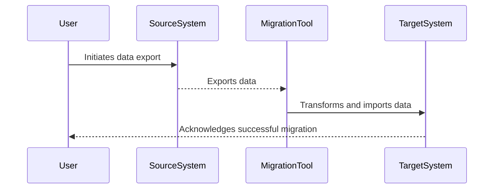

## Introduction

Data migration is a critical aspect of cloud computing as businesses transition from legacy systems to modern cloud-based solutions. This process involves transferring data between different storage mediums or formats, ensuring data integrity, security, and minimal downtime. This article explores the architectural approaches, patterns, and tools that facilitate efficient data migration.

## Design Patterns and Architectural Approaches

### 1. Bulk Data Transfer

**Description**: Suitable for migrating large datasets by exporting data from the source system and importing it into the target system. This approach is ideal for non-time-critical migrations.

- **Benefits**: Simplicity and suitability for massive data volumes.
- **Drawbacks**: Longer downtime and potential data consistency issues.

### 2. Incremental Data Migration

**Description**: Data is migrated incrementally over time, allowing both systems to coexist during the migration period.

- **Benefits**: Minimal downtime and continuous data availability.
- **Drawbacks**: Complexity in ensuring data consistency.

### 3. On-the-fly Data Conversion

**Description**: Data is transformed during the migration process to match the target schema or format.

- **Benefits**: Seamless integration with the target system.
- **Drawbacks**: Higher computational overhead.

### 4. Hybrid Approaches

Combining various strategies to create a tailored migration process. For example, using bulk transfer for static data and incremental transfer for dynamic data.

## Best Practices

- **Thorough Planning**: Understand data dependencies, regulatory requirements, and potential risks before migration.
- **Automated Tools**: Leverage migration tools that offer automation, error detection, and recovery features.
- **Data Validation**: Implement robust data validation checks before and after migration to ensure integrity.
- **Monitoring and Logging**: Continually monitor the migration process to detect and resolve issues promptly.
- **Rollback Procedures**: Always have a rollback plan to revert to the original state in case of failures.

## Example Code

### Using AWS Data Migration Service (DMS) for Database Migration

```bash
aws dms create-replication-task \
    --replication-task-identifier my-task-id \
    --source-endpoint-arn arn:aws:dms:us-west-2:123456789012:endpoint:RDSMySQLSource \
    --target-endpoint-arn arn:aws:dms:us-west-2:123456789012:endpoint:RedshiftTarget \
    --migration-type full-load-and-cdc \
    --table-mappings file://mapping-file.json \
    --replication-task-settings file://settings-file.json
```

### Sample schema transformation with Python using Pandas

```python
import pandas as pd

source_data = pd.read_csv('source_data.csv')

target_data = source_data.rename(columns={'oldColName': 'newColName'}).dropna(subset=['importantColumn'])

target_data.to_parquet('target_data.parquet')
```

## Diagrams

### Data Migration Process Sequence Diagram



## Related Patterns and Tools

- **Database Sharding**: Optimize data distribution across databases to improve scalability.
- **ETL (Extract, Transform, Load)**: Use ETL processes for structured data transformation and integration.
- **Cloud Provider Tools**: Utilize cloud-specific tools such as AWS DMS, Google Cloud Data Transfer Service, and Azure Database Migration Service for seamless migrations.

## Additional Resources

- **AWS Data Migration Services**: [AWS DMS Documentation](https://aws.amazon.com/dms/)
- **Azure Database Migration Service**: [Azure Migration Services](https://azure.microsoft.com/en-us/services/database-migration/)
- **Google Cloud Transfer**: [Google Data Transfer](https://cloud.google.com/storage-transfer-service)

## Summary

Data migration is a nuanced and critical task in the cloud computing paradigm. Employing the right combination of migration strategies, tools, and best practices can significantly reduce risks and ensure a seamless transition to modern storage solutions. A well-planned migration ensures data availability, consistency, and integrity, enabling businesses to leverage the full potential of cloud computing with minimal disruption.
