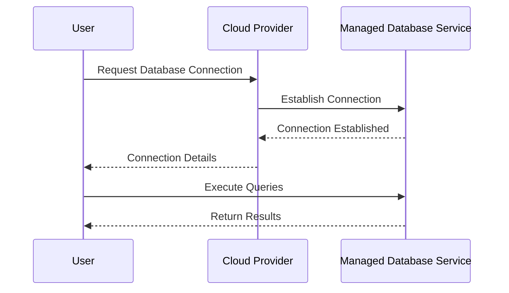

## Introduction

Managed Database Services are becoming increasingly vital in today's cloud-centric landscape. These services, offered by major cloud providers such as AWS, Microsoft Azure, and Google Cloud Platform, help organizations offload the complexities of database management. By utilizing these services, businesses can focus on their core competencies while the cloud provider handles routine tasks such as provisioning, patching, backup, recovery, and scaling. 

## Architectural Approaches

### Key Approaches
1. **Platform-as-a-Service (PaaS)**: This approach provides a fully managed environment where the user only interacts with the database through the service interface. This eliminates the need for infrastructure management.
2. **Software-as-a-Service (SaaS)**: For applications that require databases as part of their services, database management is abstracted away completely from the end-user.
3. **Hybrid Cloud Solutions**: Some services allow integration with on-premise databases, providing a unified interface for database management across environments.

### Benefits
- **Scalability**: With managed services, databases can scale up or down automatically in response to application needs, ensuring optimal performance without manual intervention.
- **Reliability**: Providers ensure high availability and disaster recovery, often across multiple data centers.
- **Security**: Managed services offer robust security features including encryption, identity management, and compliance with industry standards.

## Example Code

Consider using AWS RDS to illustrate how managed database services simplify database operations:

```bash

aws rds create-db-instance \
    --db-instance-identifier mydatabase \
    --db-instance-class db.t3.micro \
    --engine mysql \
    --allocated-storage 20 \
    --master-username admin \
    --master-user-password password123 \
    --vpc-security-group-ids sg-0123456789abcdef0
```

This simple command sets up a managed MySQL database instance in Amazon RDS, handling provisioning, hardware maintenance, automatic backups, and more.

## Diagram

The following Mermaid UML sequence diagram showcases the interaction between a user, cloud service, and managed database:



## Related Patterns

1. **Multi-cloud Strategy**: Using multiple cloud providers to enhance redundancy and reliability. 
2. **Data Lakes**: Involves data integration and processing within a centralized repository.
3. **Cloud Storage Gateway**: Facilitates seamless integration between on-premises systems and cloud storage.

## Additional Resources

- [AWS RDS Documentation](https://docs.aws.amazon.com/rds/)
- [Azure SQL Database Overview](https://docs.microsoft.com/en-us/azure/azure-sql/)
- [Google Cloud SQL Documentation](https://cloud.google.com/sql/docs/)

## Summary

Managed Database Services enable organizations to outsource the complexity of database management, allowing them to focus on business growth rather than infrastructure. They provide seamless scalability, security, and reliability, essential for modern applications. Leveraging these services equips businesses to handle large datasets efficiently and cost-effectively, ensuring high availability and performance, facilitating innovation and agility in rapidly changing environments.
