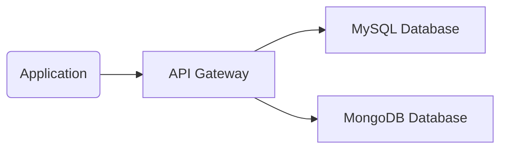

## Introduction

As organizations increasingly rely on diverse data types and varied applications, a single storage technology often cannot efficiently address all their needs. **Polyglot Persistence** is an architectural approach that advocates for using multiple data storage technologies, chosen based on the unique characteristics and requirements of the applications and data types involved.

### What is Polyglot Persistence?

The term "Polyglot Persistence" originates from the broader concept of "polyglot programming," where different programming languages are used together in a single application, each chosen for its particular strengths. Similarly, Polyglot Persistence involves combining different types of databases—such as relational databases, document stores, key-value stores, graph databases, and more—to meet specific requirements of different kinds of data workloads.

## Benefits

1. **Optimized Data Environment**: Choose the best storage solution for each data type, optimizing performance and scalability.
2. **Flexibility**: Allows seamless handling of structured, semi-structured, and unstructured data.
3. **Scalability**: Individual database technologies can be scaled out or adjusted independently according to their specific load and performance characteristics.
4. **Resilience**: By diversifying storage solutions, the risk of a single point of failure is mitigated.

## Architectural Approaches

### Choosing the Right Database Types

1. **Relational Databases (SQL)**: Best for structured data with relationships, supporting robust transactional support and complex queries.
   
2. **Document Stores (NoSQL)**: Ideal for semi-structured data, agility with data schemas, and JSON storage, often used in applications with rapidly changing data structures, like content management systems.

3. **Key-Value Stores**: Designed for simplicity and speed, suitable for applications with simple, discrete key-value data pairs, like session storage or caching.

4. **Graph Databases**: Optimal for interconnected data, easily modeling relationships like social networks or recommendation engines.

### Integration Patterns

- **Data Replication**: Ensure consistency and availability across different databases using replication strategies, like dual writes or change data capture.
  
- **Data Aggregation**: Implement data aggregation services to provide a unified view of data from multiple databases for reporting and analysis.
  
- **API Gateway**: Use an API gateway to abstract the complexities of different data stores from application clients, offering a uniform interface.

## Best Practices

1. **Evaluate Workload Characteristics**: Analyze the data read/write patterns, data volume, velocity, and variety to choose the appropriate database technology.
   
2. **Unified Governance**: Implement consistent data security, privacy policies, and access controls across various storage systems.
   
3. **Monitoring and Management**: Use centralized monitoring and logging tools to manage the diverse database environment effectively.

## Example Code

Here's a simple example using Java to connect to both a MySQL database and a MongoDB NoSQL database within the same application:

```java
// MySQL JDBC Connection
Connection mysqlConnection = DriverManager.getConnection("jdbc:mysql://localhost:3306/mydatabase", "user", "password");
// MongoDB Client Connection
MongoClient mongoClient = MongoClients.create("mongodb://localhost:27017");
MongoDatabase mongoDatabase = mongoClient.getDatabase("myMongoDatabase");

// Example operation demonstrating the use of both databases
Statement statement = mysqlConnection.createStatement();
ResultSet rs = statement.executeQuery("SELECT * FROM users");

while(rs.next()) {
    System.out.println("User from MySQL: " + rs.getString("username"));
}

// Fetch data from MongoDB
MongoCollection<Document> collection = mongoDatabase.getCollection("users");
FindIterable<Document> mongoResult = collection.find();

for (Document doc : mongoResult) {
    System.out.println("User from MongoDB: " + doc.getString("username"));
}
```

## Diagrams

### High-Level Architecture Diagram



This diagram illustrates a simple polyglot persistence setup where an application interacts with both a relational and a NoSQL database through an API Gateway.

## Related Patterns

- **Event Sourcing**: Capturing changes in data as an immutable sequence of events, which can be stored in various data stores.
  
- **CQRS (Command Query Responsibility Segregation)**: Separating the read and write operations of data, potentially using different storage solutions optimized for each operation type.

## Additional Resources

- [Martin Fowler's Introduction to Polyglot Persistence](https://martinfowler.com/bliki/PolyglotPersistence.html)
- [NoSQL Distilled: A Brief Guide to the Emerging World of Polyglot Persistence](https://www.amazon.com/NoSQL-Distilled-Emerging-Polyglot-Persistence/dp/0321826620)
- [Designing Data-Intensive Applications by Martin Kleppmann](https://dataintensive.net/)

## Summary

Polyglot Persistence enables organizations to handle diverse data workloads by leveraging the strengths of different storage technologies. It allows for optimized performance, scalability, and flexibility by using the right tool for the right job. While implementation can add complexity in terms of management and integration, the benefits it brings make it an essential architecture pattern in modern cloud computing systems.
