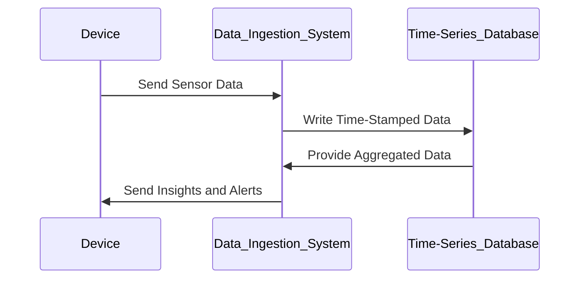

## Introduction

Time-Series Databases (TSDBs) are purpose-built tools for managing and analyzing time-stamped data, which is typically composed of sequences of data points measured at successive points in time. Common use cases include IoT sensor readings, financial market data, and performance monitoring metrics. TSDBs are optimized for high write loads, efficient storage of large datasets, and complex queries unique to time-structured data.

## Design Patterns and Architectural Approaches

### Architectural Characteristics

1. **Data Model**: Time-Series Databases often use a model focused on timestamped records, supporting efficient time-based operations.
   
2. **Read/Write Optimization**: TSDBs are typically optimized for high throughput of sequential writes and fast queries over chronological data ranges.

3. **Storage Optimization**: Techniques such as compression and partitioning help manage large volumes of data efficiently.

4. **Retention Policies**: Mechanisms for automated aging out of old data, as time-series datasets can grow indefinitely.

5. **Scalability**: Horizontal scaling to manage large volumes of data generated over time.

### Best Practices

1. **Schema Design**: Design the database schema to maximize query efficiency by leveraging time-based indexing.

2. **Retention and Roll-Up**: Implement data retention policies and roll-up strategies to balance between data precision and storage costs.

3. **Tuning and Condensing**: Pay attention to balancing disk I/O usage and memory load, as well as data condensation techniques.

4. **Data Ingestion Patterns**: Batch ingestion for high-volume data and streaming pipelines for real-time analysis.

5. **Monitoring and Alerts**: Regularly monitor performance metrics (like write latency and query execution times) specific to time-series demands.

## Example Code

Here is a simple example demonstrating how to use InfluxDB, a popular Time-Series Database, to store and query time-series data using its query language:

```python
from influxdb import InfluxDBClient

client = InfluxDBClient(host='localhost', port=8086)
client.switch_database('example_db')

json_body = [
    {
        "measurement": "temperature",
        "tags": {
            "location": "office"
        },
        "time": "2024-07-07T15:30:00Z",
        "fields": {
            "value": 22.5
        }
    }
]

client.write_points(json_body)

result = client.query('SELECT value FROM "temperature" WHERE "location" = \'office\'')
print(list(result.get_points()))
```

## Diagrams

Here's a basic example of diagram showing how data flows into a Time-Series Database:



## Related Patterns

1. **Event Sourcing**: Using an event log for state management aligns well with time-series since both provide a historical record of changes over time.

2. **CQRS (Command Query Responsibility Segregation)**: Employing separate channels for data modification (write) and data querying (read) can optimize how time-series data is processed and reported.

3. **Lambda Architecture**: Combines batch and stream processing of data, which can be beneficial when handling and analyzing large volumes of time-series data.

## Additional Resources

- **InfluxData:** [InfluxDB Guide](https://docs.influxdata.com/influxdb/)
- **Amazon Timestream:** [AWS Timestream Documentation](https://docs.aws.amazon.com/timestream/)
- **TSDB Benchmarking:** [Time-Series Benchmark Suite](https://github.com/timescale/tsbs)

## Summary

Time-Series Databases are increasingly essential in a world surrounded by data-rich environments. These databases are uniquely suited to handle vast quantities of time-stamped data with optimized read and write operations, efficient storage management, and robust querying capabilities. When designing systems reliant on time-based data, leveraging TSDBs can lead to significant performance and scalability improvements, making them invaluable for applications ranging from IT infrastructure monitoring to advanced IoT solutions.
