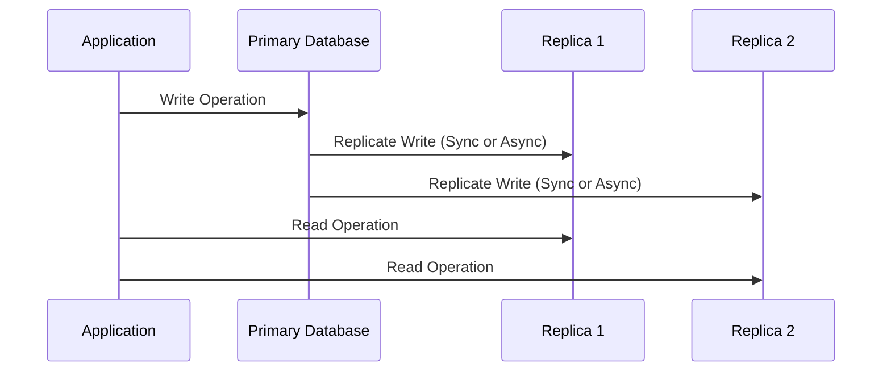

## Introduction

In the era of cloud computing, ensuring continuous service availability and data integrity is paramount. **Database Replication** is a critical pattern adopted by organizations to achieve high availability, disaster recovery, and optimal data distribution across different geographical locations. This pattern involves synchronizing data across multiple databases, enhancing resilience against system failures, and improving access times for globally distributed users.

## Problem

Databases are vulnerable to various issues like hardware failures, network outages, and data corruption. In a cloud environment, where applications serve users globally, it's crucial to maintain data availability and integrity. Traditional single-instance databases can lead to bottlenecks, performance issues, and a single point of failure, making them inadequate for modern cloud applications demanding high uptime and low latency.

## Solution

**Database Replication** addresses these challenges by copying and maintaining database objects, such as tables and rows, across multiple database instances or regions:

- **Types of Replication**:
  - **Master-Slave Replication**: A single master database handles writes, while one or more slaves replicate the master to handle read requests.
  - **Master-Master Replication**: Multiple masters can handle both read and write operations, providing active-active redundancy.
  - **Peer-to-Peer Replication**: Each node functions as both a master and a slave, allowing any node to accept writes and propagate changes to all others.

- **Synchronous vs Asynchronous Replication**:
  - **Synchronous**: Ensures immediate propagation of database changes to replicas, ensuring strong consistency at the expense of increased latency.
  - **Asynchronous**: Updates are propagated with some delay, offering better performance and lower latency at the risk of temporary inconsistencies.

## Architectural Approaches

1. **Multi-Region Replication**: Distributes data across different geographical regions to decrease latency for users worldwide and enhance fault tolerance by diverting traffic to operational regions during regional failures.

2. **Replica Set Formation**: Organizing databases into a set of replicas where one is the primary node handling data writes, with secondary nodes replicating the data while serving read requests.

3. **Conflict Resolution Strategies**: Implementing strategies like Last Write Wins, Merge, or Application-based logic to automatically resolve synchronization conflicts in multi-master systems.

## Best Practices

- **Consistency Levels**: Choose appropriate consistency levels (e.g., eventual, strong consistency) based on application needs to balance between throughput and data accuracy.

- **Monitoring and Alerting**: Implement robust monitoring and alerting mechanisms to detect replication lag, data inconsistencies, and node failures promptly.

- **Network and Security Considerations**: Secure replication channels with encryption and ensure minimal network latency between nodes, especially for synchronous replication setups.

- **Data Recovery and Testing**: Regularly test data recovery procedures to ensure quick restoration from replicas during unforeseen failures, and validate the replication setup with dry-run testing.

## Example Code

Below is a generic example using Java with MongoDB's replica set configuration:

```java
import com.mongodb.MongoClientSettings;
import com.mongodb.ServerAddress;
import com.mongodb.client.MongoClient;
import com.mongodb.client.MongoClients;
import java.util.Arrays;

public class MongoDBReplicationExample {
    public static void main(String[] args) {
        MongoClientSettings settings = MongoClientSettings.builder()
            .applyToClusterSettings(builder ->
                builder.hosts(Arrays.asList(
                    new ServerAddress("db1.example.com"),
                    new ServerAddress("db2.example.com"),
                    new ServerAddress("db3.example.com")
                )))
            .build();

        try (MongoClient mongoClient = MongoClients.create(settings)) {
            // Use the mongoClient instance to perform read/write operations
            System.out.println("Connected to the replica set.");
        }
    }
}
```

## Diagrams

### UML Sequence Diagram for Database Replication



## Related Patterns

- **Data Sharding**: Distribute large datasets across multiple databases to increase performance and manageability.
- **Data Caching**: Temporarily store frequently accessed data in memory to reduce load on databases.
- **Circuit Breaker**: Prevent system failures from cascading by isolating failing components from the rest of the system.

## Additional Resources

- [Google Cloud - Configuring and Running Data Replication](https://cloud.google.com/solutions/configuring-and-running-data-replication)
- [AWS Multi-AZ Deployment Best Practices](https://aws.amazon.com/blogs/database/multi-az-deployment-best-practices/)
- [Oracle Active Data Guard Implementation Guide](https://docs.oracle.com/cd/E11882_01/server.112/e41134/tdpsg_data_guard.htm)

## Summary

**Database Replication** is an essential pattern in cloud computing for enhancing data availability, consistency, and disaster recovery. By leveraging various replication methodologies and best practices, organizations can create robust systems that offer seamless user experiences with minimal downtime. Incorporating efficient monitoring and handling consistency trade-offs are crucial for maintaining a performant and resilient replication strategy.
