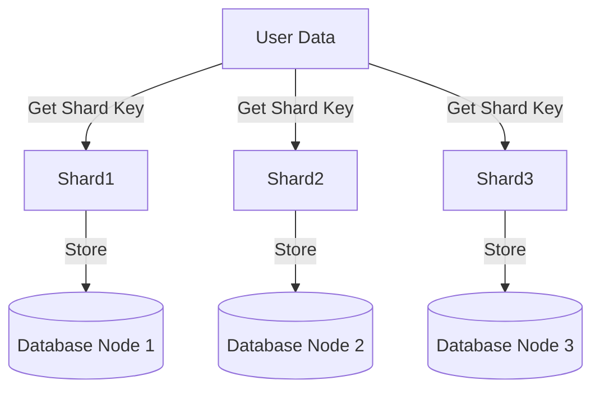

### Introduction

Data partitioning, often referred to as sharding, is a fundamental database design pattern that involves dividing a large dataset into smaller, more manageable segments across multiple databases. This approach enhances the system's capability to handle large volumes of transactions and improve performance by distributing the load. Commonly used in high-traffic applications like social media platforms, online gaming, and e-commerce websites, sharding is key to maintaining responsiveness and availability.

### Pattern Explanation

Sharding solves several key issues:

- **Performance**: By splitting data into separate shards, queries can be processed concurrently across multiple nodes, reducing response times.
- **Scalability**: Sharding supports horizontal scaling, allowing systems to handle growing data volumes by adding more database servers.
- **Availability**: Any hardware failure affects only a fraction of the data (i.e., a single shard), improving system resilience.

### Architectural Approaches

The sharding pattern is implemented through several primary approaches:

1. **Range-Based Sharding**: Data is divided based on ranges of the shard key. For example, user IDs from 1 to 1000 might go to one shard, while 1001 to 2000 might go to another.
   
2. **Hash-Based Sharding**: A hash function is applied to the shard key to determine the shard to which an entry belongs, distributing data evenly and reducing hotspots.

3. **Directory-Based Sharding**: A lookup service determines where each piece of data should be stored, allowing complex sharding logic tailored to specific requirements.

### Example Code

Here is a simplified example of implementing range-based sharding in a NoSQL database using pseudocode:

```javascript
function getShardKey(userId) {
    if (userId <= 1000) return "Shard1";
    if (userId > 1000 && userId <= 2000) return "Shard2";
    return "Shard3";
}

function saveUser(user) {
    const shardKey = getShardKey(user.id);
    database[shardKey].save(user);
}
```

### Diagram

The following Mermaid diagram illustrates a high-level overview of data partitioning:



### Best Practices

- **Shard Key Selection**: Choose a shard key that ensures data is evenly distributed to prevent overload on any single shard.
- **Monitoring and Balancing**: Continuously monitor shard sizes and re-balance when necessary to maintain distribution efficiency.
- **Replication**: Implement replication across shards to enhance fault tolerance and data availability.

### Related Patterns

- **Database Caching**: Pair with sharding to further optimize data retrieval speed.
- **Event Sourcing**: Use alongside sharding to manage distributed transactions effectively.
- **CQRS (Command Query Responsibility Segregation)**: Combine with sharding for applications requiring separation of read/write operations.

### Additional Resources

- [Martin Fowler on Database Sharding](https://martinfowler.com/articles/database-sharding.html)
- [Google Cloud's Guide to Sharding Best Practices](https://cloud.google.com/solutions/sharding-best-practices)
- [AWS DynamoDB Sharding Strategies](https://aws.amazon.com/dynamodb/)

### Summary

Data partitioning (sharding) is vital for modern applications requiring scalability and high availability. By dividing data among multiple nodes, sharding enhances both data management and retrieval efficiency, paving the way for businesses to handle large-scale data operations effectively. This pattern, when combined with other architectural strategies, helps maintain performance and reliability in distributed database systems.
