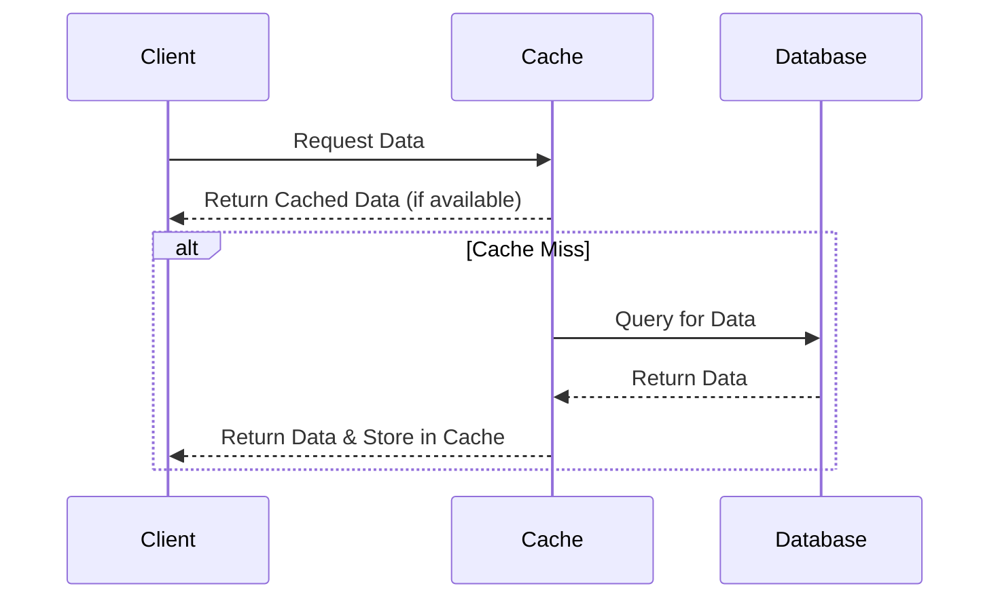

## Introduction

In modern cloud architectures, the efficient retrieval of data is crucial for enhancing performance and ensuring scalability. The **Caching Layers** design pattern plays a vital role in achieving these objectives by implementing intermediary storage solutions that allow for quicker data access, thereby reducing the load on primary databases.

## Design Pattern Context

Caching involves storing copies of data in temporary storage locations that can be accessed more quickly than a primary data store. By reducing the number of direct database requests, caching not only improves the speed of data access but also alleviates the load on database systems, leading to better overall application performance.

## Architectural Approach

### Multi-tier Caching

- **Client-Side Caching**: Utilized in the user's device or browser to store assets like images or scripts for faster local access.
- **Server-Side Caching**: Implemented within application layers, often using memory stores like Redis or Memcached.
- **CDN Caching**: Content Delivery Networks deploy caches globally, reducing latency by serving content from geographically closer nodes.

### Cache Implementations

- **In-Memory Caching**: Fast, volatile storage for frequently accessed data. Example technologies include Redis, Memcached, and Hazelcast.
- **Distributed Caching**: Spreads cached data across multiple nodes to enhance reliability and performance. Useful in distributed environments to maintain data continuity and high availability.
- **Disk-Based Caching**: Uses the filesystem for caching data, allowing for persistence and larger cache sizes at the expense of retrieval speed.

## Example Code

### Example in Java using Redis

```java
import redis.clients.jedis.Jedis;

public class RedisCacheExample {
    private static final String CACHE_KEY = "user_details";

    public void cacheData(String userId, String userData) {
        try (Jedis jedis = new Jedis("localhost")) {
            jedis.hset(CACHE_KEY, userId, userData);
        }
    }

    public String getDataFromCache(String userId) {
        try (Jedis jedis = new Jedis("localhost")) {
            return jedis.hget(CACHE_KEY, userId);
        }
    }
}
```

### Usage

Store user details in a Redis cache and retrieve them using concise methods to ensure quick access and relieve the database of repetitive queries.

## Diagrams



## Best Practices

- **Cache Eviction Policies**: Implement policies like LRU (Least Recently Used) to manage cache storage effectively, ensuring that outdated or less frequently accessed data entries are discarded.
- **Consistency Models**: Choose between strong consistency (immediate synchronization with the database) or eventual consistency (updates propagate over time) based on application needs.
- **Invalidation Strategies**: Ensure cache invalidation mechanisms are in place to update stale data upon database changes, using methods like time-to-live (TTL) or event-driven updates.

## Related Patterns

- **CDN Patterns**: Incorporates network caching to serve static and dynamic content efficiently from edge locations.
- **Read-Through Cache**: Automatically loads data into the cache upon a cache miss, simplifying cache management.
- **Write-Back vs. Write-Through**: Balances between immediate cache updates (write-through) and delayed, batched updates (write-back) based on performance needs.

## Additional Resources

- [Caching Strategies in Java](https://www.baeldung.com/java-caching)
- [Redis Official Documentation](https://redis.io/documentation)
- [Caching Best Practices](https://aws.amazon.com/caching/)

## Summary

The **Caching Layers** design pattern serves as a critical component for optimizing performance and improving scalability in cloud environments. By incorporating well-structured cache strategies, applications can dramatically reduce latency and database load, thereby enhancing user experience and operational efficiency. Through various caching techniques and best practices, this pattern ensures data can be fetched swiftly while maintaining consistency and reliability across distributed systems.
