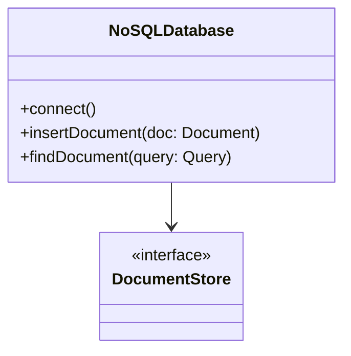

## Introduction

In the sphere of cloud computing, NoSQL databases have emerged as pivotal tools for handling large-scale, unstructured data, and supporting dynamic application requirements. Unlike traditional SQL databases that require predefined schemas, NoSQL databases provide flexibility through schema-less designs, making them ideal for applications with evolving data models.

## Design Pattern Description

NoSQL databases embrace the diversity of data types by offering various data model approaches such as:

- **Key-Value Stores**: These represent the simplest form of database where each data item is stored as a key-value pair. It is an ideal solution for applications requiring quick lookups by keys, such as caching mechanisms or session storages.

- **Document Stores**: These store data in a semi-structured format using documents, typically in JSON or BSON formats, allowing for complex nested data structures. This type of database is useful when dealing with hierarchical data, such as user profiles or catalogs.

### Benefits

- **Scalability**: NoSQL databases are designed to scale out by distributing data across multiple nodes, making them able to handle vast volumes of transactions and data.

- **Flexibility**: Schema-less nature enables easy adaptation to changes, supporting evolving data models without requiring costly migrations.

- **Performance**: Optimized for specific use cases like read-heavy or write-heavy workloads, often providing better performance compared to traditional RDBMS when tailored appropriately.

## Architectural Approaches

### Horizontal Scaling

One of the fundamental strengths of NoSQL databases is their capability to scale horizontally, which involves adding more servers to accommodate increased load rather than scaling vertically by adding more power to existing servers.

### Distributed Data Storage

NoSQL systems typically employ partitioning strategies to distribute data across nodes efficiently, enhancing fault tolerance and availability. Techniques such as sharding and replication ensure data redundancy and consistency across distributed systems.

### Eventual Consistency

For systems where availability is prioritized over immediate consistency, eventual consistency models are applied, ensuring that all updates will propagate across the system eventually (given no new updates are made).

## Best Practices

- **Understand Use Cases**: Choose a NoSQL database that aligns with your specific requirements (e.g., high read vs. high write needs).

- **Data Modeling**: Design your data model to reflect your application's access patterns, leveraging denormalization and embedding for optimized performance.

- **Indexing Strategies**: Implement effective indexing strategies to speed up data retrievals, considering trade-offs between write performance and data access times.

- **Backup and Recovery**: Regularly plan and test backup and recovery processes to ensure data integrity and availability.

## Example Code

Below is an example using a Document Store (MongoDB) for managing a collection of user profiles.

```javascript
// Connect to MongoDB
const { MongoClient } = require('mongodb');
const url = 'mongodb://localhost:27017';
const client = new MongoClient(url);
const dbName = 'userDB';

async function main() {
  await client.connect();
  console.log('Connected successfully to server');
  const db = client.db(dbName);
  const collection = db.collection('users');

  // Insert a new document
  const insertResult = await collection.insertOne({ username: 'jdoe', age: 30, hobbies: ['reading', 'gaming'] });
  console.log('Insert Result:', insertResult);

  // Find a user by username
  const findResult = await collection.findOne({ username: 'jdoe' });
  console.log('Found Document:', findResult);
  
  await client.close();
}

main().catch(console.error);
```

## Diagrams

Here is a basic **UML Class Diagram** illustrating the typical architecture of a NoSQL System using a Document Store model:



## Related Patterns

- **Sharding Pattern**: A data partitioning strategy to distribute load across multiple nodes.
- **CQRS Pattern (Command Query Responsibility Segregation)**: Separating read and write workloads for optimized performance.

## Additional Resources

1. **"MongoDB: The Definitive Guide"** - Comprehensive resource on MongoDB's document store model.
2. **"Designing Data-Intensive Applications"** by Martin Kleppmann – A book that covers scalable and reliable data systems.

## Summary

NoSQL databases are transformative in the handling of modern data requirements. By adopting architectures such as key-value pairs and document stores, they offer unparalleled scalability, flexibility, and performance, supporting a wide variety of dynamic applications. Understanding their design patterns and architectural benefits is crucial for any organization seeking to optimize its data handling capabilities in a cloud environment.
