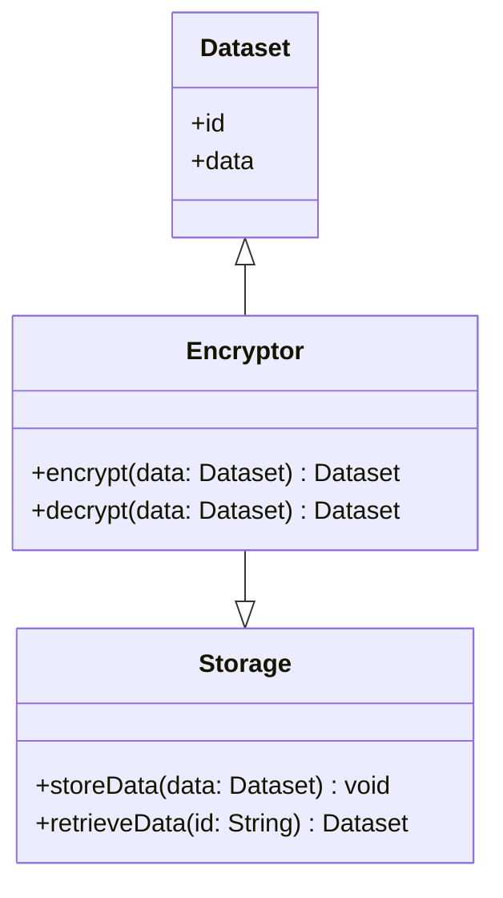

## Introduction

### Overview

**Data Encryption at Rest** is a vital practice in cloud computing and data storage that involves encrypting data stored on any type of medium. This method ensures that even if a storage medium is physically accessed or compromised, the data remains unreadable without the proper decryption keys.

### Importance

Encrypting data at rest is crucial for maintaining data privacy, meeting regulatory compliance requirements, protecting intellectual property, and providing a safeguard against data breaches.

## Implementation

### Techniques

1. **Symmetric Encryption**: Uses a single key for both encryption and decryption. AES (Advanced Encryption Standard) is commonly used for encrypting data at rest.
   
2. **Asymmetric Encryption**: Involves a pair of keys; a public key for encryption and a private key for decryption. This is used less frequently for data at rest due to its complexity and computational overhead.

3. **Hybrid Approaches**: Combine both symmetric and asymmetric encryption to benefit from the simplicity of symmetric encryption and the security offered by asymmetric encryption.

### Architectural Approaches

- **Storage Level**: Encrypt data directly at the storage level using tools provided by cloud providers (e.g., AWS KMS, Azure Key Vault, Google Cloud KMS).
  
- **Application Level**: Encrypt data before it reaches storage. This approach gives applications more control over encryption but requires managing encryption keys and processes.

- **Database Level**: Use database features to encrypt tables, columns, or entire databases.

### Best Practices

1. **Key Management**: Use a robust key management solution to securely store, rotate, and manage encryption keys.
2. **Performance Monitoring**: Monitor system performance as encryption can add overhead.
3. **Compliance and Auditing**: Ensure encryption practices comply with industry standards and legal regulations.
4. **Regular Updates and Patching**: Keep encryption protocols and libraries updated to mitigate vulnerabilities.

## Example Code

Here is an example of encrypting a string using AES symmetric encryption in Java:

```java
import javax.crypto.Cipher;
import javax.crypto.KeyGenerator;
import javax.crypto.SecretKey;
import javax.crypto.spec.GCMParameterSpec;
import java.util.Base64;

public class DataEncryptionExample {
    private static final String AES = "AES";
    private static final String AES_GCM_NO_PADDING = "AES/GCM/NoPadding";
    private static final int GCM_TAG_LENGTH = 16;

    public static String encrypt(String data, SecretKey key) throws Exception {
        Cipher cipher = Cipher.getInstance(AES_GCM_NO_PADDING);
        GCMParameterSpec spec = new GCMParameterSpec(GCM_TAG_LENGTH * 8, new byte[12]);
        cipher.init(Cipher.ENCRYPT_MODE, key, spec);
        byte[] encryptedData = cipher.doFinal(data.getBytes());
        return Base64.getEncoder().encodeToString(encryptedData);
    }

    public static void main(String[] args) throws Exception {
        KeyGenerator keyGenerator = KeyGenerator.getInstance(AES);
        keyGenerator.init(256);
        SecretKey secretKey = keyGenerator.generateKey();

        String originalData = "Sensitive information";
        String encryptedData = encrypt(originalData, secretKey);

        System.out.println("Original: " + originalData);
        System.out.println("Encrypted: " + encryptedData);
    }
}
```

## Diagrams

Below is a basic UML diagram illustrating how encryption at rest might integrate into a cloud service architecture.



## Related Patterns

- **Data Masking**: Techniques for anonymizing data fields to protect sensitive information.
- **Access Control**: Defines who has access to particular data and resources.
- **End-to-End Encryption**: Ensures data is encrypted while being transferred and at rest in both ends.

## Additional Resources

- [AWS KMS Documentation](https://docs.aws.amazon.com/kms/index.html)
- [Azure Encryption and Key Management](https://azure.microsoft.com/en-us/solutions/key-vault/)
- [Google Cloud Key Management Service](https://cloud.google.com/security-key-management)

## Summary

Data Encryption at Rest is a critical security measure designed to protect stored data on cloud environments and local storage. By employing encryption techniques, organizations can guard against unauthorized accesses and meet compliance requirements while managing sensitive data efficiently. Proper key management, thorough performance assessment, and compliance adherence form the backbone of a robust encryption strategy ensuring data remains secure against threats.
