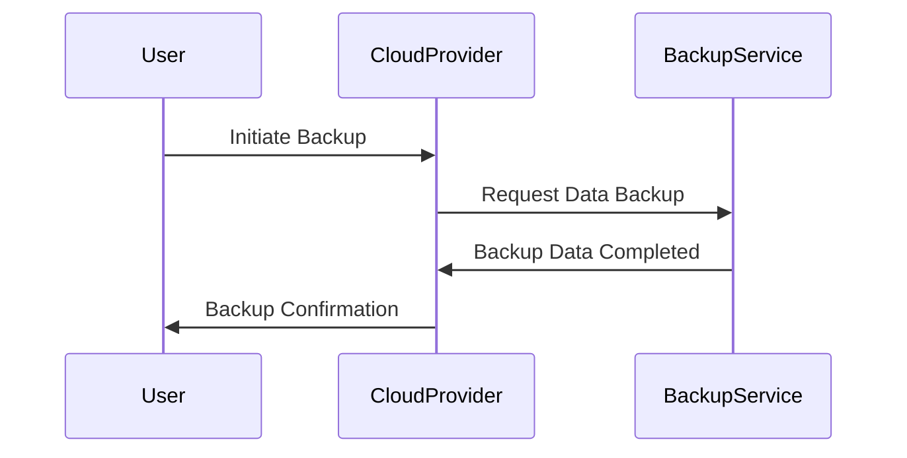

In the realm of cloud computing, backup and restore strategies are fundamental practices to ensure data resilience and business continuity. These strategies involve regularly copying data to secure locations and rigorously testing the recovery processes to minimize downtime and data loss in the event of a failure, corruption, or disaster.

## Design Patterns and Architectural Approaches

### 1. **Incremental Backups**
Incremental backups involve capturing only the data that has changed since the last backup. This approach saves storage space and speeds up the backup process, although it may complicate the restore process since multiple sets of backups may need to be combined to fully restore data.

### 2. **Snapshot Backups**
These involve taking a "snapshot" of the system at a certain point in time, which can be utilized to quickly restore the data to that state. Cloud providers often offer snapshot services that integrate seamlessly with cloud-based infrastructure, providing rapid backup and recovery options.

```java
// Example Code: Utilizing AWS Snapshot to Backup an EBS Volume
import com.amazonaws.services.ec2.AmazonEC2;
import com.amazonaws.services.ec2.model.*;
import static com.amazonaws.services.ec2.AmazonEC2ClientBuilder.defaultClient;

public class EBSBackup {
    public static void main(String[] args) {
        AmazonEC2 ec2 = defaultClient();
        CreateSnapshotRequest request = new CreateSnapshotRequest()
            .withVolumeId("vol-1234567890abcdef0")
            .withDescription("Daily backup snapshot");
        CreateSnapshotResult response = ec2.createSnapshot(request);
        System.out.println("Snapshot ID: " + response.getSnapshot().getSnapshotId());
    }
}
```

### 3. **Log-based Backups**
Databases often employ transaction logs that record every change to ensure data consistency. These logs can be used to recreate or roll back transactions during restore operations, providing a more granular recovery option.

### 4. **Continuous Data Protection (CDP)**
CDP continuously captures changes to data, allowing restoration to any point in time. This can be extremely effective for environments requiring minimal data loss tolerance, such as transactional financial systems.

## Best Practices

- **Regular Testing**: Regularly test the restore process to ensure that backups can be recovered successfully and data integrity is maintained. Testing helps spot contingencies and bottlenecks that could otherwise impede recovery during a real incident.

- **Automated Backups**: Leverage automation tools to schedule and manage backups. Cloud providers offer integrated solutions to automate and manage the predominancy of backup tasks, reducing human error.

- **Offsite Storage**: Maintain copies of critical data in geographically distributed locations to protect against regional disasters.

## Related Patterns

- **Disaster Recovery Planning (DRP)**: Involves creating a comprehensive plan to recover critical data and IT infrastructure after a catastrophic event.

- **Data Replication**: Duplicating data across various sites to ensure accessibility and durability, vital for global applications with high availability requirements.

## Diagrams

### Backup Process Flow



## Additional Resources

- **AWS Backup Documentation**: A comprehensive resource for leveraging AWS Backup to automate and centrally manage backups across AWS services.
- **Azure Backup Service**: Microsoft's cloud-native backup solution that protects and restores data for IT environments.

## Conclusion

Backup and restore strategies are pivotal to effective cloud data management. By leveraging cloud-native tools, enterprises can ensure their data is protected against various threats, including system failures, data breaches, and natural disasters. It is essential to not only implement these strategies but to continually evaluate and adapt them to meet evolving business requirements and technological advances.
