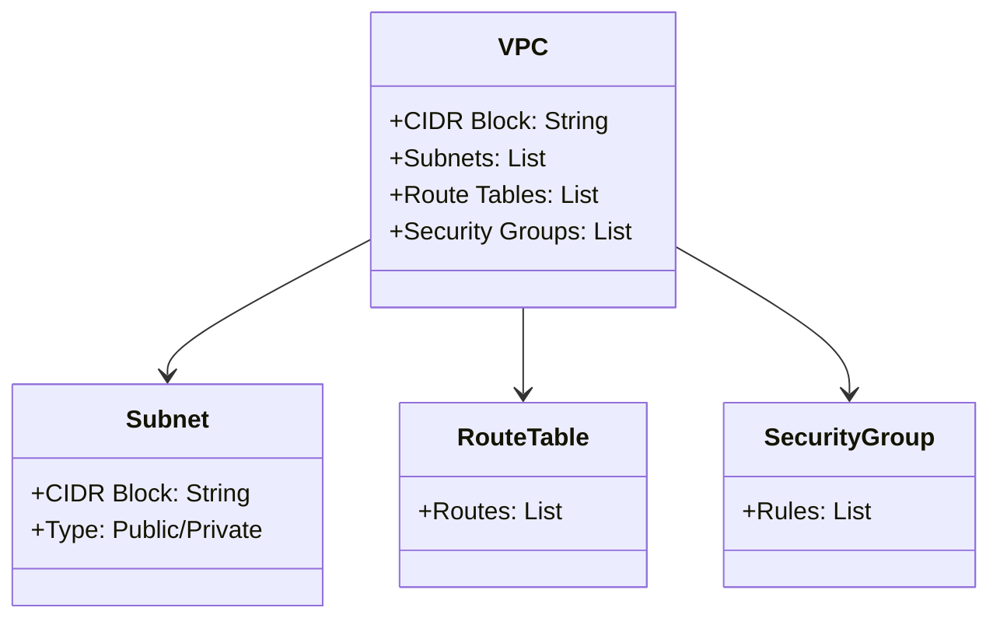

## Introduction

A **Virtual Private Cloud (VPC)** is an essential networking component in cloud computing that allows organizations to establish isolated virtual networks within a cloud provider's infrastructure. These virtual networks mimic traditional physical networks, providing enhanced security, control, and customization over network resources. The VPC pattern is integral to cloud architecture, enabling seamless integration with existing on-premises systems and other cloud services.

## Detailed Explanation

### Key Features of VPC

1. **Network Isolation**: 
   - VPCs are isolated from other virtual networks on the cloud, ensuring that your resources remain private and secure.
   
2. **Customizable Subnets**:
   - Create multiple subnets within a VPC, allowing granular control over network architecture and segmenting resources based on requirements.
   
3. **Security Controls**:
   - Implement security groups and network ACLs (Access Control Lists) to manage inbound and outbound traffic.
   
4. **Public & Private Subnets**:
   - VPCs can be divided into public and private subnets to host resources according to their need for internet exposure.
   
5. **Routing & Peering**:
   - Configure route tables to connect within and outside the VPC. VPC peering enables connectivity between different VPCs.
   
6. **Direct Connection Options**:
   - Leverage options like AWS Direct Connect or Azure ExpressRoute to secure, high-bandwidth, dedicated connections to on-premises infrastructure.

### Architectural Approaches

- **Microservices Integration**:
  - Utilize VPCs to host microservices that require secure interactions with each other, minimizing latency and maintaining security boundaries.
  
- **Hybrid Cloud Deployments**:
  - Extend on-premises into the cloud using VPCs, facilitating a hybrid architecture that is secure, flexible, and scalable.
  
- **Multi-cloud Strategy**:
  - Implement VPCs across different cloud platforms to optimize for cost, redundancy, or specific service capabilities, maintaining a consistent network strategy.

### Best Practices

- **VPC Network Segmentation**:
  - Use subnets strategically to separate workloads and enforce different levels of security controls.

- **Monitoring and Logging**:
  - Enable logging for traffic flows with tools like AWS VPC Flow Logs for insightful auditing and monitoring.

- **Least Privilege Principle**:
  - Apply security group rules and ACLs following the principle of least privilege, only permitting necessary network communications.

- **Automation & Infrastructure as Code**:
  - Utilize infrastructure as code (IaC) tools like Terraform or AWS CloudFormation to automate VPC deployment and management, ensuring consistency and scalability.

## Example Code

Below is a simple Terraform script to create a VPC on AWS:

```hcl
provider "aws" {
  region = "us-east-1"
}

resource "aws_vpc" "my_vpc" {
  cidr_block = "10.0.0.0/16"

  tags = {
    Name = "my-vpc"
  }
}

resource "aws_subnet" "my_subnet" {
  vpc_id     = aws_vpc.my_vpc.id
  cidr_block = "10.0.1.0/24"

  tags = {
    Name = "my-subnet"
  }
}
```

## Diagrams

Here’s a basic UML diagram illustrating a VPC architecture:



## Related Patterns

- **Hybrid Cloud**: VPCs are integral when extending on-premises data centers to the cloud, enabling a seamless hybrid architecture.
- **Network Segmentation**: Enhance security and performance by segmenting cloud networks into VPCs and subnets.
- **Cloud VPN**: Securely connect on-premises networks to VPCs across the cloud infrastructure.

## Additional Resources

- [AWS VPC Documentation](https://docs.aws.amazon.com/vpc/)
- [Azure Virtual Network Documentation](https://docs.microsoft.com/en-us/azure/virtual-network/)
- [Google Cloud VPC Documentation](https://cloud.google.com/vpc/docs)

## Summary

The Virtual Private Cloud (VPC) represents a fundamental networking strategy in cloud computing, providing isolated environments to securely manage and deploy resources. By understanding and utilizing VPC, organizations can better architect their cloud systems, ensuring robust security and seamless integration with existing infrastructure. With best practices and architectural patterns, VPCs offer the flexibility to design adaptable and secure cloud infrastructure tailored to specific business needs.
