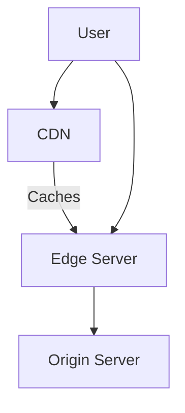

## Introduction

Content Delivery Networks (CDNs) are crucial for enhancing the performance and scalability of web applications. By distributing content across a network of geographically dispersed edge locations, CDNs reduce latency and improve load times for end-users, ultimately leading to an enriched user experience.

## Design Pattern Overview

The CDN architecture operates by caching content on multiple edge servers worldwide. This approach minimizes the distance content travels from the server to the user, effectively increasing the speed and reliability of content delivery. This method is particularly beneficial for static assets such as images, videos, stylesheets, and JavaScript files.

## Key Characteristics

- **Geographical Distribution**: CDNs utilize a vast network of servers located in various geographical areas, known as Points of Presence (PoP), to ensure proximity to end-users.
- **Caching**: By caching content at edge locations, CDNs effectively reduce server load, lower bandwidth costs, and enhance the delivery speed of cached components.
- **Redundancy and Fault Tolerance**: CDNs can manage traffic spikes and server failures efficiently, providing robust availability and reliability.
- **Load Distribution and Optimization**: Dynamic content delivery is optimized via intelligent algorithms, directing user requests to the nearest, least congested servers.
- **Security Enhancements**: Many CDNs offer DDoS protection, SSL/TLS encryption, and Web Application Firewalls (WAF) to safeguard web applications.

## Example Code

While CDNs often involve configuration rather than coding, integrating a CDN in a cloud service provider such as AWS CloudFront involves simple steps and could be integrated into an infrastructure as code (IaC) practice using tools like AWS CloudFormation:

```yaml
Resources:
  MyCloudFrontDistribution:
    Type: "AWS::CloudFront::Distribution"
    Properties:
      DistributionConfig:
        Origins:
          - DomainName: mywebsite.s3.amazonaws.com
            Id: S3Origin
            S3OriginConfig:
              OriginAccessIdentity: origin-access-identity/cloudfront/E127EXAMPLE51Z
        Enabled: true
        DefaultCacheBehavior:
          TargetOriginId: S3Origin
          ViewerProtocolPolicy: allow-all
          AllowedMethods:
            - GET
            - HEAD
          CachedMethods:
            - GET
            - HEAD
        ViewerCertificate:
          CloudFrontDefaultCertificate: true
```

## Architectural Diagram



## Related Patterns

- **Edge Computing**: Extends cloud capabilities by processing data closer to the user, reducing latency.
- **Geolocation Routing Pattern**: Directs user requests to data centers geographically nearest to the user for faster response.

## Best Practices

- **Strategic Content Caching**: Determine which content benefits most from caching and configure your CDN settings accordingly.
- **Regular Cache Purging**: Implement an effective cache invalidation strategy to ensure users receive the most up-to-date content.
- **Security Enhancements**: Leverage CDN security features such as encryption and access control lists (ACLs) to protect content.
- **Monitor and Optimize**: Continuously monitor CDN performance metrics to identify bottlenecks and optimize configurations.

## Additional Resources

- [AWS CDN (Amazon CloudFront)](https://aws.amazon.com/cloudfront/)
- [Google Cloud CDN](https://cloud.google.com/cdn)
- [Azure Content Delivery Network](https://azure.microsoft.com/en-us/services/cdn/)

## Summary

Content Delivery Networks (CDNs) offer a powerful mechanism for improving the speed, reliability, and security of content delivery. By leveraging strategically located edge servers to cache content, CDNs reduce latency and bandwidth costs while catering to heightened expectations for performance and availability in today's digital landscape. Embracing CDNs as part of your cloud architecture can significantly boost user satisfaction and application scalability.
