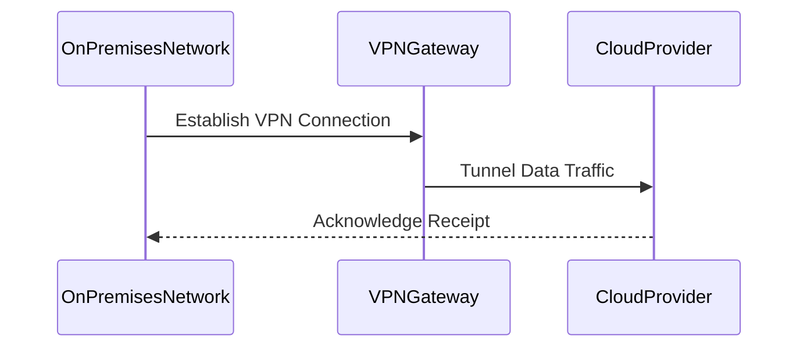

Hybrid Networking is a critical architectural approach for organizations that utilize both on-premises infrastructure and cloud services. By integrating these networks, businesses can leverage the flexibility and scalability of the cloud while retaining control over their on-premises resources. This integration facilitates unified communication, enhanced data transfer, and efficient resource sharing without compromising security or performance.

## Detailed Explanation of Hybrid Networking

### Design Pattern Overview

Hybrid Networking aims to connect disparate network environments into a unified, cohesive system. This is accomplished by establishing secure connections between on-premises data centers and cloud service providers such as AWS, Azure, Google Cloud, or others. It involves overcoming challenges related to network latency, security, and interoperability.

### Architectural Approaches

1. **Virtual Private Networks (VPNs):**
   - Establish secure, encrypted connections over the internet between on-premises and cloud networks.
   - Supports site-to-site and point-to-site configurations.
   - Suitable for low to medium traffic volumes.

2. **Direct Connect/Interconnect Services:**
   - Provides dedicated, private connectivity bypassing public internet to connect data centers to cloud services.
   - Offers reliable and consistent performance with lower latency.
   - Suitable for enterprises with high data throughput and security needs.

3. **Hybrid Access Points:**
   - Deploy access points in the cloud that facilitate seamless connectivity from on-premises networks.
   - Utilizes cloud-native networking services to enhance overall network management.

### Best Practices

- **Assess Network Requirements:**
  Evaluate the bandwidth, latency, and redundancy needs of your applications and networks.

- **Implement Strong Security Posture:**
  Use encryption, access controls, and regular network monitoring to protect data in transit.

- **Optimize Network Performance:**
  Use edge networking services and content delivery networks (CDNs) to minimize latency.

- **Continuously Monitor and Adjust:**
  Utilize network monitoring tools to assess performance and dynamically adjust connections as needed.

### Example Code

Below is a conceptual example of setting up a VPN connection using AWS:

```bash
aws ec2 create-vpn-connection \
    --type ipsec.1 \
    --customer-gateway-id cgw-abc0123456789abcdef \
    --vpn-gateway-id vgw-1234567890abcdef0 \
    --options '{"StaticRoutesOnly":false}'
```

### Diagrams



### Related Patterns

- **API Gateway Pattern:** Facilitates secure and scalable API access across hybrid networks.
- **Data Replication Pattern:** Supports data synchronization between on-premises and cloud databases.

### Additional Resources

- [AWS Hybrid Networking Guide](https://aws.amazon.com/solutions/hybrid/)
- [Azure Hybrid Networking Documentation](https://docs.microsoft.com/en-us/azure/architecture/example-scenario/hybrid/network-topologies)

## Final Summary

Hybrid Networking is indispensable for organizations that leverage cloud services but must also maintain on-premises infrastructure. By implementing secure, reliable networking solutions, organizations can benefit from the cloud's scalability and flexibility while ensuring that their legacy systems remain functional and integrated. This balanced approach mitigates issues related to network latency, security, and interoperability, paving the way for a successful hybrid cloud strategy.
