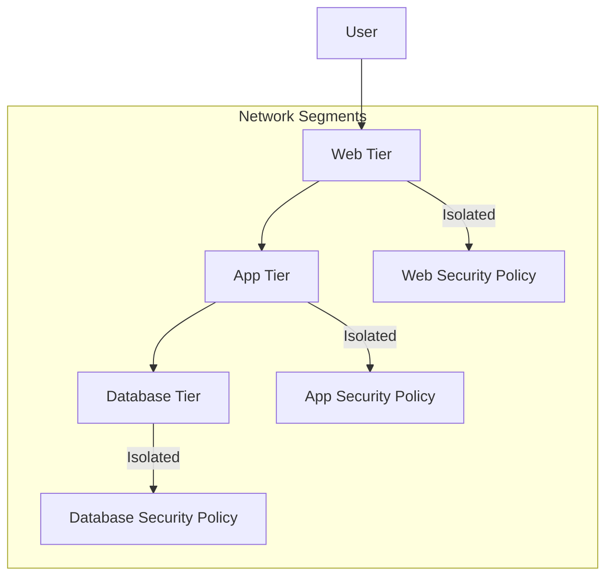

## Introduction to Micro-Segmentation

Micro-segmentation is a cutting-edge approach to cloud networking that focusses on enhancing security by dividing network environments into smaller, isolated segments at the workload level. This method reduces the potential attack surface within the network, creating granular security zones that are easier to manage and secure individually.

## Architectural Approaches

Micro-segmentation can be implemented through various architectural components and strategies:

1. **Hypervisor-based Segmentation**: Utilizing virtualization technologies to enforce policies inside the hypervisor, allowing for greater control and isolation of virtual machines.

2. **Network-based Segmentation**: Implementing micro-segmentation at the network layer using software-defined networking (SDN) to dynamically apply policies.

3. **Workload-based Segmentation**: Embedding security directly into workloads using host-based security applications or containers.

4. **Policy-driven Segmentation**: Using automation tools to create and manage policies that automatically adapt to changes in the network environment.

## Best Practices

- **Granular Policy Definition**: Define policies that are specific to applications and services to ensure minimal required permissions are granted.
- **Zero Trust Model**: Implement a Zero Trust architecture where every part of the network is always verified.
- **Automate Policy Management**: Utilize tools that enable automated and dynamic policy management for responsive and adaptive security practices.
- **Continuous Monitoring & Analysis**: Deploy monitoring tools that can provide real-time insights and analytics to detect and respond to security events.
- **Integration with DevOps**: Ensure that security policies are integrated seamlessly into DevOps processes to maintain agility and speed without compromising security.

## Example Code

Below is a basic example demonstrating how a micro-segmented security policy might be defined using an SDN approach in pseudocode.

```typescript
// Pseudocode for defining micro-segmentation policies

const segments = [
    { id: "web-tier", access: "HTTP, HTTPS" },
    { id: "app-tier", access: "SSH, HTTPS" },
    { id: "db-tier", access: "DB_PORT" }
];

function applyPolicy(segment) {
    SDN_Controller.applySecurityPolicy(segment.id, segment.access);
}

segments.forEach(segment => applyPolicy(segment));
```

## Diagrams

Below is UML diagram illustrating a simple micro-segmentation architecture:



## Related Patterns

- **Zero Trust Network**: Advocates for stringent identity verification for every user or device, eliminating reliance on network locations.
- **Container Security**: Focuses on enforcing security protocols within containerized applications as part of a micro-segmented strategy.
- **Network Isolation**: Emphasizes the compartmentalization of network resources to prevent lateral movement during a security breach.

## Additional Resources

- [Zero Trust Architecture](https://csrc.nist.gov/publications/detail/sp/800-207/final)
- [Software Defined Networking: Concepts](https://www.sdxcentral.com/sdn/definitions/what-the-definition-of-software-defined-networking/)

## Final Summary

Micro-segmentation stands out as a pivotal design pattern in cloud network security, allowing organizations to segment their network at the workload level. By applying detailed and dynamic security policies, businesses can minimize their attack surface and stop potential threats from moving laterally across the network. Integrating micro-segmentation within existing security frameworks and adopting a zero-trust mindset further fortifies an organization's defenses against cyber threats.
