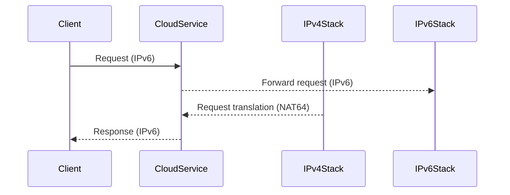

## Introduction

With the rapid growth of internet-connected devices and increased demand for IP addresses, IPv6 (Internet Protocol version 6) emerges as the next-generation internet protocol designed to supplement and eventually replace IPv4. The modern cloud ecosystem, with its scalability and high availability requirements, makes the transition to IPv6 not only necessary but critical. This design pattern focuses on strategies to support and transition cloud networking services to IPv6 while maintaining seamless operations.

## Design Pattern Explanation

### Problem Statement

The exhaustion of IPv4 addresses poses a significant bottleneck for the expansion of cloud-based services and infrastructure. As a solution, IPv6 provides a vastly expanded address space, improved routing efficiency, and better support for new services and devices. Transitioning to IPv6 presents challenges like compatibility with existing systems, security concerns, and the need to manage concurrent dual-stack environments.

### Solution

The IPv6 Support and Transition pattern provides a comprehensive framework to enable IPv6 within cloud infrastructures. This framework encompasses basic support for IPv6, dual-stack configurations, address translation mechanisms, and strategic roll-out plans for a complete transition.

#### Key Strategies

1. **Dual-Stack Implementation**: Run IPv4 and IPv6 protocols side-by-side, allowing applications and services to communicate over either protocol based on capability and preference.
2. **Tunneling**: Use tunneling techniques (e.g., 6to4, Teredo) to encapsulate IPv6 traffic over IPv4 networks, facilitating incremental deployment.
3. **Translation**: Implement translation mechanisms such as NAT64 and DNS64 to allow communication between IPv4-only and IPv6-only nodes.
4. **Policy and Planning**: Establish comprehensive policies for IPv6 addressing, security considerations, and operational practices tailored to the unique needs of cloud environments.

## Architectural Approaches

- **Infrastructure Setup**: Integrate IPv6 at the network infrastructure level, ensuring that cloud providers offer native IPv6 support on all virtual networks, load balancers, and security appliances.
- **Service Layer Adaptation**: Update cloud services to fully support IPv6, including APIs, storage solutions, and compute instances.
- **Security Measures**: Apply IPv6 firewall policies, intrusion detection, and mitigation strategies to protect against new attack vectors introduced by IPv6.

## Best Practices

- Conduct an initial audit to identify IPv4 dependencies and assess IPv6 readiness.
- Implement robust logging and monitoring systems to ensure visibility and troubleshooting capabilities in a dual-stack environment.
- Educate and train IT teams to manage and troubleshoot IPv6-related issues.
- Use address allocation schemes that simplify network management and enhance security.

## Example Code

```javascript
// Example on handling IPv6 connections in a Node.js server
const http = require('http');

const server = http.createServer((req, res) => {
  res.writeHead(200, {'Content-Type': 'text/plain'});
  res.end('Hello, IPv6 World\n');
});

// Listening on both IPv4 and IPv6
server.listen(8080, '::', () => {
  console.log('Server running at http://[::]:8080/');
});
```

## Diagrams



## Related Patterns

- **Elastic IP Addressing**: Dynamically allocate IP addresses in a scalable manner to manage resources efficiently.
- **Edge Networking**: Leverage IPv6 at the edge to improve access and resource management capabilities.

## Additional Resources

- [IETF - IPv6 Specifications](https://www.ietf.org/topics/ipv6/)
- [OWASP IPv6 Security](https://owasp.org/www-pdf-archive/IPv6-Security.pdf)
- [AWS IPv6 Adoption](https://aws.amazon.com/blogs/networking-and-content-delivery/ipv6-support/)

## Summary

IPv6 Support and Transition is a critical design pattern for modern cloud infrastructure. Adopting IPv6 allows cloud-based systems to scale effectively while addressing the limitations posed by IPv4's address exhaustion. By employing strategic transition techniques such as dual-stack operations, tunneling, and translation, organizations can ensure their cloud services remain future-proof, secure, and efficiently managed.
