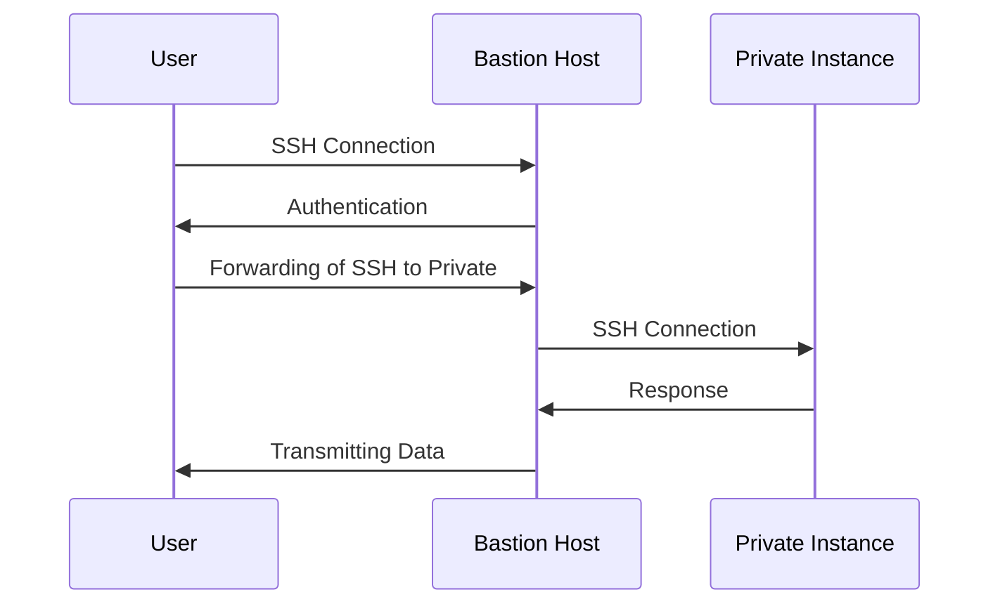

## Introduction

A Bastion Host acts as a fortified entry point to a specific part of a network, typically used to allow secure remote access to a cloud-based private network. By concentrating access to a single, manageable point (the Bastion), you can enhance security protocols and minimize exposure to external attacks.

## Detailed Explanation

### Architectural Approach

Bastion Hosts are common in cloud environments where direct access to instances in private subnets is restricted. The Bastion Host is typically placed in a public subnet and has the following responsibilities:

- **Restricting Access:** It controls and logs who can access the private network behind it.
- **Authentication:** It performs user authentication. Users must connect through the Bastion Host before accessing other resources.
- **Cryptographic Support:** Uses secure protocols like SSH (Secure Shell) or VPN (Virtual Private Network) for secure connections.

### Implementation Steps

1. **Setup:** Deploy the Bastion Host in a public subnet within your Virtual Private Cloud (VPC).
2. **Configuration:** Configure Security Groups to allow SSH or VPN access only to the Bastion Host.
3. **Access Management:** Integrate with authentication services like IAM or LDAP for managing user access.
4. **Connection:** Users connect to the Bastion Host and then initiate further connections to private instances.
5. **Monitoring:** Implement logging and monitoring for all access attempts through the Bastion Host, integrating with cloud-native monitoring services.

```bash
ssh -A user@bastion-host -i /path/to/private/key 
ssh user@private-instance
```

## UML Diagram



## Best Practices

- **Minimalist Configuration:** Only install necessary services to limit vulnerabilities.
- **Regular Updates:** Keep the system and security patches up-to-date.
- **Network Controls:** Utilize Network Access Control Lists (NACLs) and Security Groups to restrict network traffic.
- **Logging and Auditing:** Activate logging with services like AWS CloudTrail for auditing user activities.
- **Use Multi-Factor Authentication (MFA):** Enforce MFA to strengthen security for critical operations.

## Related Patterns

- **Jump Box:** Similar to Bastion Hosts but used for short-term administrative purposes.
- **VPN Gateway:** Offers a tunneling mechanism if more robust network encryption is needed.
- **Zero Trust Model:** Integrates with high-security environments requiring strict identity verification.

## Additional Resources

- [AWS Documentation on Bastion Hosts](https://docs.aws.amazon.com/solutions/latest/bastion-hosts/architecture.html)
- [Azure's Bastion Service](https://docs.microsoft.com/en-us/azure/bastion/bastion-overview)
- [Google Cloud: Setting up a Bastion Host](https://cloud.google.com/solutions/connecting-securely)

## Summary

Bastion Hosts are a critical component in securing access to cloud-based private networks. By mediating connections between external users and internal resources, they provide an added layer of security that allows organizations to manage internal networks efficiently while minimizing potential attack vectors. Implementing Bastion Hosts with adherence to security best practices ensures a robust defense against unauthorized access and data breaches.
