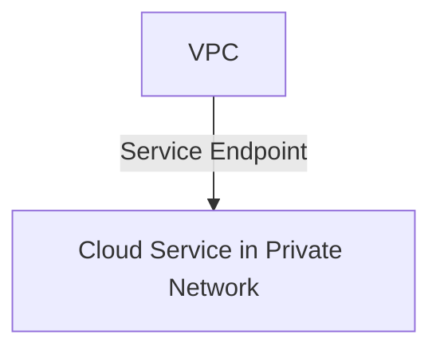

## Introduction to Service Endpoints

Service Endpoints is a cloud networking pattern that enables you to connect your Virtual Private Cloud (VPC) directly to supported cloud services over the cloud provider's internal network. By ensuring that the communication between your VPC and the various cloud services does not traverse the public internet, Service Endpoints enhances both security and performance.

## Architectural Overview

In a cloud environment, communication between your VPC and cloud services is essential. Typically, this communication might involve routing the traffic over the public internet, exposing it to potential security risks and incurring latency. Service Endpoints overcome these issues by allowing direct connectivity over the provider's backbone network.

### Key Components

- **VPC**: A logically isolated section of the cloud where you can launch resources in a virtual network.
- **Cloud Service**: Services provided by the cloud provider, such as storage, databases, computing resources, etc.
- **Endpoint**: A network endpoint that allows access to specific cloud services from within VPCs privately.

### How It Works

1. **Endpoint Creation**: Create a service endpoint in your VPC for a specific cloud service.
2. **Route Traffic**: Configure your VPC routing tables to direct traffic destined for the cloud service through the service endpoint. 
3. **Access**: Your resources within the VPC use the private IP and service endpoint to access the cloud service.

The concept can be visualized in the following diagram:



## Example Code

Assuming you're on AWS, you can create a VPC Endpoint for Amazon S3 using the AWS CLI:

```bash
aws ec2 create-vpc-endpoint --vpc-id vpc-0abcdef1234567890 --service-name com.amazonaws.us-east-1.s3 --vpc-endpoint-type Gateway
```

This command connects your VPC to Amazon S3 over the AWS internal network without going through the public internet.

## Best Practices

1. **Security Groups and Network ACLs**: Ensure that your security settings allow traffic from your on-premise or VPC resources to service endpoints.
2. **Resource Name and Tagging**: Use consistent naming and tagging to track and manage endpoints in multi-account environments.
3. **Monitoring and Logging**: Use Cloud Watch or equivalent to monitor endpoint traffic and performance.
4. **Update Policies**: Regularly update your endpoint policies to enforce the principle of least privilege.

## Related Patterns

- **API Gateway**: Provides a centralized entry point for accessing different services.
- **Direct Connection/Peering**: Direct or peering connections set up to reduce latency and improve throughput.
- **Private Link**: Similar to Service Endpoints but typically with more control and flexibility at the service provider's side.

## Additional Resources

- [AWS VPC Endpoints Documentation](https://docs.aws.amazon.com/vpc/latest/userguide/vpc-endpoints.html)
- [Azure Private Endpoints Documentation](https://docs.microsoft.com/en-us/azure/private-link/private-endpoint-overview)
- [Google Cloud Private Google Access Documentation](https://cloud.google.com/vpc/docs/private-google-access)

## Summary

Service Endpoints play a critical role in cloud networking by ensuring secure and efficient connectivity between VPCs and cloud services. They reduce exposure to the public internet, improve performance by relying on the cloud provider's backbone, and simplify network configurations. When architecting cloud solutions, service endpoints should be a go-to pattern for secure and performant connectivity to cloud services.
