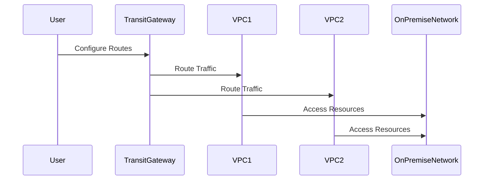

## Introduction to Transit Gateway

The **Transit Gateway** design pattern is a pivotal component in cloud networking, allowing you to simplify your network architecture by connecting multiple Virtual Private Clouds (VPCs) and on-premises networks. Unlike traditional approaches that require complex peering setups, a transit gateway acts as a central hub, facilitating seamless and scalable connectivity.

## Detailed Explanation

A **Transit Gateway** in cloud environments like AWS, Azure, and GCP helps manage large-scale network interconnections with ease. This pattern provides a novel approach to dealing with the challenges of scale and complexity in large, distributed networks by offering a centralized routing platform that connects your network components efficiently and securely.

### Core Components and Features

- **Centralized Hub**: Acts as a singular connection point for multiple networks, reducing the need for many-to-many peering.
- **Scalability**: Enables massive scaling by handling thousands of connections and high bandwidth workloads.
- **Security**: Provides enhanced security with centralized policy management and fine-grained access control.
- **Cost Efficiency**: Reduces costs by optimizing network resources and decreasing the likelihood of duplicate resources in different VPCs.
  
### Architectural Approach

The architecture of a **Transit Gateway** incorporates elements such as routing tables, VPN connectivity, and bandwidth sharing across an enterprise's cloud environment. Here's a potential setup:

- **Centralized Routing Table**: Simplifies routing logic across multiple networks.
- **Dynamic Route Propagation**: Automatically adjusts routes based on changing network topologies.
- **Multiprotocol Support**: Supports both IPv4 and IPv6, accommodating diverse application requirements.

### Sample Code and Configuration

Below is an example of how you might configure a Transit Gateway in a cloud environment like AWS using Terraform:

```hcl
resource "aws_ec2_transit_gateway" "example" {
  description = "Example Transit Gateway"

  // Set the default route table settings
  default_route_table_association = "disable"
  default_route_table_propagation = "disable"

  // Add tags to identify your resources
  tags = {
    Name = "ExampleTransitGateway"
  }
}

resource "aws_ec2_transit_gateway_vpc_attachment" "example" {
  subnet_ids         = ["subnet-12345678", "subnet-87654321"]
  transit_gateway_id = aws_ec2_transit_gateway.example.id
  vpc_id             = aws_vpc.example.id

  tags = {
    Name = "ExampleTransitGatewayAttachment"
  }
}
```

### Diagrams

#### UML Sequence Diagram:



## Related Patterns

- **Hub-and-Spoke Model**: Similar in concept with the central hub architecture.
- **Service Mesh**: Focuses on inter-service communication within a cluster, often complementing network patterns like Transit Gateway.
- **Cloud VPN**: Often used together to extend internal networks across cloud.

## Additional Resources

- [AWS Transit Gateway – Connect Your VPCs and On-Premises Networks](https://aws.amazon.com/transit-gateway/)
- [Azure Virtual WAN](https://azure.microsoft.com/en-us/services/virtual-wan/)
- [Google Cloud Network Connectivity](https://cloud.google.com/network-connectivity/docs/overview)

## Summary

The Transit Gateway design pattern is a foundational component in modern cloud network architecture. By centralizing and simplifying complex network topologies, it provides scalability, security, and cost-efficiency. Embracing this pattern can lead to more resilient and manageable networks, whether operating across multiple clouds or hybrid environments.
