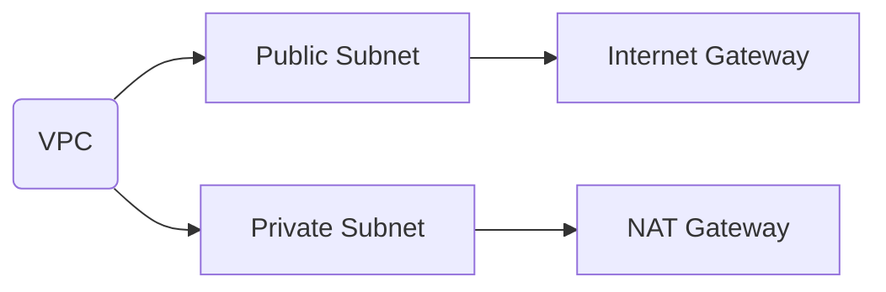

## Introduction

As organizations increasingly migrate to cloud providers, managing networking resources efficiently becomes crucial. **Subnets Segmentation** is a foundational pattern in cloud networking that involves dividing a Virtual Private Cloud (VPC) into smaller subnetworks. This segregation is essential for organizing resources, enforcing security protocols, and controlling access within a cloud environment.

## Detailed Explanation

Subnets are logical divisions of an IP network, and they play a critical role in cloud architecture. By segregating networks, enterprises can isolate and protect sensitive data, optimize network traffic, and streamline resource management.

### Benefits of Subnets Segmentation

1. **Enhanced Security**: By dividing a VPC into subnets, organizations can control traffic more effectively and implement network security measures specifically tailored to each segment.
   
2. **Improved Resource Organization**: Subnetting enables more effective management and categorization of cloud resources based on departments, project needs, or any criteria that suits an organization’s architecture.

3. **Optimized Traffic Management**: Segregating traffic at the subnet level facilitates more efficient routing and minimizes the potential for bottlenecks or collisions.

4. **Scale and Flexibility**: Easily manage scaling policies and adapt network configurations without affecting the entire network.

## Architectural Approaches

### Designing Subnets

1. **Public vs. Private Subnets**: Distinguish between public subnets for internet-facing resources and private subnets for internal-only resources.
   
2. **Subnet Size**: Carefully plan subnet IP ranges during VPC creation, considering not only current needs but also potential future growth.

3. **Network Access Control**: Use Network Access Control Lists (ACLs) and security groups to define and enforce traffic rules within and between subnets.

4. **Zoning for Compliance**: Implement subnet zones based on regulatory compliance and data sovereignty requirements, isolating sensitive data for security.

## Best Practices

1. **Least Privilege Principle**: Configure access controls to give only the necessary permissions to each subnet, limiting exposure to potential threats.

2. **Regular Auditing**: Periodically review subnet configurations and traffic patterns to ensure compliance with security policies and efficient resource use.

3. **Cost Management**: Monitor network-related costs and adjust subnet usage as necessary to optimize expenses without compromising performance or security.

4. **Automation Tools**: Leverage Infrastructure as Code (IaC) tools such as Terraform or AWS CloudFormation to manage and automate subnet configuration.

## Example Code

Below is a simple example using Terraform to create a VPC with subnets:

```hcl
provider "aws" {
  region = "us-west-2"
}

resource "aws_vpc" "my_vpc" {
  cidr_block = "10.0.0.0/16"
}

resource "aws_subnet" "public_subnet" {
  vpc_id                  = aws_vpc.my_vpc.id
  cidr_block              = "10.0.1.0/24"
  map_public_ip_on_launch = true
}

resource "aws_subnet" "private_subnet" {
  vpc_id     = aws_vpc.my_vpc.id
  cidr_block = "10.0.2.0/24"
}
```

## Diagrams

Here's diagram illustrating subnet segmentation:



## Related Patterns

- **VPC Peering**: Connect different VPCs for data and resource sharing while maintaining isolation.
- **Direct Connect**: Establish dedicated network connections from on-premises to AWS for improved bandwidth and security.
- **Service Mesh**: Manage microservice communications within a network with enhanced security and observability.

## Additional Resources

- [AWS Subnet Documentation](https://docs.aws.amazon.com/vpc/latest/userguide/vpc-subnets.html)
- [Azure Virtual Network Documentation](https://docs.microsoft.com/en-us/azure/virtual-network/virtual-networks-overview)
- [Google Cloud VPC Documentation](https://cloud.google.com/vpc/docs/subnets)

## Summary

Subnets Segmentation is fundamental for effective cloud networking, enhancing security, organization, and traffic management within VPCs. By thoughtfully designing subnet structures, applying best practices, and leveraging tools for automation, organizations can build robust, scalable, and secure cloud networks that meet business and regulatory requirements.
