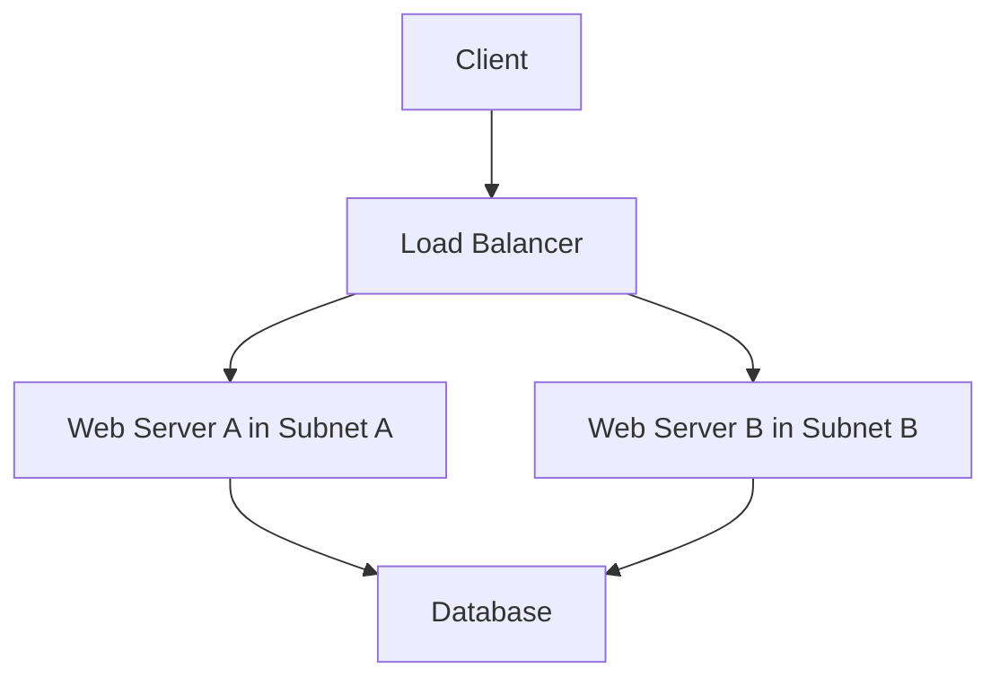

## Overview

High Availability Network Design is fundamental in modern cloud architecture, aiming to minimize downtime and ensure continuous operation by implementing redundant network paths and automatic failover mechanisms. This design pattern is crucial for maintaining service availability in the event of failures.

## Key Concepts

1. **Redundancy**: Deploy multiple instances of network components, such as routers and switches, to eliminate single points of failure.

2. **Failover Mechanisms**: Implement automatic switching to a standby system upon the failure of the primary system to maintain service continuity.

3. **Load Balancing**: Distribute traffic across multiple servers to prevent overload and ensure high performance and availability.

4. **Geographic Distribution**: Deploy network resources in multiple locations to mitigate risks associated with localized failures.

5. **Regular Testing**: Conduct regular failover and recovery testing to ensure systems respond correctly to failures.

## Architectural Approaches

### Dual Router Setup

A dual router setup ensures that if one router fails, the other can take over without interrupting network services. This is commonly implemented using protocols like VRRP (Virtual Router Redundancy Protocol).

### Multi-Zone Deployment

Deploying resources across multiple data centers or availability zones provides resilience against zone-specific failures and enhances disaster recovery capabilities.

### Diverse Connectivity

Utilizing multiple internet service providers or network paths ensures connectivity even if one provider experiences issues.

## Best Practices

- **Implement Monitoring and Alerts**: Use tools to monitor network performance and provide alerts for unusual behaviors or outages.
  
- **Optimize Configuration Management**: Employ configuration management tools to track changes and ensure consistency across network devices.

- **Use Scalable Solutions**: Design solutions that can adapt to increasing loads without sacrificing performance.

- **Plan for Maintenance**: Design the network to allow for maintenance without impacting availability.

## Example Code

Here's a simple example of a redundant network setup using configuration snippets similar to cloud infrastructure as code tools like Terraform:

```hcl
resource "aws_vpc" "main" {
  cidr_block = "10.0.0.0/16"
}

resource "aws_subnet" "subnet_a" {
  vpc_id     = aws_vpc.main.id
  cidr_block = "10.0.1.0/24"
  availability_zone = "us-west-1a"
}

resource "aws_subnet" "subnet_b" {
  vpc_id     = aws_vpc.main.id
  cidr_block = "10.0.2.0/24"
  availability_zone = "us-west-1b"
}

// Launch instances in both subnets to ensure redundancy
resource "aws_instance" "web_a" {
  ami           = "ami-0c55b159cbfafe1f0"
  instance_type = "t2.micro"
  subnet_id     = aws_subnet.subnet_a.id
}

resource "aws_instance" "web_b" {
  ami           = "ami-0c55b159cbfafe1f0"
  instance_type = "t2.micro"
  subnet_id     = aws_subnet.subnet_b.id
}
```

## Diagram



## Related Patterns

- **Load Balancer Pattern**: Distribute traffic efficiently across servers to ensure balanced network loads and improve availability.
- **Disaster Recovery Pattern**: Implement recovery strategies to restore data and operations after a network failure.
  
## Additional Resources

- [AWS High Availability Networking](https://aws.amazon.com/ha-networking/)
- [Azure Networking Best Practices](https://docs.microsoft.com/en-us/azure/architecture/best-practices/networking)
- [Google Cloud Networking Overview](https://cloud.google.com/networking/)
  
## Summary

High Availability Network Design is critical for ensuring that network infrastructures are robust, reliable, and can handle failures without service disruptions. By leveraging redundancy, failover mechanisms, and geographic distribution, organizations can significantly enhance their network's resiliency and reliability in today's cloud environments.
