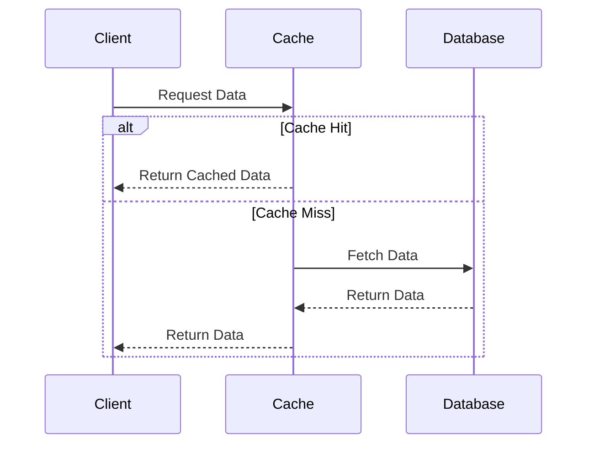

## Overview

In the realm of cloud computing, latency is a critical concern, particularly for applications requiring real-time processing or low-latency responses. Latency Optimization Strategies encompass various architectural approaches, best practices, and design patterns aimed at minimizing latency within cloud network architectures.

## Architectural Approaches

### Edge Computing

Edge computing moves data processing closer to the data source to reduce latency:
- **Benefits**: Reduces round-trip time by processing data near its source.
- **Use Case**: IoT devices in smart cities where rapid data processing is essential.

### Content Delivery Networks (CDNs)

Use CDNs for distributing content across geographically dispersed servers:
- **Benefits**: Minimizes latency by caching content closer to users.
- **Use Case**: Streaming services needing to deliver video with minimal buffering.

### Network Infrastructure Optimization

Optimize infrastructure through dedicated networking solutions:
- **Benefits**: Provides predictable latency by using direct connections (e.g., AWS Direct Connect).
- **Use Case**: Financial services requiring high-frequency trading with deterministic latency.

## Design Patterns

### Caching

Implement caching to store frequently accessed data:
- **Description**: Reduces latency by retrieving data from cache instead of the origin.
- **Tools**: Redis, Memcached.

### Asynchronous Messaging

Use asynchronous messaging to allow tasks to proceed without waiting for immediate responses:
- **Description**: Decouples components, enabling them to work independently.
- **Examples**: Apache Kafka, RabbitMQ.

### Load Balancing

Distribute traffic among multiple servers:
- **Description**: Ensures no single server becomes a bottleneck.
- **Tools**: NGINX, HAProxy.

## Best Practices

- **Data Compression**: Compress data to decrease transmission time over the network.
- **Efficient Protocols**: Utilize protocols like HTTP/2 which are optimized for web traffic.
- **Priority Traffic Routing**: Implement Quality of Service (QoS) policies to prioritize critical traffic.

## Example Code

### Implementing Caching with Redis

```java
import redis.clients.jedis.Jedis;

public class CachingExample {
    public static void main(String[] args) {
        Jedis jedis = new Jedis("localhost");
        String key = "cachedData";
        String value = jedis.get(key);

        if (value == null) {
            value = fetchFromDatabase();
            jedis.setex(key, 3600, value); // Cache for one hour
        }

        System.out.println("Data: " + value);
    }

    private static String fetchFromDatabase() {
        // Simulate data fetching
        return "DatabaseValue";
    }
}
```

## Diagrams

### UML Sequence Diagram: Cache Lookup



## Related Patterns

- **Retry Pattern**: Enhance reliability by retrying failed operations.
- **Bulkhead Pattern**: Isolate failures to prevent cascading impact on other services.

## Additional Resources

- [AWS Latency Optimization Strategies](https://aws.amazon.com/blogs/networking-and-content-delivery/optimizing-application-latency/)
- [Edge Computing in Azure](https://azure.microsoft.com/en-us/solutions/edge-computing/)
- [Google Cloud Networking](https://cloud.google.com/networking/docs)

## Summary

Latency Optimization Strategies help in addressing latency challenges in cloud networks, ensuring that critical applications maintain high performance. By leveraging architectural designs like edge computing, CDNs, and network optimizations, alongside patterns like caching and asynchronous messaging, organizations can significantly reduce latency. Understanding and implementing these strategies effectively can lead to substantial improvements in user experience and application responsiveness.
