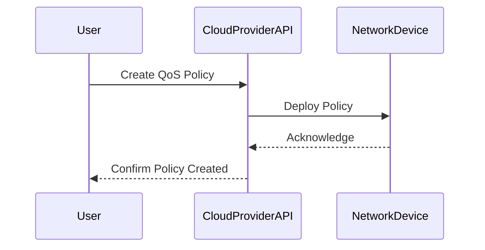

## Overview

Quality of Service (QoS) is a crucial aspect of cloud computing that involves managing network resources to provide different prioritization levels for various types of traffic. QoS ensures that mission-critical applications receive the necessary bandwidth and minimal latency to function correctly, especially in environments with limited resources or high network traffic.

## Detailed Explanation

QoS is implemented through a combination of techniques that tailor network behavior to meet specific performance criteria, which might include ensuring low latency, minimal jitter, or sufficient bandwidth for particular application types. This is especially vital in cloud computing environments where multiple users and services share finite resources.

### Key Components of QoS

1. **Traffic Classification**: This involves identifying and categorizing traffic types to determine how they should be handled.

2. **Traffic Shaping**: Limits outgoing traffic to ensure the network operates within its capacity, avoiding congestion.

3. **Prioritization**: Assigns higher priority to specific types of traffic, such as Voice over IP (VoIP) or video conferencing, which are sensitive to delays.

4. **Resource Reservation**: Allocates certain amounts of bandwidth or processing capacity for particular services.

5. **Load Balancing**: Distributes network traffic efficiently across servers or paths to avoid overloads.

### Example Code

Here's a conceptual example of setting up QoS policies using a hypothetical cloud provider's API, illustrating how you might prioritize VoIP traffic:

```javascript
const cloudProviderAPI = require('cloud-provider-sdk');

const qosPolicy = {
  name: "HighPriorityVoIP",
  description: "QoS policy to prioritize VoIP traffic.",
  matchingCriteria: {
    protocol: "UDP",
    port: 5060 // Standard port for SIP (VoIP)
  },
  actions: {
    prioritize: true,
    maxLatency: 100 // milliseconds
  }
};

cloudProviderAPI.network.createQoSPolicy(qosPolicy)
  .then(response => console.log("QoS policy created successfully:", response))
  .catch(error => console.error("Error creating QoS policy:", error));
```

## Diagrams

### UML Sequence Diagram

Below is a simplified sequence diagram illustrating the process of implementing a QoS policy in a cloud network.



## Best Practices

- **Analyze Network Traffic**: Regularly analyze network traffic to identify which services or applications require QoS policies.

- **Define Clear QoS Policies**: Establish clear, concise policies that outline the prioritization levels and performance metrics.

- **Monitor Performance**: Continuously monitor the network to ensure QoS policies are effective and adjust as necessary.

- **Test and Validate**: Regularly test QoS configurations to maintain optimal performance and compliance with SLAs.

## Related Patterns

- **Elastic Load Balancer**: Complements QoS by balancing traffic loads across multiple paths or servers, ensuring no single path is overwhelmed.

- **Service Level Agreement (SLA) Monitoring**: Ensures that QoS policies meet the agreed performance benchmarks, maintaining service reliability.

## Additional Resources

- [AWS Quality of Service](https://aws.amazon.com/qos/)
- [Microsoft Azure QoS Documentation](https://docs.microsoft.com/en-us/azure/networking/qos)
- [Google Cloud Networking](https://cloud.google.com/networking/docs)

## Summary

Quality of Service (QoS) is essential in cloud environments to manage and prioritize network traffic effectively, ensuring critical applications receive the necessary performance and reliability. By implementing well-defined QoS policies, organizations can maintain high standards of network performance and adhere to service level agreements, providing an optimal experience for end users.
