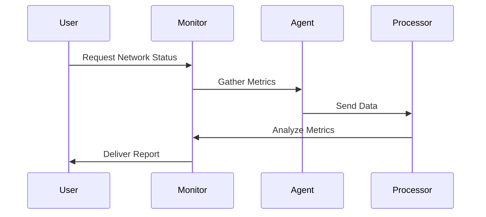

## Introduction

As cloud computing environments become increasingly complex and dynamic, maintaining a high degree of network performance and reliability has become more critical than ever. **Network Monitoring and Diagnostics** is a design pattern focused on using various tools and best practices to continuously observe network health, identify performance bottlenecks, and troubleshoot connectivity issues.

## Design Pattern Overview

Network Monitoring and Diagnostics is an approach that encompasses several practices and tools designed to ensure the optimal operation of network systems within cloud environments. Key aspects include:

- **Real-time Monitoring**: Continual assessment of network traffic flow, bandwidth usage, and latency.
- **Data Collection and Analysis**: Gathering relevant metrics and logs to facilitate analysis.
- **Automated Alerts**: Configuring systems to trigger alerts on detecting anomalies or threshold breaches.
- **Diagnostic Tools**: Leveraging network analyzers and troubleshooters to pinpoint issues.
- **Performance Tuning**: Using insights gained from monitoring and diagnostics to enhance network performance.

## Architectural Approaches

1. **Agent-based Monitoring**: Deploy agents within your infrastructure nodes to collect detailed metrics on network performance.
  
2. **Agentless Monitoring**: Utilize network-based monitoring solutions that do not require software installation on nodes, reducing overhead.

3. **Centralized Logging and Analysis**: Implement a centralized logging system where network logs are collected, stored, and analyzed to gain comprehensive insights.

4. **Network Topology Mapping**: Use tools that automatically map your network topology, making it easier to identify and troubleshoot connectivity issues.

## Best Practices

- **Define Key Performance Indicators (KPIs)**: Identify critical metrics such as latency, packet loss, and bandwidth usage to focus monitoring efforts.
  
- **Leverage Cloud-native Tools**: Utilize cloud service provider tools such as AWS CloudWatch, Google Cloud's Network Intelligence Center, or Azure Network Monitor for integrated monitoring solutions.
  
- **Automate Alerts and Reporting**: Set up automated systems to notify network administrators immediately upon detecting anomalies.
  
- **Regular Audits and Testing**: Perform regular audits on your network setups and conduct testing to ensure they can handle expected loads.

## Example Code

Below is a simplistic example using a Python script that retrieves network statistics using a popular library, psutil, to show basic network monitoring:

```python
import psutil

def print_network_stats():
    network_info = psutil.net_io_counters(pernic=True)
    for nic, stats in network_info.items():
        print(f"Interface: {nic}")
        print(f"Bytes Sent: {stats.bytes_sent}")
        print(f"Bytes Received: {stats.bytes_recv}")
        print(f"Packets Sent: {stats.packets_sent}")
        print(f"Packets Received: {stats.packets_recv}")

if __name__ == "__main__":
    print_network_stats()
```

## Diagrams

Here's a simple sequence diagram using Mermaid for a network monitoring process:



## Related Patterns

- **Automated Scaling**: Enhances network resilience by adjusting resources based on network traffic.
  
- **Fault Isolation**: Improves network diagnostics by identifying and isolating faults quickly.
  
- **Service Mesh**: Provides easy facilitation of networking communications between services, often integrating monitoring features.

## Additional Resources

- [AWS Network Monitoring Solutions](https://aws.amazon.com/networking/)
- [Google Cloud Network Intelligence Center](https://cloud.google.com/network-intelligence-center)
- [Azure Network Watcher](https://azure.microsoft.com/en-us/services/network-watcher/)

## Summary

The Network Monitoring and Diagnostics pattern provides an essential set of practices and tools aimed at maintaining network health within cloud environments. By utilizing real-time monitoring, diagnostics, and performance tuning, organizations can ensure robust network performance and quickly address any issues that arise. Employing a combination of cloud-native tools and best practices, businesses can effectively monitor, alert, troubleshoot, and optimize their networking infrastructure, leading to more resilient and efficient cloud operations.
