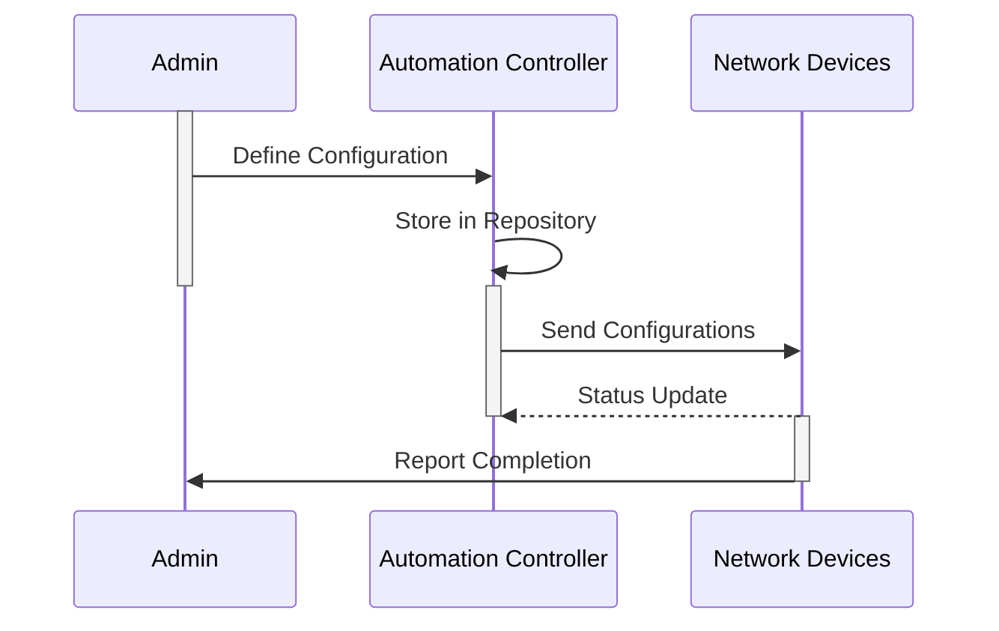

## Introduction

Network Automation refers to the process of using software to configure, manage, and operate networking devices within a cloud environment automatically. This approach aims to reduce the need for manual intervention, thereby minimizing potential human errors and increasing operational efficiency. Network automation is crucial especially in large-scale and complex network environments that require fast and accurate configurations.

## Detailed Explanation

### Key Concepts

1. **Automated Configuration Management**: Automated systems apply configuration changes consistently across multiple network devices. This reduces the risk of misconfigurations and ensures compliance with organizational standards.

2. **Scripting and Tools**: Network automation often involves writing scripts with languages such as Python or using automation tools like Ansible and Terraform to define the desired state of network resources.

3. **Orchestration**: This involves managing the holistic operation of multiple workflows to ensure that they are executed in the correct order and at the right time.

4. **Monitoring and Feedback Loops**: Continuously monitor network performance and automatically adjust configurations based on feedback to maintain the desired level of performance.

### Benefits

- **Error Reduction**: Automating repetitive tasks reduces the likelihood of human errors, which can lead to network outages or performance degradation.
  
- **Operational Efficiency**: Automation accelerates the execution of network adjustments, allowing for rapid scalability and responsiveness to changes in demand.
  
- **Consistency and Compliance**: Ensures consistent deployment of network configurations, aiding compliance with IT policies and standards.

## Architectural Approach

Network automation solutions typically follow a client-server model, where a central automation controller communicates with distributed network devices to apply configurations. The architecture often includes:

- **Automation Controller**: A centralized system that manages configuration templates, schedules deployment, and monitors execution.

- **Device Agents**: Software running on network devices that receives instructions from the controller and implements changes.

- **Configuration Repositories**: Source control repositories where configuration scripts and templates are stored and updated.

### Example Code

Here is an example using Python and Ansible to automate the configuration of network devices:

```python
import ansible_runner

def apply_network_configuration(inventory, playbook):
    r = ansible_runner.run(private_data_dir='/tmp', inventory=inventory, playbook=playbook)
    if r.rc != 0:
        print(f"Error: {r.events[-1]['stdout']}")
        return False
    print("Network configuration applied successfully.")
    return True

apply_network_configuration('inventory.yml', 'network_setup.yml')
```

## Diagrams

### Network Automation Workflow Diagram



## Related Patterns

- **Infrastructure as Code (IaC)**: Automating the provisioning of infrastructure, and is complementary to network automation.
- **Continuous Integration/Continuous Deployment (CI/CD)**: Ensures that network configurations can be tested and deployed in a consistent manner.
- **Self-Healing Networks**: Uses automation to detect and correct issues without human intervention.

## Additional Resources

- [Network Automation Fundamentals](https://www.cisco.com/)
- [Ansible for Network Automation](https://docs.ansible.com/)
- [Terraform for Networking](https://www.terraform.io/)

## Summary

Network Automation is an essential pattern within cloud computing, aimed at enhancing the reliability and efficiency of network operations. By leveraging tools, scripting, and orchestration, organizations can ensure consistent, error-free management of their networking equipment. This automation enables rapid scalability and flexibility, thereby aligning network operations with the dynamic needs of modern cloud environments.
