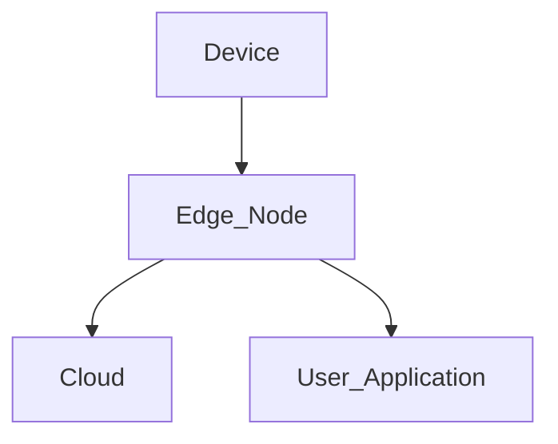

## Introduction

Edge Networking is an essential cloud computing design pattern that effectively extends network services closer to end-users and devices. This approach is particularly beneficial for Internet of Things (IoT) applications and scenarios requiring low-latency communication. By processing and analyzing data at the edge of the network, organizations can reduce latency, enhance bandwidth efficiency, and ensure quicker data insights.

## Detailed Explanation

### Architectural Approach

In traditional networking models, data is transmitted from devices to centralized cloud data centers for processing, which can lead to latency issues. Edge Networking shifts some of the workloads to the edge of the network, closer to the source. The architecture generally includes the following key components:

- **Edge Nodes**: These are devices or servers located at the edge of the network, responsible for data processing and initial analysis. They might be located at a company branch, a local facility, or embedded within IoT devices.
  
- **Cloud Connectivity**: Although processing is handled at the edge, these nodes connect back to the central cloud infrastructure, facilitating further comprehensive data analysis and storage.
  
- **Security Layers**: Through secure protocols and encryption methods, Edge Networking incorporates security measures to protect data both at rest and in transit.

### Use Cases

1. **IoT Management**: Edge Networking enables real-time data processing for IoT devices, crucial for applications like smart cities, healthcare monitoring systems, and autonomous vehicles.
2. **Content Delivery**: Reduces the load on central servers and speeds up media streaming services by serving content from the closest geographical location.
3. **Industrial Automation**: Manufacturing systems can process data from sensors locally at the edge to optimize production efficiency and monitor machinery health.

### Best Practices

1. **Deploy Robust Security**: Ensure that edge nodes are protected against vulnerabilities since they can often be physically accessible.
2. **Network Optimization**: Use load balancing and efficient protocols like MQTT for lightweight messaging in constrained environments.
3. **Data Management**: Implement data aggregation and filtering at edge nodes to optimize bandwidth and reduce unnecessary data transport.

## Example Code

Here's an example of a simple edge computing setup using AWS Greengrass, which facilitates edge computing on IoT devices:

```python
import greengrasssdk

client = greengrasssdk.client('iot-data')

def lambda_handler(event, context):
    response = client.publish(
        topic='my/topic',
        payload='Hello from Greengrass at the edge!'
    )
    return 'Message sent!'
```

## Diagrams



## Related Patterns

- **Content Delivery Network (CDN)**: Distributes content via network edges to improve access speed.
- **Decomposed Gateway**: An architecture pattern for scaling gateways in a microservices topology.

## Additional Resources

- AWS Greengrass [Documentation](https://docs.aws.amazon.com/greengrass/)
- Google Cloud's Edge TPU [Guide](https://cloud.google.com/edge-tpu/)

## Summary

Edge Networking is an impactful pattern in cloud architecture, bringing the power of cloud processing closer to data origins, significantly improving response times, and enabling efficient management of IoT ecosystems. As data volume and demand for real-time applications grow, edge networking will play an increasingly pivotal role in networking strategy.
