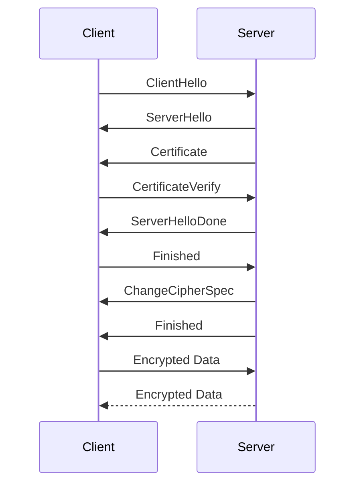

---

linkTitle: "Network Encryption"
title: "Network Encryption: Securing Data in Transit Across Networks"
category: "Networking Services in Cloud"
series: "Cloud Computing: Essential Patterns & Practices"
description: "Network Encryption is a critical cloud computing design pattern focused on securing data while it traverses from one point to another within or outside of a cloud environment, using techniques such as SSL/TLS and VPNs to ensure confidentiality, data integrity, and authentication."
categories:
- cloud
- security
- networking
tags:
- encryption
- SSL/TLS
- VPN
- data integrity
- cloud security
date: 2024-07-07
type: docs

canonical: "https://softwarepatternslexicon.com/18/4/27"
license: "© 2024 Tokenizer Inc. CC BY-NC-SA 4.0"
---

### Introduction

In the realm of cloud computing, one critical concern is securing data as it moves from one point to another, a process commonly referred to as "data in transit." Network encryption is an essential design pattern that ensures data confidentiality, integrity, and authentication using protocols and techniques like SSL/TLS, IPSec, and VPNs. This pattern is indispensable in protecting sensitive information from eavesdropping, tampering, or interception by unauthorized parties.

### Design Pattern Explanation

Network encryption encompasses several techniques used to encrypt data moving across networks:

- **SSL/TLS (Secure Sockets Layer / Transport Layer Security):** These protocols encrypt data exchanged between clients and servers. TLS, a successor to SSL, is widely used to secure web communications, ensuring that sensitive data such as credit card information and personal details remain confidential.
  
- **IPSec (Internet Protocol Security):** Often utilized in VPNs, IPSec encrypts and authenticates data packets sent over an IP network, securing communications at the network layer.
  
- **VPN (Virtual Private Network):** VPNs provide a secure tunnel for data to travel between a user's device and the network, leveraging encryption protocols such as IPSec or SSL/TLS to protect data in transit.

### Architectural Approaches

When implementing network encryption in cloud environments, architectural considerations play a key role:

1. **Layered Security:** Use encryption at multiple layers to protect data comprehensively, such as combining TLS for application-layer security with IPSec for network-layer protection.
   
2. **Certificate Management:** Implement robust processes for certificate issuance and revocation to support SSL/TLS encryption.
   
3. **Endpoint Security:** Ensure devices and network nodes are secured to prevent unauthorized access and data leakage.
   
4. **Performance Impact Assessment:** Evaluate the computational overhead introduced by encryption and optimize as necessary, potentially using offloading techniques or hardware acceleration.
   
5. **Compliance and Regulations:** Ensure encryption implementations meet regulatory standards such as GDPR, HIPAA, or PCI-DSS, which may have specific encryption requirements.

### Best Practices

- *Use up-to-date protocols*: Always use the latest version of encryption protocols (e.g., TLS 1.3) to guard against emerging vulnerabilities.
- *Strong Key Management*: Implement secure methods for key generation, distribution, and storage.
- *Regular Audits*: Conduct regular security assessments and audits to ensure encryption mechanisms remain effective.
- *Failover Mechanisms*: Ensure encrypted connections are resilient against failures by incorporating failover and redundancy.

### Example Code

**Implementing TLS in Java:**

```java
import javax.net.ssl.*;
import java.io.*;
import java.net.*;

public class TLSSocketClient {
    public static void main(String[] args) throws Exception {
        SSLSocketFactory factory = (SSLSocketFactory) SSLSocketFactory.getDefault();
        try (SSLSocket socket = (SSLSocket) factory.createSocket("hostname", 443)) {
            socket.startHandshake();
            try (BufferedWriter writer = new BufferedWriter(new OutputStreamWriter(socket.getOutputStream()));
                 BufferedReader reader = new BufferedReader(new InputStreamReader(socket.getInputStream()))) {
                writer.write("GET / HTTP/1.0\r\n\r\n");
                writer.flush();
                String line;
                while ((line = reader.readLine()) != null) {
                    System.out.println(line);
                }
            }
        }
    }
}
```

### Diagrams

Here's a simple sequence diagram illustrating data encryption in transit using TLS:



### Related Patterns

- **Data Encryption at Rest**: Securing stored data using encryption techniques to protect against physical theft or unauthorized access.
  
- **Access Control**: Implementing permissions and authentication mechanisms to ensure that only authorized users have access to sensitive data.

- **Logging and Monitoring**: Capturing logs and monitoring network traffic to detect and respond to suspicious activities promptly.

### Additional Resources

- [OpenSSL Documentation](https://www.openssl.org/docs/)
- [OWASP Transport Layer Security Cheat Sheet](https://cheatsheetseries.owasp.org/cheatsheets/Transport_Layer_Protection_Cheat_Sheet.html)
- [VPN Technologies Overview](https://tools.ietf.org/html/rfc2764)

### Summary

Network encryption is a fundamental pattern in cloud security that deals with protecting data as it is transmitted across networks. By employing protocols such as SSL/TLS and IPSec, cloud architectures can secure data from unauthorized access and ensure its confidentiality and integrity. Adhering to best practices in deployment and management is essential in maintaining secure and compliant communications across cloud services and networks.
