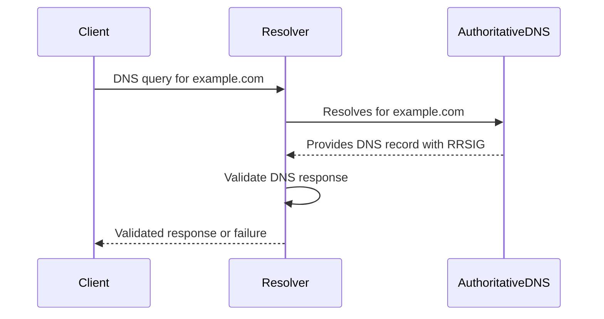

## Introduction to DNS Security Extensions (DNSSEC)

DNS Security Extensions (DNSSEC) are a suite of IETF specifications designed to protect the integrity and authenticity of DNS data. It extends the DNS protocol to digitally sign the records in a way that prevents unauthorized modification, thereby ensuring that clients receive genuine DNS responses. By doing this, DNSSEC protects against vulnerabilities such as DNS cache poisoning, man-in-the-middle attacks, and DNS spoofing.

This pattern is crucial for maintaining the sanctity of internet communications, where DNS remains a foundational service, translating human-readable domain names to machine-readable IP addresses.

## Problem Addressed

Traditional DNS is susceptible to various attacks because of its lack of encryption. Notably, DNS spoofing attacks where an attacker provides false DNS responses to a DNS query intended for another server, can lead users to malicious websites. This can have serious implications, including data theft, eavesdropping, and session hijacking.

## Solution

DNSSEC adds a layer of security to the DNS protocol by incorporating public key cryptography for signing DNS data. This includes:

1. **Signing DNS Responses**: Each DNS response is digitally signed. Clients can verify these signatures against public keys stored within DNS.

2. **Chain of Trust**: DNSSEC establishes a hierarchy of trust from the root DNS servers down to individual domain records. Each level in the DNS hierarchy signs the level directly below it.

3. **Key Management**: DNSSEC uses key pairs and manages key rollovers efficiently to ensure minimal disruption.

4. **Authenticated Denial of Existence**: DNSSEC can securely inform clients that specific domains do not exist without posing a risk to data integrity.

## Architectural Approach

Implementing DNSSEC involves a strategic approach to DNS architecture:

- **Key Generation**: A cryptographic public-private key pair is generated for each zone. 

- **Zone Signing**: The domain's DNS records are signed with the private key.

- **Key Distribution**: The public key is distributed and managed at recursive resolvers with trust anchors.

- **Recursive Resolver Security**: Resolvers should be capable of DNSSEC validation and configured to maintain DNSSEC trust anchors.

## Best Practices

- **Regular Key Rollover**: Periodically rollover keys to mitigate risks associated with leakage or cryptographic vulnerabilities.

- **Automated Key Management**: Use automated key management solutions for ensuring swift and error-free key rollover processes.

- **Monitor DNSSEC Validations**: Continuously monitor logs for DNSSEC validation errors and resolve issues promptly to maintain service integrity.

- **Stay Updated**: Keep your DNSSEC software and resolvers updated with the latest security patches and protocol advancements.

## Example Implementation

In this example, we illustrate a basic setup of DNSSEC for a domain using BIND:

```shell
dnssec-keygen -a RSASHA256 -b 2048 -n ZONE example.com

dnssec-keygen -f KSK -a RSASHA256 -b 2048 -n ZONE example.com

dnssec-signzone -o example.com db.example.com

zone "example.com" {
    type master;
    file "db.example.com.signed";
    allow-update { none; };
};
```

## Diagrams

### Sequence Diagram for DNSSEC Query Validation


## Related Patterns

- **Certificate Transparency**: Monitor the issuance of certificates to detect misissuance of SSL certificates.

- **Public Key Infrastructure (PKI)**: Ensures strong encryption and security across a network through a hierarchy of trusted certificate authorities.

## Additional Resources

- [IETF RFCs for DNSSEC](https://www.rfceditor.org/rfc/rfc4033)
- [DNSSEC Tools and Software](https://dnssec-tools.org/)
- [BIND DNSSEC Guide](https://bind9.readthedocs.io/en/latest/dnssec-guide.html)

## Summary

DNS Security Extensions (DNSSEC) play a vital role in securing DNS infrastructure from malicious attacks by ensuring authenticity and integrity of DNS data through cryptographic techniques. Implementing DNSSEC effectively can prevent DNS spoofing and enhance trust in IP networks, which is critical in today’s cloud computing environments.

By incorporating DNSSEC into cloud-based DNS services, organizations can protect user interactions, sensitive data exchanges, and financial transactions from fraudulent redirections and unauthorized interceptions.
