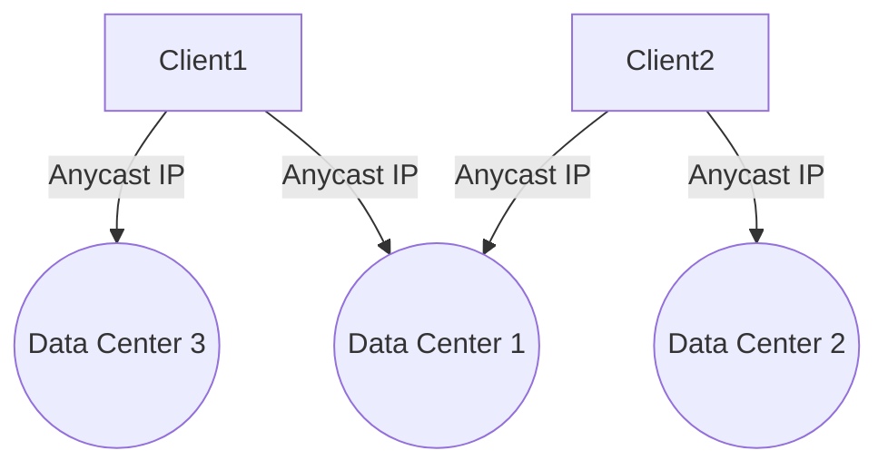

## Overview

Anycast Networking is a pattern used in cloud computing and network architecture where a single IP address is advertised from multiple locations. Client requests to this address are routed to the nearest location based on routing protocol decisions. This method enhances load distribution and redundancy, reduces latency, and increases fault tolerance.

## Design Pattern Details

### Architectural Approach

Anycast allows data packets from clients to take the shortest available path to a designated server among a group of servers sharing the same IP address. This is achieved through using routing protocols, such as Border Gateway Protocol (BGP), to determine the best path. Each server in the group can be located in different data centers globally, ensuring that users are directed to the nearest or most suitable server.

### Benefits

1. **Load Balancing:** Offers natural load balancing by distributing requests based on proximity and network conditions.
2. **Redundancy:** Increases the availability of services by providing multiple paths.
3. **Reduced Latency:** Minimizes delay as requests are served by the closest server.
4. **Fault Tolerance:** Automatically reroutes traffic in case of a node failure, enhancing resilience.

### Best Practices

- **Strategic Placement:** Deploy servers across strategic locations to optimize routing paths for better load distribution.
- **Monitoring & Analytics:** Implement monitoring systems to track performance and identify potential routing issues.
- **BGP Configuration:** Regularly review and update BGP configurations to accommodate network changes.
- **Security Measures:** Protect anycast networks from DDoS attacks by implementing robust security protocols.

### Example Code

While direct code examples for setting up anycast primarily involve network configuration rather than programming, here's a conceptual overview using BGP:

```bash
router bgp 65001
  network 10.1.1.0 mask 255.255.255.0
  neighbor 192.0.2.2 remote-as 65002
  neighbor 192.0.2.2 next-hop-self
```

In a cloud environment, several providers offer managed anycast services that streamline the setup process.

## Diagrams



## Related Patterns

- **GeoDNS Pattern:** Uses Domain Name System (DNS) to direct users to geographically closest servers based on their IP address.
- **Global Server Load Balancing (GSLB):** Distributes traffic across multiple servers in different locations to optimize resource use and decrease response time.

## Additional Resources

- [RFC 1546 - Host Anycasting Service](https://tools.ietf.org/html/rfc1546)
- [Google Cloud's Anycast](https://cloud.google.com/network-connectivity/docs/networking/anycast-overview)
- [AWS Global Accelerator](https://aws.amazon.com/global-accelerator/)

## Summary

Anycast Networking is a highly effective pattern for enhancing the performance and reliability of global services in the cloud. By ensuring that user requests are always routed to the nearest or most optimal datacenter, it supports seamless scalability, better user experience, and improved service availability. Integrating anycast into your cloud strategy requires thoughtful planning around network configuration and monitoring to maximize its benefits.
