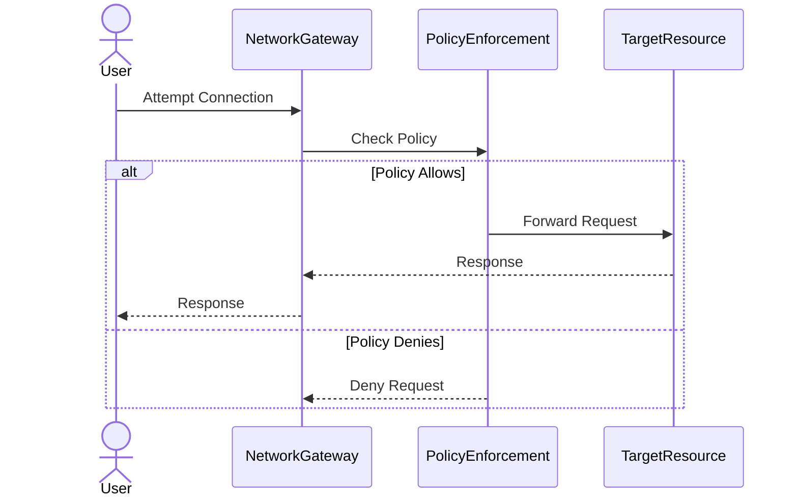

## Introduction

The Network Policy Enforcement pattern is a crucial design approach in cloud computing environments that ensures secure and compliant communication among resources. With cloud environments providing scalable and dynamic resources, managing and securing network communication becomes essential to prevent unauthorized access and potential data breaches.

## Detailed Explanation

### Architectural Characteristics

Network Policy Enforcement involves using predefined policies to control the flow of data over the network. These policies specify allowed or denied communications between specific resources or networks within a cloud infrastructure. The policies are typically expressed in terms of IP addresses, ports, protocols, and other networking elements.

#### Key Objectives:

- **Isolation:** Ensure that resources can be isolated from one another, protecting sensitive data and applications.
- **Access Control:** Restrict access to approved services and data paths.
- **Compliance:** Facilitate adherence to organizational and regulatory security standards.
- **Auditability:** Provide logging and audit capabilities to track communication attempts and policy violations.

### Implementation Strategies

1. **Policy Definition:** Define clear network policies that capture the security requirements and communication rules for your cloud environment.

2. **Enforcement Points:** Deploy enforcement mechanisms at critical network touchpoints, such as cloud firewalls, virtual routers, and overlay networks.

3. **Continuous Monitoring:** Implement tools to continuously monitor network traffic against established policies. Tools like AWS Network Firewall, Azure Network Security Groups, and GCP Firewall Rules can facilitate monitoring.

4. **Incident Response:** Establish procedures to respond to unauthorized access or policy violations promptly, ensuring quick recovery and maintaining security posture.

### Example Code

Here is an example of defining a simple network policy in Kubernetes to deny all ingress traffic to a specific application namespace:

```yaml
apiVersion: networking.k8s.io/v1
kind: NetworkPolicy
metadata:
  name: deny-all-ingress
  namespace: my-app
spec:
  podSelector: {}
  policyTypes:
  - Ingress
  ingress: []
```

This policy effectively blocks all incoming traffic to any pod in the `my-app` namespace unless otherwise specified by another permissive rule.

### Diagrams

Below is UML sequence diagram illustrating how Network Policy Enforcement operates once a policy is applied.



## Related Patterns

- **Zero Trust Network:** Works on the principle of not trusting any request by default and verifies every attempt before allowing resource access.
- **Microsegmentation:** An approach for dividing data centers and cloud environments into smaller zones, each with specific security policies.
- **Inbound and Outbound Traffic Control:** Tailors access controls based on the direction of traffic flow to ensure security.

## Additional Resources

- [Cloud Networking Principles and Practices](https://cloudnetworkingresource.com)
- [AWS Network Firewall Documentation](https://docs.aws.amazon.com/network-firewall)
- [Azure Network Security Groups](https://azure.microsoft.com/en-us/services/network-security-groups/)

## Summary

With the increasing complexity and number of threats present in cloud environments, Network Policy Enforcement becomes an essential pattern to manage and secure network communications. By defining and applying appropriate policies, organizations can safeguard their resources and ensure they operate within compliance boundaries, thereby reducing the risk of unauthorized access and data breaches.
