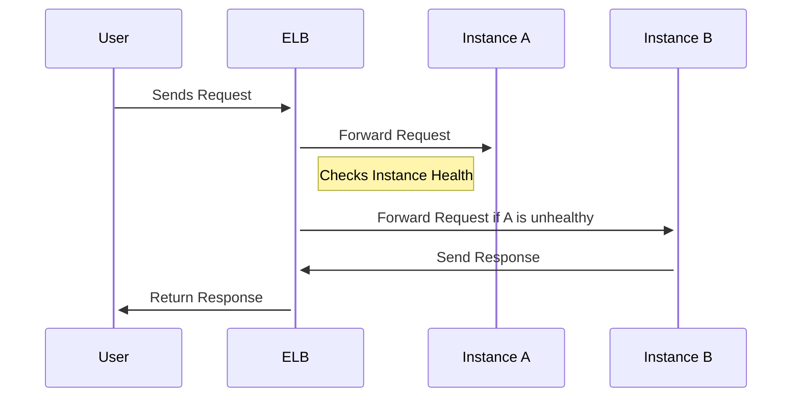

## Introduction

Elastic Load Balancing (ELB) is a critical design pattern in cloud computing that ensures the equitable distribution of incoming network traffic across multiple servers, containers, or virtual machines. This is essential for maintaining application availability, improving fault tolerance and optimizing resource utilization.

## Architectural Approach

Elastic Load Balancing serves as a single entry point to your application, seamlessly routing client requests to various backend instances. ELB handles real-time traffic adjustments and maintains the workload distribution dynamically to prevent any single instance from becoming overburdened.

### Key Features

- **Automatic Scaling**: ELB automatically adjusts to incoming traffic conditions, distributing traffic evenly and scaling when necessary.
- **Health Checks**: It continuously monitors the health of registered instances, automatically rerouting traffic to healthy instances when issues occur.
- **Fault Tolerance**: Distributes traffic to multiple instances spanning multiple availability zones, ensuring resilience to failures.
  
### Components

- **Listeners**: Define the protocol and port on which the load balancer listens for incoming connections.
- **Target Groups**: Routes requests to one or more registered targets (i.e., EC2 instances) using a configured routing algorithm.
- **Load Balancer Nodes**: Instances in multiple availability zones to facilitate high availability.

## Example Code

Here's an example using a fictional cloud provider's SDK to set up an ELB:

```java
ElasticLoadBalancing client = ElasticLoadBalancingClient.builder()
    .region(Region.US_EAST_1)
    .build();

CreateLoadBalancerRequest request = CreateLoadBalancerRequest.builder()
    .loadBalancerName("my-load-balancer")
    .listeners(Listener.builder()
        .protocol(Protocol.HTTP)
        .port(80)
        .targetGroupArn("target-group-arn")
        .build())
    .build();

CreateLoadBalancerResponse response = client.createLoadBalancer(request);

System.out.println("Created Load Balancer: " + response.loadBalancers().get(0).loadBalancerName());
```

## Diagrams



## Best Practices

- **Use Health Checks**: Always configure health checks for backend instances to ensure ELB distributes traffic only to healthy instances.
- **Security**: Utilize security groups and network ACLs to control inbound traffic to the ELB.
- **Enable Cross-Zone Load Balancing**: This feature ensures even distribution of traffic across instances in different zones.

## Related Patterns

- **Auto Scaling**: Automatically add or remove instances based on demand, often used in conjunction with ELB to ensure sufficient capacity.
- **Service Discovery**: To dynamically add back-end instances behind an ELB without manual configuration.

## Additional Resources

- [AWS Elastic Load Balancing Documentation](https://docs.aws.amazon.com/elasticloadbalancing)
- [GCP Load Balancing Guide](https://cloud.google.com/load-balancing/docs)

## Summary

Elastic Load Balancing is an indispensable pattern in cloud architecture for distributing incoming application traffic. By ensuring high availability, fault tolerance, and seamless scaling, ELB supports dynamic workloads and enhances your application's reliability. Adopting best practices such as proper health checks and security configurations will maximize the benefits of Elastic Load Balancing while integrating effectively with other cloud patterns like Auto Scaling and Service Discovery.
