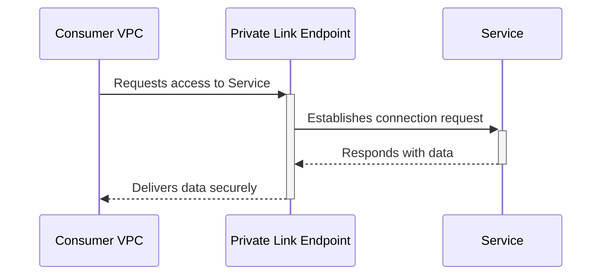

## Introduction

Private Link Services in cloud computing provide a secure way to connect services and resources without exposing them to the public internet. This pattern is essential for organizations looking to enhance security, privacy, and compliance by restricting network exposure while maintaining high-performance communication between services.

## Design Pattern Explanation

### Problem Statement

As cloud-based architectures grow in complexity, they encompass multiple services often residing in different Virtual Private Clouds (VPCs) or even across different cloud providers. Exposing these services to the public internet for communication can lead to security vulnerabilities and compliance issues. Organizations need a method to enable secure, direct access between services without using the public internet.

### Solution

Private Link Services facilitate direct, private connectivity between consumers and service resources via private endpoints, leveraging service provider networks. This pattern allows cloud resources and services to communicate securely across various networks while staying off the public network, greatly reducing exposure to internet-based threats.

### Components

1. **Consumer VPC**: The cloud network where the service consumer resides and which requires access to the service.
   
2. **Provider VPC**: The cloud network hosting the service to which access is needed.

3. **Endpoint**: A logical entity representing the service or resource that needs to be accessed privately.

4. **Private Link Endpoint**: A network interface that provides connectivity from the consumer network to the service resource located in the provider network.

5. **Domain Name System (DNS)**: Configuration to resolve service requests to the Private Link Endpoint.

### Workflow

1. **Configure Service Provider**: Set up the service in the provider VPC and create a private link endpoint for the service.

2. **DNS Configuration**: Update DNS within the consumer network to route service requests to the private link endpoint instead of the service’s public address.

3. **Access Control**: Establish permissions and policies to control access to the private link endpoint, ensuring that only authorized consumer resources can connect to the service.

4. **Connection Establishment**: Initiate connections from consumer resources to the private link endpoint using the private IP addresses assigned by your DNS configuration.

## Example Code

Below is a hypothetical representation of setting up a Private Link Endpoint using AWS CloudFormation:

```yaml
Resources:
  MyVPCEndpoint:
    Type: "AWS::EC2::VPCEndpoint"
    Properties:
      VpcId: "vpc-xxxxxxxx"
      ServiceName: "com.amazonaws.vpce.us-west-2.vpce-svc-xxxxxxxx"
      VpcEndpointType: Interface
      PrivateDnsEnabled: true
      SecurityGroupIds:
        - "sg-xxxxxxxx"
```

## Diagrams

### UML Sequence Diagram



## Best Practices

- **Access Control**: Implement strict security group rules and IAM policies to govern who can communicate over private links.

- **Monitoring and Logging**: Monitor traffic to and from private link endpoints to detect and respond to anomalies efficiently.

- **Maintain Resilience**: Utilize multiple availability zones to ensure high availability and fault tolerance for your private links.

- **Regular Audits**: Perform security audits and compliance checks regularly to ensure the private link configuration aligns with organizational policies.

## Related Patterns

- **Virtual Network Peering**: Facilitates a more simplified direct connection between VPCs in the same cloud provider.

- **Transit Gateway**: Ideal for managing multiple VPC connections as a central hub, it can also facilitate inter-region connectivity in the same cloud.

## Additional Resources

- [AWS PrivateLink Documentation](https://aws.amazon.com/privatelink/)
- [Azure Private Link Overview](https://docs.microsoft.com/en-us/azure/private-link/private-link-overview)
- [Understanding Private Connectivity in Google Cloud](https://cloud.google.com/solutions/understanding-private-connectivity)

## Summary

Private Link Services offer a robust solution for securely connecting services and consumers in cloud environments without exposing them to the public internet. By replacing the public access model with a private network configuration, organizations can significantly enhance their security posture, comply with regulatory standards, and maintain high performance in service communication. With the careful configuration and best practices, this pattern can seamlessly integrate into existing architectures, empowering businesses to leverage cloud resources without compromising security and privacy.
