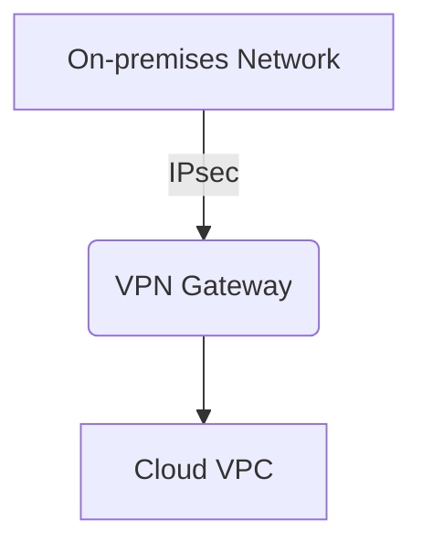

## Overview

VPN Connections are integral to ensuring secure, reliable, and private communication between on-premises infrastructure and cloud-based Virtual Private Clouds (VPCs). This pattern allows organizations to extend their network architecture into the cloud, providing seamless, encrypted access to cloud resources.

## Architectural Approaches

### Site-to-Site VPN

A site-to-site VPN connects entire networks to each other, such as connecting an on-premises network to a cloud VPC. This approach is suitable for organizations that need frequent and secure communication between distributed resources.

**Characteristics:**
- Utilizes IPsec protocols for encryption.
- Often implemented using hardware VPN devices.
- Suitable for connecting branch offices to corporate headquarters or cloud environments.

### Client-to-Site VPN

A client-to-site VPN connects an individual device to a remote network. This is useful for individual users who access cloud resources securely from remote locations.

**Characteristics:**
- Uses VPN client software on the device.
- Encrypts data using SSL or IPsec protocols.
- Ideal for remote workforce accessing cloud services.

## Best Practices

1. **Choose the Right Protocol**: IPsec is commonly used for site-to-site VPNs, whereas SSL is used for client-to-site VPNs. Choose based on security, performance, and compatibility.

2. **Implement Redundancy**: Configure multiple VPN connections to ensure failover capabilities and maintain uptime in case of a primary connection failure.

3. **Use Strong Authentication**: Employ multi-factor authentication (MFA) to enhance security and prevent unauthorized access.

4. **Monitor and Optimize**: Continuously monitor VPN traffic for performance bottlenecks and optimize configurations to suit changing network loads.

5. **Regularly Update**: Keep VPN software and hardware updated to protect against vulnerabilities and ensure compliance with security standards.

## Example Code

Here's a basic example configuration of a site-to-site VPN connection on AWS using Terraform:

```hcl
provider "aws" {
  region = "us-west-2"
}

resource "aws_vpc" "main" {
  cidr_block = "10.0.0.0/16"
}

resource "aws_vpn_gateway" "vgw" {
  vpc_id = aws_vpc.main.id
}

resource "aws_customer_gateway" "cgw" {
  bgp_asn    = 65000
  ip_address = "203.0.113.12"
  type       = "ipsec.1"
}

resource "aws_vpn_connection" "vpn" {
  customer_gateway_id = aws_customer_gateway.cgw.id
  vpn_gateway_id      = aws_vpn_gateway.vgw.id
  type                = "ipsec.1"
}
```

## Diagrams

Here is a simple network diagram using Mermaid to illustrate the VPN connection:



## Related Patterns

- **Direct Connect**: Provides a dedicated, private connection to cloud networks, often delivering more stable performance and lower latency than standard VPN connections.

- **Hybrid Networking**: Integrates various networking patterns, including VPNs, direct connections, for a comprehensive cloud connectivity solution.

- **Network Security Zone**: Implements security zones within a network to segregate traffic and enforce security policies tailored for different types of data and users.

## Additional Resources

- [AWS VPN Documentation](https://docs.aws.amazon.com/vpn/index.html)
- [Azure VPN Gateway Overview](https://docs.microsoft.com/en-us/azure/vpn-gateway/vpn-gateway-about-vpn-gateway-settings)
- [Google Cloud Interconnect](https://cloud.google.com/network-connectivity/docs/interconnect)

## Summary

VPN Connections provide a secure channel for bridging on-premises networks with cloud environments. They are essential for maintaining privacy and data integrity across hybrid cloud architectures. By implementing robust VPN patterns and best practices, organizations can achieve secure and efficient cloud connectivity tailored to their specific needs.
