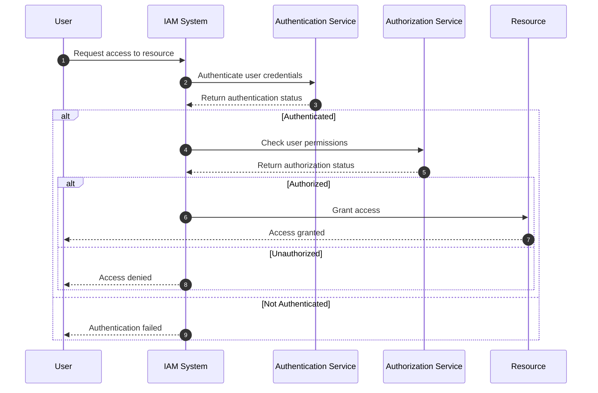

## Introduction

Identity and Access Management (IAM) is critical to maintaining security and compliance in cloud environments. IAM systems provide a structured framework to authenticate and authorize users, granting them appropriate access levels to various resources based on their role and the principle of least privilege. This pattern is essential for any organization looking to securely manage user access across multiple applications and services.

## Design Pattern Overview

The IAM pattern promotes centralizing user management and access control, providing organizations with the tools to create, modify, and remove user identities, while also setting up policies to govern the permissions each user has. The flexibility of IAM allows for fine-grained controls over who can do what with which resources.

### Key Components

1. **Authentication**: Verifying the identity of a user or system trying to access resources.
2. **Authorization**: Determining what an authenticated user or system is allowed to do.
3. **User Management**: Processes for creating, updating, and deleting user identities.
4. **Policy Management**: Establishing rules that dictate user permissions and access rights.

## Architectural Approaches

1. **Role-Based Access Control (RBAC)**: Predefined roles with specific permissions are assigned to users, simplifying management.
2. **Attribute-Based Access Control (ABAC)**: Access decisions are based on attributes (user, resource, environment).
3. **Rule-Based Access Control**: Uses fixed rules to govern access, often configured through if-then logic.
4. **Permission-Based Access**: Directly assigns permissions to users, providing flexibility but increased administrative overhead.

## Best Practices

- **Principle of Least Privilege**: Grant users only the permissions they need to perform their job.
- **Regular Audits**: Conduct audits of user access and activities to identify unauthorized access and refine policies.
- **Multi-Factor Authentication (MFA)**: Enhance security by requiring multiple forms of verification.
- **Automated Provisioning**: Automate user onboarding and offboarding to ensure policies are consistently applied.

## Example Code

Here's an example of creating an IAM policy using AWS IAM JSON policy documents:

```json
{
  "Version": "2012-10-17",
  "Statement": [
    {
      "Effect": "Allow",
      "Action": [
        "s3:GetObject"
      ],
      "Resource": [
        "arn:aws:s3:::example-bucket/*"
      ]
    }
  ]
}
```

This policy allows read access (`GetObject`) to objects within a specific S3 bucket.

## Diagrams

### Sequence Diagram of Authentication and Authorization



## Related Patterns

- **Federated Identity Management**: Involves allowing users to access multiple systems using a single set of credentials, often bridging corporate identities with external systems.
- **Service Identity Management**: Focuses on managing identities and access for services, rather than human users, often used in microservices architectures.
- **Access Policy Management**: Dedicated patterns for authoring, deploying, and managing access control policies across the enterprise.

## Additional Resources

- [AWS Identity and Access Management Documentation](https://aws.amazon.com/iam/)
- [Google Cloud Identity Platform](https://cloud.google.com/identity)
- [Azure Active Directory (AAD)](https://azure.microsoft.com/en-us/services/active-directory/)

## Summary

Identity and Access Management (IAM) is a vital pattern for securing cloud environments, ensuring that users have the right level of access to resources in an efficient and scalable manner. By centralizing identity and access controls, organizations can better protect their data, reduce the risk of unauthorized access, and maintain compliance with industry standards. IAM practices such as RBAC, MFA, and automated provisioning are key strategies to effectively implement this pattern.
