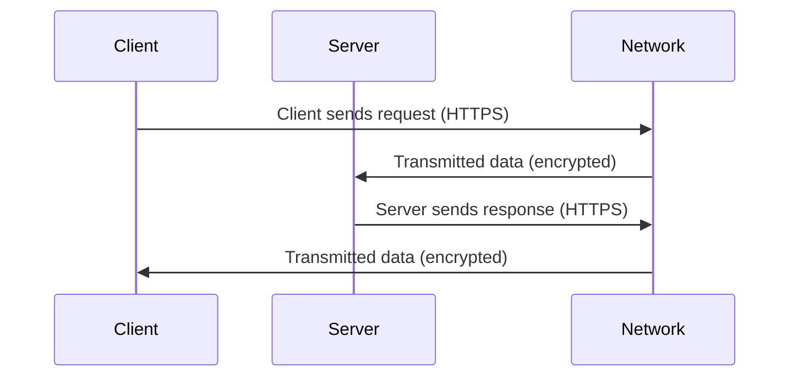

## Introduction

In cloud computing environments, protecting data is paramount as it transits over networks and resides in storage systems. "Encryption in Transit and at Rest" is a critical design pattern that ensures data confidentiality and integrity. By encrypting data when it is transmitted over networks ("in transit") and when it is stored ("at rest"), organizations can guard against unauthorized access and breaches.

## Detailed Explanation

### Encryption in Transit

- **Definition**: Encryption in transit protects data that is transmitted over networks. It prevents eavesdroppers from intercepting and reading data as it moves between systems, be it client-server communication or between microservices in a distributed architecture.
- **Protocols and Techniques**:
  - **TLS/SSL**: Transport Layer Security (TLS) and its predecessor Secure Sockets Layer (SSL) are cryptographic protocols designed to provide secure communication over a computer network.
  - **VPNs**: Virtual Private Networks (VPNs) extend a private network across a public network, facilitating encrypted communication.
  - **End-to-End Encryption (E2EE)**: In E2EE, data is encrypted on the sender’s system and only decrypted by the intended recipient, with no intermediate nodes being able to decrypt the data.

### Encryption at Rest

- **Definition**: Encryption at rest protects data stored on physical media. It ensures that even if the storage medium is breached or improperly accessed, the data remains unintelligible without the corresponding decryption keys.
- **Approaches and Tools**:
  - **Disk Encryption**: Encrypts entire volumes on storage devices (e.g., BitLocker, LUKS).
  - **File/Database Encryption**: Individual files or databases are encrypted, often using database-specific tools or encryption libraries (e.g., TDE in SQL Server, Transparent Data Encryption).
  - **Cloud Storage Encryption**: Most cloud providers offer built-in options for encrypting stored data (e.g., AWS KMS, GCP CMEK).

## Architectural Approaches

1. **Layered Security Model**: Employ multiple layers of encryption and security controls to reinforce protection e.g., TLS for data in motion and AES for data at rest.
2. **Automated Key Management**: Utilize Managed Key Management Services (KMS) to automate key creation, rotation, and deletion.
3. **Compliance-driven Encryption**: All implementations should align with compliance requirements such as GDPR, HIPAA, which often have specific encryption mandates.
4. **Zero Trust Networking**: Adopt a zero-trust architecture to ensure all transmitted data is encrypted, regardless of network perimeter.

## Best Practices

- **Use Strong Encryption Algorithms**: Always use strong and vetted algorithms like AES-256 for symmetric encryption and RSA, ECC for asymmetric encryption.
- **Regular Key Rotation**: Periodically rotate encryption keys to minimize the risk of keys being compromised.
- **Audit and Monitor Encryption Processes**: Implement logging and monitoring to detect and respond to potential security breaches related to encryption.
- **Backups and Redundancy**: Ensure encrypted data backups are regularly tested and stored in redundant locations.

## Example Code

Here's an example in Java using `javax.crypto` for encrypting data at rest.

```java
import javax.crypto.Cipher;
import javax.crypto.KeyGenerator;
import javax.crypto.SecretKey;
import javax.crypto.spec.SecretKeySpec;

public class EncryptionExample {

    public static byte[] encryptData(String data, SecretKey key) throws Exception {
        Cipher cipher = Cipher.getInstance("AES");
        cipher.init(Cipher.ENCRYPT_MODE, key);
        return cipher.doFinal(data.getBytes());
    }
    
    public static SecretKey generateSecretKey() throws Exception {
        KeyGenerator keyGenerator = KeyGenerator.getInstance("AES");
        keyGenerator.init(256); // Key size
        return keyGenerator.generateKey();
    }

    public static void main(String[] args) throws Exception {
        String data = "Sensitive Data";
        SecretKey secretKey = generateSecretKey();
        byte[] encryptedData = encryptData(data, secretKey);

        System.out.println("Encrypted Data: " + new String(encryptedData));
    }
}
```

## Diagrams

Below is a basic sequence diagram illustrating the encryption in transit process.



## Related Patterns

- **Secure Data Exchange Pattern**: Focuses on ensuring data exchanges between distributed systems are secure.
- **Data Locality Pattern**: Often paired with encryption at rest to optimize geographic compliance and latency.

## Additional Resources

- [NIST Special Publication 800-57](https://csrc.nist.gov/publications/detail/sp/800-57-part-1/rev-5/final): A guideline for key management.
- [OWASP Top Ten Security Risks](https://owasp.org/www-project-top-ten/): Provides insights into common web application vulnerabilities, including data exposure risks.

## Summary

The "Encryption in Transit and at Rest" pattern is essential for maintaining the security and integrity of your data in cloud environments. By employing robust encryption mechanisms, adhering to compliance standards, and implementing best practices for key management, organizations can significantly mitigate the risks of data exposure and breaches. This design pattern functions as a cornerstone of secure cloud architecture, vital for protecting sensitive information in an increasingly digital world.
