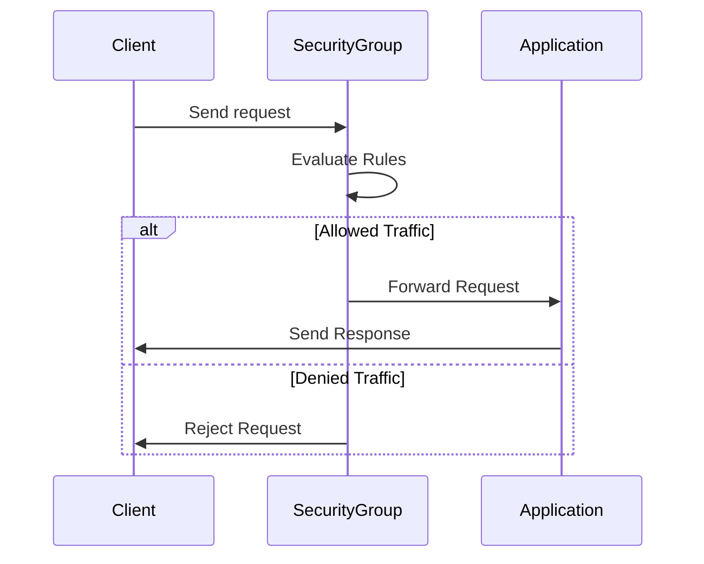

## Introduction
Security Groups and Firewalls play a vital role in securing cloud environments by controlling the inbound and outbound network traffic to and from cloud resources. This pattern defines a set of rules that dictate which traffic is permissible and which should be blocked, providing a robust layer of security.

## Detailed Explanation

### Security Groups
Security groups act as virtual firewalls that offer rule-based filtering of network traffic for cloud resources. Each security group encompasses a collection of rules that specify permissible inbound and outbound traffic. Security groups are stateful, meaning that if an incoming request is permitted, the outgoing traffic is automatically allowed.

**Features of Security Groups:**
- **Rule-Based Filtering:** Define explicit rules for accepting or rejecting traffic on specified ports and protocols.
- **Statefulness:** Automatically manage traffic states, simplifying rule management.
- **Resource Association:** Attach security groups directly to cloud instances or services.

### Firewalls
Firewalls are integral components that enforce access control policies. While both security groups and firewalls serve similar functions, firewalls often work at a more global level compared to instance-level security groups.

**Types of Firewalls:**
- **Network Firewalls:** Protect entire networks by controlling traffic at entry and exit points.
- **Application Firewalls:** Focus on specific applications to block unwanted in-app traffic.

## Architectural Approaches

### Layered Security Architecture
Implement security groups and firewalls within a layered security strategy incorporating multiple layers of defense. This provides redundancy and increases the resilience of the system against attacks.

### Least Privilege Principle
Apply the principle of least privilege by allowing only minimal necessary access. Define specific, limited rules that allow essential traffic and deny everything else to reduce potential attack vectors.

## Best Practices
- **Regular Audits:** Continuously audit security group and firewall rules to ensure they align with current security policies.
- **Rule Minimization:** Avoid overly permissive rules; define specific and narrow rules to minimize unnecessary exposure.
- **Incident Monitoring:** Enable real-time logging and monitoring of network traffic to proactively identify and respond to incidents.
- **Automation:** Use infrastructure as code tools to manage security rules to ensure consistency and repeatability.

## Example Code

Here's an example of defining an AWS security group using Terraform:

```hcl
resource "aws_security_group" "example" {
  name        = "example-group"
  description = "Security group for example purposes"

  ingress {
    from_port   = 22
    to_port     = 22
    protocol    = "tcp"
    cidr_blocks = ["0.0.0.0/0"]
  }

  egress {
    from_port   = 0
    to_port     = 0
    protocol    = "-1"
    cidr_blocks = ["0.0.0.0/0"]
  }
}
```

## Diagrams

Below is sequence diagram illustrating the sequence of traffic checking against a security group.



## Related Patterns

- **Identity and Access Management (IAM):** Manages user and service permissions and enhances security.
- **Zero Trust Architecture:** Assumes no implied trust within network boundaries, imposing strict verification.
- **VPNs:** Secure connections between different network parts or between user devices and cloud services.

## Additional Resources
- [AWS Security Groups](https://docs.aws.amazon.com/vpc/latest/userguide/VPC_SecurityGroups.html)
- [Azure Network Security Groups](https://docs.microsoft.com/en-us/azure/virtual-network/security-overview)
- [Google Cloud Firewalls](https://cloud.google.com/vpc/docs/firewalls)

## Summary
Security Groups and Firewalls are pivotal elements in safeguarding cloud resources by defining and enforcing rules to control network traffic efficiently. By understanding their operation, leveraging best practices, and integrating them into broader security architectures, organizations can significantly enhance their security posture in the cloud.
