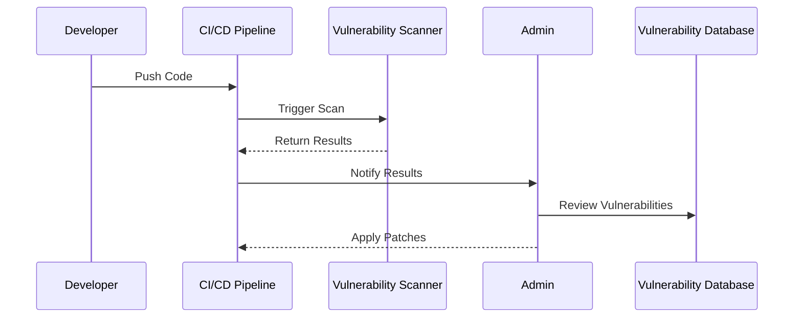

In the evolving landscape of cloud computing, ensuring the security of systems and data is paramount. Vulnerability Scanning and Management is a key pattern that involves periodically checking for security weaknesses within a system and implementing timely patches to reduce potential risks. This approach safeguards against unauthorized access, data breaches, and other security threats that could compromise sensitive information and system integrity.

## Detailed Explanation

### Design Pattern Overview

Vulnerability Scanning and Management encompasses identifying, assessing, and mitigating security vulnerabilities in cloud environments. This practice involves:

1. **Regular Scanning**: Automated tools are used to perform regular scans of cloud resources to identify potential security vulnerabilities.
2. **Vulnerability Assessment**: The outcome of scans is analyzed to determine the severity and impact of identified vulnerabilities.
3. **Patch Management**: Timely application of patches and updates to address known vulnerabilities and reduce the risk of exploitation.

### Architectural Approach

Vulnerability Scanning and Management relies on a continuous and proactive approach to cloud security. The architecture usually integrates the following components:

- **Automated Scanning Tools**: Tools like Nessus, Qualys, or AWS Inspector are employed for scheduled and on-demand scans.
- **Vulnerability Database**: A repository that houses information about known vulnerabilities, often linked to databases such as CVE (Common Vulnerabilities and Exposures).
- **Notification System**: Alerts and reports are generated to notify administrators about critical vulnerabilities and required actions.
- **Patch Deployment**: Systems for automated or manual patching to ensure vulnerabilities are addressed effectively.

### Best Practices

1. **Continuous Monitoring**: Implement automated scanning at regular intervals or based on specific events.
2. **Prioritization**: Focus resources on high-impact and high-severity vulnerabilities using a risk-based approach.
3. **Automation**: Leverage automation for consistent scanning, reporting, and patching processes.
4. **Compliance**: Ensure scanning and management processes comply with relevant industry standards and regulations, such as GDPR or HIPAA.
5. **Integration**: Embed vulnerability management into the CI/CD pipeline for continuous updates and security checks.

## Example Code

While example code for vulnerability scanning may largely depend on the specific tools and platforms, here is a concise script for obtaining vulnerability scan reports using an imaginary vulnerability management API:

```python
import requests

API_ENDPOINT = 'https://api.vulnerabilityscanner.com/v1/scans'
API_KEY = 'your_api_key'

headers = {
    'Authorization': f'Bearer {API_KEY}',
    'Content-Type': 'application/json'
}

def get_scan_report(scan_id):
    response = requests.get(f'{API_ENDPOINT}/{scan_id}', headers=headers)
    if response.status_code == 200:
        return response.json()
    else:
        raise Exception('Failed to retrieve scan report')

scan_report = get_scan_report('sample_scan_id')
print(scan_report)
```

## UML Diagram

To understand the process, consider the following sequence diagram illustrating the interaction between components in a typical vulnerability scanning workflow:



## Related Patterns

- **Security Information and Event Management (SIEM)**: Collecting and analyzing security data for real-time monitoring.
- **Incident Response and Management**: Procedures for handling security incidents efficiently.

## Additional Resources

- [NIST: Vulnerability Management](https://csrc.nist.gov)
- [OWASP Vulnerability Management Guide](https://owasp.org/www-project-vulnerable-web-applications-directory/)

## Summary

Vulnerability Scanning and Management is integral to maintaining robust security in cloud environments. By implementing regular scans and applying timely patches, organizations can mitigate risks, protect sensitive data, and maintain compliance with industry standards. This proactive approach not only enhances security but also contributes to overall operational resilience in cloud-based systems.
