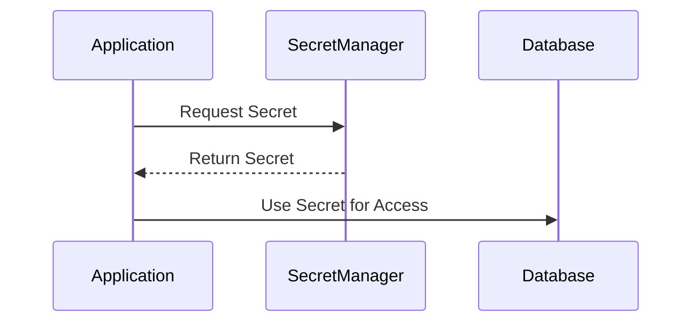

## Overview

In the realm of cloud computing, managing sensitive information such as passwords, API keys, encryption keys, and certificates is critical. Secure Secret Management is a design pattern dedicated to ensuring such sensitive information is stored and accessed securely, minimizing unauthorized access risks. Cloud environments present unique challenges and dynamics that necessitate specialized solutions for secure data management.

## Detailed Explanation

### Key Concepts

1. **Secrets**: Any sensitive information that must be tightly controlled, such as passwords, API tokens, SSH keys, and client secrets.
2. **Secret Management**: The practice of handling secrets throughout their lifecycle, from creation through distribution to eventual rotation and destruction.
3. **Access Control**: The process of defining and managing which users or services can read or write particular secrets.

### Architectural Approaches

- **Centralized Secret Storage**: Storing all secrets in a centralized, secure database that is strictly controlled. Tools like HashiCorp Vault, AWS Secrets Manager, and Azure Key Vault exemplify this pattern.
- **Role-Based Access Control (RBAC)**: Implementing strict policies that define who has access to specific secrets based on their roles within an organization. This can be enforced through cloud provider IAM capabilities.
- **Encryption-at-Rest and In-Transit**: Ensuring that all secrets are encrypted when stored and remain encrypted during transmission to prevent interception by unauthorized entities.
- **Audit Logging**: Keeping meticulous logs of access to secrets for monitoring and compliance purposes, and to quickly identify possible security incidents.

### Best Practices

- **Least Privilege Principle**: Grant access only to what is necessary for users and applications to perform their functions, reducing the attack surface.
- **Secret Rotation**: Regularly updating secrets to mitigate the risk of unauthorized access from leaked or compromised data.
- **Environment Segregation**: Isolating secrets by environment (e.g., development, staging, production) to limit the potential impact of a breach.
- **Automated Auditing**: Using automated tooling to constantly monitor access patterns and alert on suspicious activities.

### Example Code

```java
// Example of using AWS Secrets Manager in Java
AWSSecretsManager client  = AWSSecretsManagerClientBuilder.standard()
                               .withRegion(Regions.DEFAULT_REGION)
                               .build();

String secretName = "myDatabaseSecret";
GetSecretValueRequest getSecretValueRequest = new GetSecretValueRequest()
                                        .withSecretId(secretName);
GetSecretValueResult getSecretValueResult = client.getSecretValue(getSecretValueRequest);

String secret = getSecretValueResult.getSecretString();
```

### Diagrams



### Related Patterns

- **Identity and Access Management (IAM)**: Focuses on managing user identities and their access permissions within a cloud environment.
- **Encryption**: Emphasizes techniques for encrypting data both at rest and in transit.
- **Zero Trust Security**: Advocates for securing identities, endpoints, networks, and resources, without implicitly trusting connections.

### Additional Resources

- [HashiCorp Vault Documentation](https://www.vaultproject.io/docs)
- [AWS Secrets Manager Documentation](https://docs.aws.amazon.com/secretsmanager/latest/userguide/intro.html)
- [Azure Key Vault Documentation](https://docs.microsoft.com/en-us/azure/key-vault/general/basic-concepts)

## Summary

Secure Secret Management is an essential pattern in modern cloud security practices, facilitating secure storage, access, and lifecycle management of sensitive data like API keys and passwords. By adhering to best practices, leveraging centralized management tools, and instituting strong access controls and auditing measures, organizations can significantly bolster their security posture in cloud environments.
