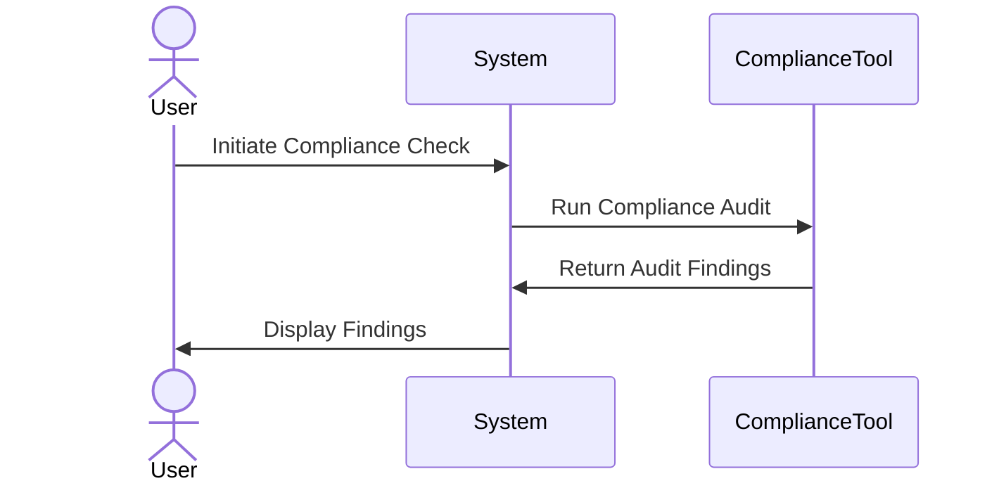

## Introduction

Compliance Management in cloud computing involves the implementation of processes, tools, and practices to ensure that cloud-based systems and services meet specific regulatory and industry standards. Regulations such as the General Data Protection Regulation (GDPR) and the Health Insurance Portability and Accountability Act (HIPAA) dictate stringent requirements for how data is stored, processed, and protected.

## Detailed Explanation

The Compliance Management pattern is essential for businesses leveraging cloud technologies to handle sensitive or regulated data. The pattern focuses on several key areas:

- **Data Security**: Ensuring that data is protected against unauthorized access and breaches.
- **Data Privacy**: Guaranteeing that personal and sensitive information is handled in accordance with regulations.
- **Auditability**: Implementing mechanisms for logging and monitoring activities to provide transparent records for compliance audits.
- **Risk Management**: Identifying and mitigating risks associated with regulatory non-compliance.

### Architectural Approaches

Compliance Management can be achieved by integrating various architectural approaches and technologies, such as:

- **Encryption**: Use encryption for data at rest and in transit to protect sensitive information.
- **Access Control**: Implement role-based access controls (RBAC) and fine-grained permissions to limit data access.
- **Monitoring and Logging**: Utilize logging tools to capture system activities and detect anomalies.
- **Automated Compliance Tools**: Deploy solutions that automate compliance checks, reporting, and alerts.

## Best Practices

- **Regular Audits and Assessments**: Schedule regular compliance audits to identify potential issues and ensure adherence to regulations.
- **Data Localization**: Ensure that data resides in geographical locations that comply with regional laws.
- **Vendor Management**: Evaluate cloud service providers for their compliance capabilities and certifications.
- **Employee Training**: Conduct ongoing training sessions for employees on compliance and data protection best practices.

## Example Code

Here's a simple example using a Python script to simulate compliance checks using AWS Security Hub:

```python
import boto3

def check_compliance(resource_id):
    client = boto3.client('securityhub')
    response = client.get_findings(
        Filters={
            'ResourceId': [{'Value': resource_id, 'Comparison': 'EQUALS'}],
            'ComplianceStatus': [{'Value': 'FAILED', 'Comparison': 'EQUALS'}]
        }
    )
    
    return response['Findings']

resource_id = 'your-resource-id'
findings = check_compliance(resource_id)
if findings:
    print("Compliance issues found:")
    for finding in findings:
        print(finding['Title'], finding['Description'])
else:
    print("Resource is compliant.")
```

## Diagrams

Below is a simple UML sequence diagram depicting the compliance check process using automated tools:



## Related Patterns

- **Identity and Access Management (IAM)**: Ensures that users have proper access rights.
- **Data Masking**: Protects sensitive data by obfuscating real data.
- **Incident Response Management**: Prepares systems for responding to compliance breaches.

## Additional Resources

- AWS Security and Compliance Lens
- Microsoft's Compliance offerings
- NIST compliance frameworks

## Summary

Compliance Management is a vital design pattern for any cloud-based business handling sensitive or regulated data. It involves enforcing data protection, privacy, and audit practices to ensure systems meet legal and regulatory requirements. By implementing comprehensive compliance management strategies, businesses can mitigate risks and protect against costly data breaches and legal ramifications.
