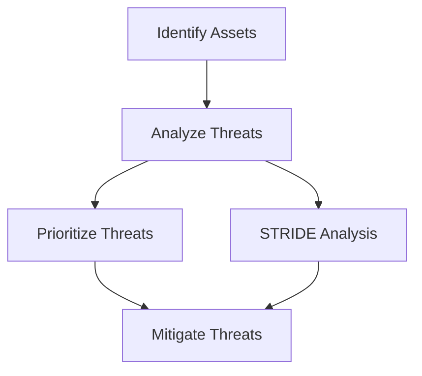

## Introduction

Threat Modeling is a vital security design practice in cloud computing and software development. It involves the proactive identification and analysis of potential threats to a system, aiming to address these threats early in the development process. By anticipating and mitigating security risks, organizations can significantly enhance the security posture of their systems.

## Detailed Explanation

### Purpose of Threat Modeling

Threat Modeling serves to preemptively address potential security risks, thereby reducing the attack surface of a system. It involves understanding possible threats, vulnerabilities, and the impact on the system to implement appropriate defenses.

### Key Activities in Threat Modeling

1. **Identify Assets**: Figuring out what needs protecting.
2. **Enumerate Threats**: Predict potential threats.
3. **Analyze Vulnerabilities**: Understand weaknesses that might be exploited.
4. **Prioritize Threats**: Rank threats to address the most critical ones first.
5. **Mitigate Threats**: Plan and implement defenses.

### Benefits

- **Improved Security Design**: By identifying threats early, designs can be altered to mitigate risks.
- **Cost Efficiency**: Addressing security issues during the design phase is more cost-effective than post-deployment mitigation.
- **Regulatory Compliance**: Helps in meeting various security regulations and standards.

### Approaches to Threat Modeling

- **STRIDE**: Focuses on six potential threat categories—Spoofing, Tampering, Repudiation, Information Disclosure, Denial of Service, and Elevation of Privilege.
- **DREAD**: Prioritizes threats based on Damage potential, Reproducibility, Exploitability, Affected Users, and Discoverability.
- **PASTA**: A process for attack simulation and threat analysis that aligns business objectives with technical requirements.

## Example Code & Diagrams

### STRIDE Example

Implementing a simplified form of the STRIDE model using pseudo-code:

```pseudo
function identifyThreats(systemComponents):
    for component in systemComponents:
        if component.type == 'entry point':
            checkThreat = STRIDE.Spoofing(component)
        else if component.type == 'data store':
            checkThreat = STRIDE.InformationDisclosure(component)

        for threat in checkThreat:
            log(threat)
```

### UML Diagram

Below is a simplified representation of a typical threat modeling process using STRIDE.



## Related Patterns

- **Defense in Depth**: Utilizing multiple security mechanisms to protect against threats.
- **Zero Trust Architecture**: A security model based on strict verification.

## Additional Resources

- [OWASP Threat Modeling](https://owasp.org/www-project-threat-modeling/)
- [Microsoft Threat Modeling Tool](https://www.microsoft.com/en-us/securityengineering/sdl/threatmodeling)

## Summary

Threat Modeling is a crucial practice in developing secure cloud-based systems. By systematically identifying and managing potential threats, developers can ensure robust security measures are incorporated from the earliest stages of software design. Using well-established methodologies such as STRIDE and PASTA can provide a strong framework for addressing security challenges in cloud computing environments.
