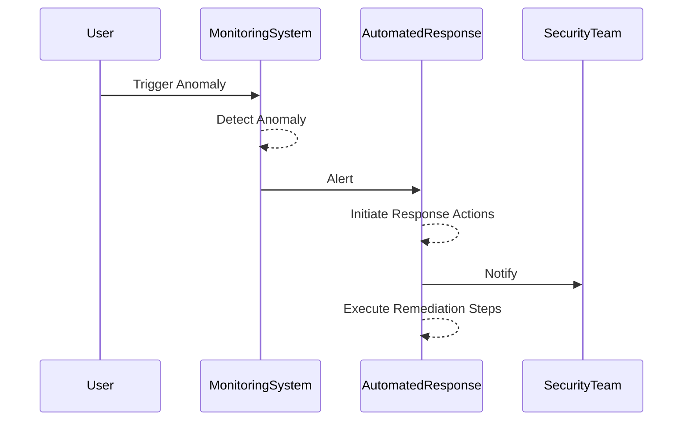

## Introduction

Automated Incident Response (AIR) is an essential design pattern within cloud security, aimed at enhancing the speed and effectiveness of managing and mitigating security threats. In today's environment, where threats evolve rapidly, relying solely on traditional or manual response methods can lead to significant vulnerabilities. AIR leverages automation tools and practices to detect, respond to, and resolve incidents in real-time or near-real-time, minimizing potential damage and downtime.

## Detailed Explanation

### Design Pattern Components

1. **Detection Automation:**
   - Utilizes machine learning and heuristic-based systems to identify anomalies or potential security incidents.
   - Integrates with monitoring tools to collect and analyze logs, network behaviors, and system activities to identify threats early.

2. **Response Automation:**
   - Automatically initiates predefined responses to detected incidents. Responses may include quarantining affected systems, blocking malicious IP addresses, or modifying access controls.
   - Uses playbooks that list automated steps for specific incident types.

3. **Remediation Automation:**
   - Automatically performs recovery actions, such as restoring systems from the last known good state or applying patches.
   - Employs version control and state configuration tools to ensure systems are quickly returned to a secure state.

### Architectural Approach

- Design AIR processes around existing security policies and compliance requirements.
- Implement continuous integration/continuous deployment (CI/CD) principles to ensure that security patches and configurations are consistently and rapidly applied across environments.
- Use infrastructure-as-code (IaC) for consistent security configurations across deployments, making automated remediation steps predictable and reliable.

### Example Code

Below is a simplified pseudocode example for an automated response triggered by a compromised server detection:

```python
def detect_and_respond():
    if detect_intrusion("server_id"):
        quarantine_server("server_id")
        notify_security_team("Intrusion detected on server_id")

def detect_intrusion(server_id):
    # Logic to detect intrusion
    return anomaly_detected()

def quarantine_server(server_id):
    # Logic to isolate the server
    execute_network_policy(server_id, "isolate")

def notify_security_team(message):
    # Send alert to security dashboard
    alert_security_dashboard(message)
```

### Diagram

Here's a simple sequence diagram using Mermaid to illustrate a typical AIR process:



### Best Practices

- **Integration with SIEM Tools:** Ensure integration with Security Information and Event Management (SIEM) systems for comprehensive visibility and analytics.
- **Regular Update of Playbooks:** Continuously update response playbooks to adapt to new threat vectors.
- **Testing and Validation:** Regularly test automated response workflows to validate efficacy and detect potential flaws.

### Related Patterns

- **Security Monitoring and Alerting:** Proactively monitor cloud environments for threats and receive alerts for potential incidents.
- **Immutable Infrastructure:** Use immutable infrastructure concepts to quickly reconstruct any compromised resources from secure, approved configurations.
- **Service Resilience and Redundancy:** Design applications with redundancy to ensure uptime and availability, even during incident responses.

### Additional Resources

- **The NIST Computer Security Incident Handling Guide:** Provides guidelines for incident response processes and planning.
- **OWASP Security Knowledge Framework:** A comprehensive database of security measures and patterns applicable to automated response and cloud security.

## Summary

Automated Incident Response is a pivotal pattern in modern cloud computing, significantly enhancing the capability of organizations to handle and mitigate security incidents effectively. By employing automation, organizations can reduce response times, ensure consistent remediation actions, and allow security teams to focus on more strategic tasks, thereby improving overall security posture.
