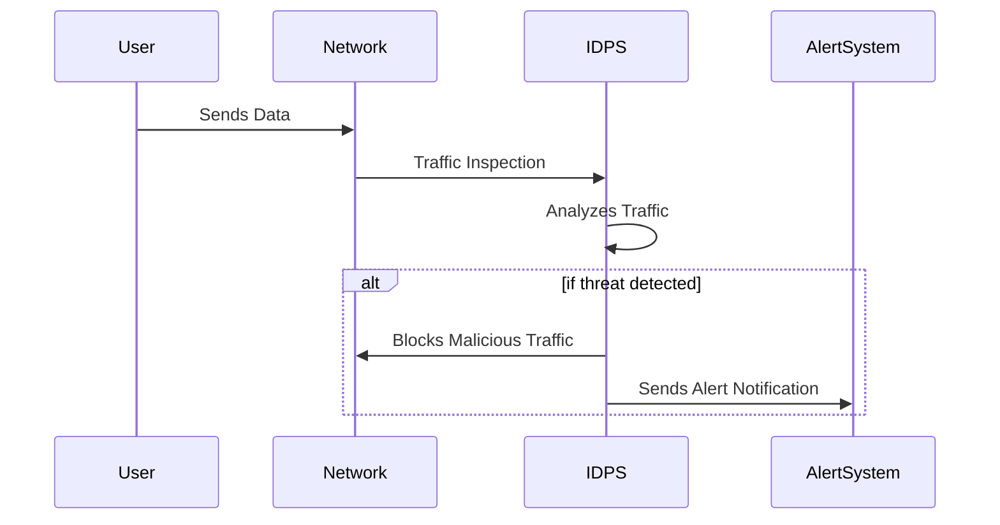

## Introduction to Intrusion Detection and Prevention Systems (IDPS)

Intrusion Detection and Prevention Systems (IDPS) play a crucial role in safeguarding network and system security by actively monitoring, detecting, and preventing potential malicious activities. In the context of cloud computing, where distributed resources are often subject to various security threats, implementing effective IDPS solutions is paramount for maintaining a secure environment.

### Key Concepts and Components

- **Intrusion Detection**: The process of analyzing data from networks or systems to identify potential security breaches.
- **Intrusion Prevention**: Actively responds to detected threats with actions such as blocking traffic or reconfiguring a firewall.
- **Network-Based IDPS (NIDPS)**: Monitors network traffic for signs of suspicious activities.
- **Host-Based IDPS (HIDPS)**: Focuses on monitoring individual host computers.
- **Signature-Based Detection**: Uses predefined patterns (signatures) to identify known threats.
- **Anomaly-Based Detection**: Identifies unusual behavior that deviates from the norm.

### Architectural Approaches

1. **Centralized vs. Distributed Deployment**:
   - *Centralized*: A single control point manages the detection and response strategy across all systems.
   - *Distributed*: Each system or cluster operates its IDPS instance, allowing for localized response strategies.

2. **Cloud-Native IDPS**:
   - Integrates directly with cloud platforms (e.g., AWS GuardDuty, Azure Security Center), leveraging cloud provider tools for enhanced scalability and performance.

### Best Practices

- **Continuous Monitoring**: Regularly update IDPS signatures and rules to detect new threats.
- **Behavioral Analytics**: Implement anomaly detection to identify sophisticated threats.
- **Scalability**: Ensure the IDPS solution can scale in response to increased network demand or complexity.
- **Integration with Other Security Tools**: Combine IDPS data with threat intelligence platforms for a comprehensive security posture.
- **Regular Audits and Updates**: Conduct periodic reviews to refine detection policies and prevention mechanisms.

### Example Code and Configuration

For organizations leveraging AWS, enabling Amazon GuardDuty provides a robust cloud-native IDPS solution:

```bash
aws guardduty create-detector --enable
aws guardduty get-findings --detector-id "detector-id"
```

For an open-source approach, consider tools like Snort for network-based intrusion detection:

```bash
apt-get install snort

snort -c /etc/snort/snort.conf -i eth0
```

### Diagrams



### Related Patterns

- **Zero Trust Networks**: Assumes that threats could originate from both outside and inside the network.
- **Secure Access Service Edge (SASE)**: Converges network and security services in the cloud.

### Additional Resources

- [NIST Special Publication 800-94: Guide to Intrusion Detection and Prevention Systems (IDPS)](https://csrc.nist.gov/publications/detail/sp/800-94/rev-1/final)
- [OWASP Top Ten Security Risks](https://owasp.org/www-project-top-ten/)

## Summary

Intrusion Detection and Prevention Systems (IDPS) are vital components in a robust cloud security strategy, capable of identifying and neutralizing threats in real-time. From deploying network and host-based solutions to leveraging cloud-native technologies, IDPS enhances the security posture by enabling continuous monitoring, threat detection, and automated response capabilities. By adopting best practices and aligning IDPS deployments with organizational security policies, companies can effectively mitigate risks in cloud environments.

Understanding and implementing IDPS allows for proactive threat management and fortification of network and system defenses, contributing to the overall resilience and security of cloud infrastructures.
