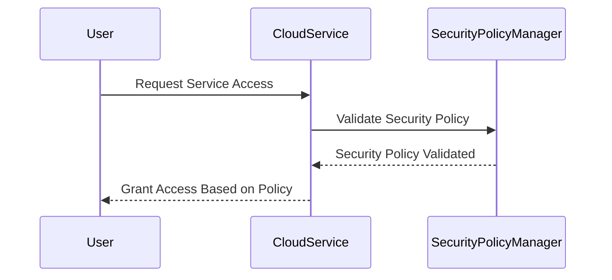

## Introduction

In cloud environments, security is a top concern for both service providers and consumers. As organizations leverage a variety of services across diverse platforms such as GCP, AWS, Azure, and private clouds, ensuring security compliance and maintaining robust defense mechanisms can become complex. **Service-Level Security Policies** address this need by customizing security configurations for each specific cloud service being used. This approach ensures that the cloud infrastructure and applications adhere to organizational security standards and compliance requirements.

## Design Pattern Explanation

Service-Level Security Policies involve defining and applying security policies at the service level rather than a one-size-fits-all approach. This pattern enables fine-grained control over security configurations, allowing security measures to be specifically tailored to the unique characteristics and demands of each cloud service used.

### Key Elements of Service-Level Security Policies:

1. **Service Identification:** Recognize and categorize the specific services being utilized in the cloud environment.

2. **Policy Definition:** Develop security policies specific to each service’s requirements. This could include data encryption standards, access control policies, network security settings, etc.

3. **Policy Implementation:** Apply these tailored security measures to the respective cloud services.

4. **Continuous Monitoring:** Regularly monitor cloud services to ensure compliance with security policies and adjust them as necessary to respond to new security threats.

5. **Audit and Compliance:** Ensure that security policies meet industry and regulatory compliance requirements such as GDPR, HIPAA, and ISO standards.

## Architectural Approaches

### Multi-Layer Security Architecture

Given the diversity of cloud services and potential attack vectors, implementing a multi-layer security architecture is beneficial:

- **Physical Security:** Ensure data center physical access is tightly controlled.
  
- **Network Security:** Use firewalls, VPNs, and secure VPC setups to protect network communications.

- **Endpoint Security:** Apply antivirus, DLP, and other measures at the user/device level.
  
- **Application Security:** Include code security reviews, application firewalls, and runtime protection.

- **Data Security:** Encrypt data at rest and in transit, manage keys in centralized services.

- **Identity and Access Management (IAM):** Implement strong IAM policies to manage user permissions and access controls effectively.

## Example Code

Here is a conceptual example of defining a security policy for an AWS S3 bucket:

```hcl
resource "aws_s3_bucket" "example" {
  bucket = "my-security-policy-bucket"

  # Apply bucket policy
  policy = <<POLICY
{
  "Version": "2012-10-17",
  "Statement": [
    {
      "Sid": "AllowSSLRequestsOnly",
      "Action": "s3:*",
      "Effect": "Deny",
      "Resource": "${aws_s3_bucket.example.arn}/*",
      "Condition": {
        "Bool": {
          "aws:SecureTransport": "false"
        }
      },
      "Principal": "*"
    }
  ]
}
POLICY
}
```

## Diagrams

### Service-Level Security Policies: Sequence Diagram



## Related Patterns

- **Identity Management Patterns**: Enhance security by integrating advanced IAM features.
- **Data Encryption Patterns**: Protect data integrity and confidentiality.
- **Network Security Patterns**: Implement secure network configurations and practices.

## Additional Resources

- [NIST Cloud Computing Security](https://www.nist.gov/programs-projects/cloud-computing-security)
- [AWS Security Documentation](https://docs.aws.amazon.com/security/)
- [Azure Security Center](https://azure.microsoft.com/en-us/services/security-center/)

## Summary

Service-Level Security Policies are essential for customizing security settings specific to each cloud service used. They enable organizations to implement detailed, compliant, and effective security controls tailored to each service’s unique requirements, thus maximizing security integrity and minimizing potential vulnerabilities in the cloud. By following best practices and leveraging modern security approaches, organizations can enhance their cloud security posture significantly.
