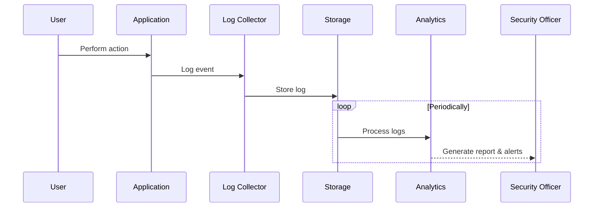

## Introduction to Security Auditing and Reporting

The Security Auditing and Reporting pattern is integral to maintaining robust security postures within cloud environments. It involves collecting, storing, and analyzing logs and activities across systems and applications to detect, report, and respond to potential security threats. This pattern supports compliance with regulations such as GDPR, HIPAA, and PCI-DSS by providing detailed records of activities.

## Architectural Overview

### Design Goals

- **Visibility**: Provide transparency into system and user activities.
- **Compliance**: Ensure adherence to industry standards and regulations.
- **Forensic Analysis**: Offer a basis for forensic investigations in the event of security incidents.
- **Alerting and Monitoring**: Enable prompt responses to security threats through real-time alerts.

### Key Components

1. **Data Collection**: Tools and agents that gather logs and events from various sources such as applications, network devices, and operating systems.
2. **Data Storage**: Secure, scalable storage solutions for retaining collected logs for later analysis.
3. **Analysis and Reporting**: Analytical tools and dashboards to interpret data, spot anomalies, and generate reports for stakeholders.
4. **Alerting Mechanisms**: Systems that trigger alerts based on predefined conditions and thresholds.

### Sequence Diagram



## Implementation Example

In a cloud-native environment using AWS, logs can be captured using CloudTrail and CloudWatch Logs. CloudTrail records AWS account activity, while CloudWatch Logs provide a mechanism to store, monitor, and access log files from Amazon EC2 instances, AWS CloudTrail, and other sources.

Example in AWS Environment:

```bash
aws cloudtrail create-trail --name my-trail --s3-bucket-name my-log-bucket

aws logs create-log-group --log-group-name MyAppLogs
aws logs create-log-stream --log-group-name MyAppLogs --log-stream-name AppStream
```

In this setup:
- **CloudTrail** captures account-level events, which can be used for auditing purposes.
- **CloudWatch Logs** can be configured to trigger alarms based on predefined patterns or anomalies.

## Best Practices

- **Centralize Logging**: Use a centralized logging service to aggregate logs from multiple sources for efficient analysis.
- **Data Retention Policies**: Implement policies that define how long logs should be kept, balancing compliance requirements and storage costs.
- **Automated Alerts**: Set up automated alerts for unusual activity to enable rapid response.
- **Regular Audits**: Conduct regular audits of your logging and reporting setup to ensure its effectiveness and compliance.

## Related Patterns

- **Data Encryption**: Protects data logs at rest and in transit to ensure confidentiality and integrity.
- **Identity and Access Management**: Controls who can access logs and reports.
- **Intrusion Detection System (IDS)**: Complements logging solutions by providing real-time threat detection.

## Additional Resources

- [AWS Security Best Practices](https://aws.amazon.com/architecture/security-best-practices/)
- [Azure Security Documentation](https://docs.microsoft.com/en-us/azure/security/)
- [Cloud Security Alliance](https://cloudsecurityalliance.org/)

## Summary

Security Auditing and Reporting is a critical pattern for maintaining cloud security and compliance. By effectively capturing, storing, and analyzing security logs, organizations can deter threats, support compliance, and maintain system integrity. Implementing this pattern requires careful planning and the right tools to ensure comprehensive visibility and quick incident response capabilities across cloud environments.
