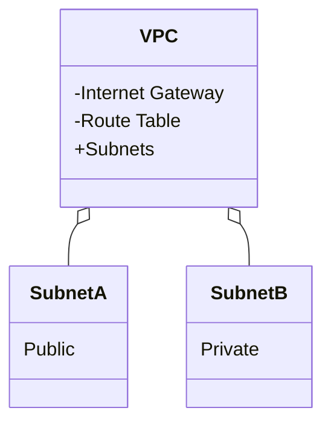

Network isolation is a fundamental concept in securing cloud environments. By isolating environments and resources, organizations can contain security breaches and minimize the impact on the broader network.

## Design Pattern of Network Isolation

Network Isolation Techniques refer to a collection of practices designed to segment cloud resources into distinct, isolated environments to prevent unauthorized access and mitigate the spread of potential threats. This pattern is crucial for building a secure cloud infrastructure that safeguards sensitive data and resources.

### Architectural Approaches

1. **Virtual Private Cloud (VPC):**
   - Create a logically isolated section within a cloud provider’s environment.
   - Leverage subnets, route tables, and network access control lists (ACLs) to further isolate resources.

2. **Network Segmentation:**
   - Employ subnetting and VLANs to separate network segments.
   - Apply firewalls and security groups to control traffic flow between segments.

3. **Micro-segmentation:**
   - Implement fine-grained segmentation at the workload level through software-defined networking (SDN).
   - Use identity-based policies to control communication between microservices.

4. **VPN and Gateway Services:**
   - Establish secure communication channels between on-premises resources and the cloud with VPNs.
   - Use gateway services to monitor and restrict data flow.

5. **Private Connectivity:**
   - Utilize dedicated cloud connections like AWS Direct Connect or Azure ExpressRoute.
   - Encourage secure, dedicated links for sensitive data transfers without exposing traffic to the public internet.

## Best Practices

- **Least Privilege Access:** Assign minimal access rights needed for resources to function.
- **Regular Audits and Monitoring:** Continuously monitor network traffic and conduct audits to ensure adherence to security policies.
- **Redundancy and Failover Planning:** Ensure network paths have redundancy to maintain isolation during failures.
- **Policy Automation:** Automate the enforcement of security policies using Infrastructure as Code (IaC).

## Example Code

Here’s a simple Terraform code snippet to establish a VPC with subnets:

```hcl
provider "aws" {
  region = "us-west-2"
}

resource "aws_vpc" "main" {
  cidr_block = "10.0.0.0/16"
}

resource "aws_subnet" "subnet_a" {
  vpc_id     = aws_vpc.main.id
  cidr_block = "10.0.1.0/24"
}

resource "aws_subnet" "subnet_b" {
  vpc_id     = aws_vpc.main.id
  cidr_block = "10.0.2.0/24"
}
```

## Diagrams

### Network Isolation Example Using VPC



## Related Patterns

- **Identity and Access Management (IAM):** Integrate IAM controls to enhance network isolation strategies.
- **Zero Trust Networks:** Combine with zero trust principles to further restrict network access based on identity verification.
- **Service Mesh:** Utilize service mesh for managing micro-segmented network communications between microservices.

## Additional Resources

- AWS VPC Documentation: [AWS VPC](https://aws.amazon.com/vpc/)
- GCP Networking Best Practices: [GCP Networking](https://cloud.google.com/architecture/best-practices-for-enterprise-organizations)
- Azure Network Security: [Azure Networking Services](https://azure.microsoft.com/en-us/services/networking/)

## Summary

Network isolation techniques are critical for maintaining a secure cloud environment. By segmenting resources and applying stringent security controls, organizations can protect sensitive data and reduce the risk of lateral movement during a breach. Adopting practices like VPCs, network segmentation, and micro-segmentation not only enhances the security posture but also provides a robust framework for managing cloud resources securely. Always align these techniques with organizational policies and compliance requirements to ensure a fortified cloud infrastructure.
