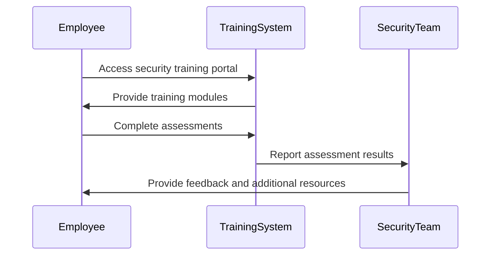

## Overview

In the rapidly evolving landscape of cloud computing, security is a paramount concern that requires ongoing attention and adaptation. The **Security Training and Awareness** pattern is an essential component in ensuring that all stakeholders, from IT staff to executives, understand the security risks associated with cloud environments and are equipped to mitigate these risks. This pattern involves developing comprehensive training programs and awareness initiatives that educate teams about security best practices, compliance requirements, and the latest threat landscape.

## Purpose

The primary goal of this pattern is to instill a culture of security within the organization. By providing targeted training and awareness programs, organizations can proactively address potential security vulnerabilities and ensure compliance with industry standards and regulations. This approach helps in reducing human errors, which are often the root cause of security breaches.

## Architectural Approaches

1. **Layered Training Programs**: Develop a multi-tiered training framework that caters to different roles within the organization. This includes basic security awareness for all employees, specific training for technical staff, and advanced training for security teams.
   
2. **Integration with Onboarding**: Incorporate security training as a mandatory component of the employee onboarding process. This ensures that new employees are aware of the organization's security policies from day one.

3. **Continuous Learning and Updates**: Security threats are constantly evolving. Implement a system of regular updates and refresher courses to keep all employees informed about the latest developments in cloud security.

4. **Gamification and Interactive Learning**: Use gamification techniques to make learning engaging and interactive. This approach can increase participation rates and retention of information.

5. **Simulations and Drills**: Conduct regular security drills and breach simulations to test the preparedness of employees and refine the response protocols.

## Example Code

While direct code implementations are not applicable for training programs, scripting and automation can help facilitate training and awareness.

```bash
#!/bin/bash

email_list="employees@company.com"
subject="Monthly Security Update"
body="This is your monthly update on security practices and policies. Please ensure you review and comply with the guidelines."

echo "$body" | mail -s "$subject" "$email_list"
```

## Diagrams

### Training and Awareness Process



## Related Patterns

- **Identity Management**: Ensures that only authorized personnel access the system and sensitive data.
- **Audit and Monitoring**: Regular audits and continuous monitoring to detect and respond to security incidents.
- **Data Encryption**: Protects sensitive data both at rest and in transit from unauthorized access.

## Additional Resources

- [NIST Cybersecurity Framework](https://www.nist.gov/cyberframework)
- [OWASP Top Ten Security Risks](https://owasp.org/www-project-top-ten/)
- [Cloud Security Alliance (CSA) Guidelines](https://cloudsecurityalliance.org/)

## Summary

The **Security Training and Awareness** pattern is a crucial component of a robust cloud security strategy. By empowering employees with the knowledge and skills necessary to recognize and respond to security threats, organizations can cultivate a proactive security posture that mitigates risks and enhances data protection. This pattern not only involves structured training but also fosters an ongoing culture of security vigilance and responsibility across all levels of the organization.
