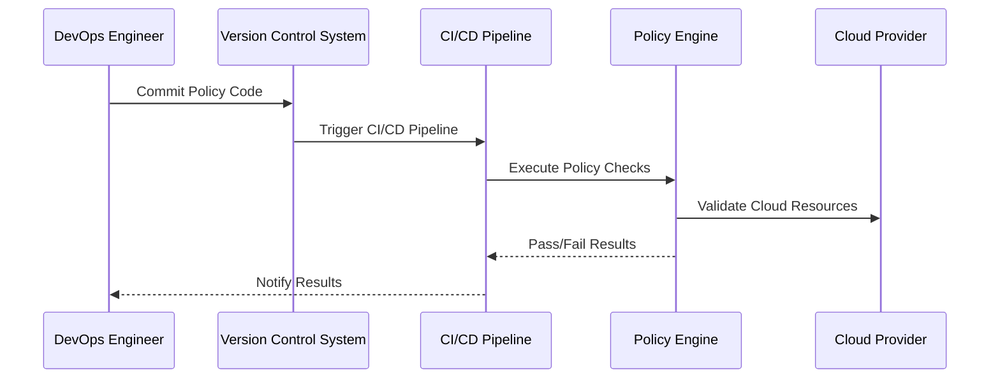

## Introduction to Policy Enforcement as Code

Policy Enforcement as Code (PEaC) is a paradigm that modernizes how security policies are defined and managed within cloud environments. By leveraging code to define security policies, organizations can automate the enforcement of security rules and compliance requirements, ensuring consistency and traceability across their entire infrastructure.

Incorporating PEaC into your cloud strategy strengthens security posture by treating policies as code artifacts, which can be versioned, reviewed, and tested just like any other part of the software development lifecycle.

## Architectural Approaches

1. **Declarative Policy Definition**:
   - Utilize a high-level, declarative language or configuration files (e.g., JSON, YAML) to define security and access policies.
   - Tools like HashiCorp Sentinel, Open Policy Agent (OPA), and AWS IAM policies support declarative policy definitions.

2. **Policy as Part of CI/CD**:
   - Integrate policy checks within Continuous Integration/Continuous Delivery (CI/CD) pipelines to automate validation against defined security standards before code deployments.

3. **Policy Execution Environment**:
   - Implement a dedicated environment where policies are consistently executed across cloud resources.
   - Use OPA or custom policy engines to evaluate compliance conditions in real-time.

4. **Version Control Systems**:
   - Store policy code in version control systems such as Git. This enables collaboration, rollback, auditability, and change management.

## Best Practices

- **Modular Policies**: Break down policies into reusable modules. This promotes scalability and reduces redundancy.
- **Unit Testing**: Create tests for policy logic to ensure reliability and correctness.
- **Access Control**: Implement a least-privilege principle to ensure that only authorized personnel can modify or deploy policies.
- **Policy Templates**: Leverage templates for common policy needs to speed up development and safeguard against security oversights.
- **Audit and Monitoring**: Continuously monitor policy adherence and conduct regular audits to identify and mitigate potential security risks.

## Example Code

This Python snippet uses a fictional policy framework to enforce that storage buckets cannot be publicly accessible:

```python
def check_bucket_policy(bucket):
    if bucket.is_public:
        raise SecurityException(f"Bucket {bucket.name} is publicly accessible!")

bucket_list = cloud_client.list_buckets()

for bucket in bucket_list:
    check_bucket_policy(bucket)
```

## Diagrams

### Policy Enforcement as Code Sequence Diagram



## Related Patterns

- **Infrastructure as Code (IaC)**: Both IaC and PEaC share the principle of defining infrastructure and policies via code. Together, they automate both resource provision and regulatory compliance.
- **Immutable Infrastructure**: Immutable infrastructure, when combined with PEaC, ensures a secure and consistent deployment environment.
- **Continuous Compliance**: Continuous Compliance involves on-going adherence verification to policies, complementing PEaC's enforcement mechanisms.

## Additional Resources

- [Managing Policies with OPA](https://www.openpolicyagent.org)
- [HashiCorp Sentinel Policy as Code](https://www.hashicorp.com/sentinel)

## Summary

Policy Enforcement as Code represents a transformative approach to cloud security by integrating policy management within the software development lifecycle, automating compliance, and enforcing rules real-time. By embodying security policies as code artifacts, organizations gain enhanced control, traceability, and consistency in meeting their compliance mandates.
