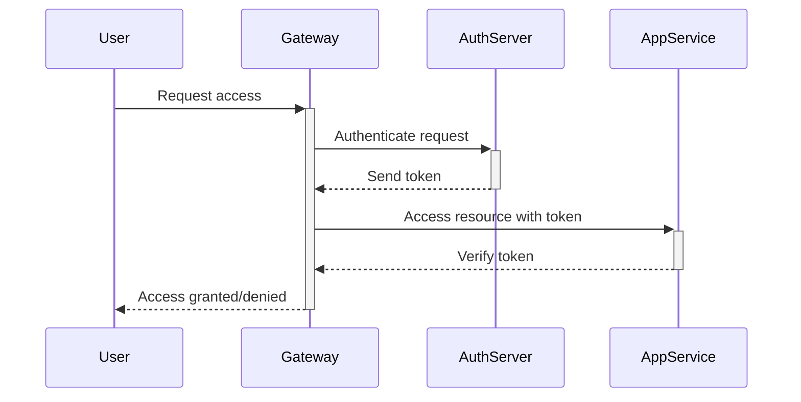

Zero Trust Architecture (ZTA) is a security paradigm focused on the principle of “never trust, always verify.” It requires that every access request be explicitly verified and authenticated regardless of whether it originates from inside or outside the network perimeter. The model assumes that threats exist both inside and outside traditional defensive perimeters and aims to protect the organization's critical resources accordingly.

## Key Components

### 1. **Continuous Verification**
Every access request is authenticated and authorized in real-time, using contextual information such as user identity, geolocation, device health, and the sensitivity of the requested resource.

### 2. **Network Segmentation**
Networks are divided into smaller segments or micro-perimeters to prevent lateral movement by potential threats. Each segment is independently secured with policies tailored to the specific needs of its resources.

### 3. **Least Privilege Access**
Access privileges are minimized, providing users only what they need to perform their tasks. This limits the potential impact of compromised credentials.

## Architectural Approaches

### Identity-Centric Controls
- **Multi-Factor Authentication (MFA):** Reinforces security by requiring additional verification factors.
- **Role-Based Access Control (RBAC):** Manages user permissions based on roles rather than individual permissions.

### Micro-Segmentation
- **Software-Defined Networking (SDN):** Allows dynamic allocation of network resources and segregation.
- **Firewall Policies:** Define and enforce strict access controls regardless of network location.

### Endpoint and Data Security
- **Encryption:** Protects data at rest and in transit.
- **Anti-Malware Solutions:** Actively monitors and protects endpoints from threats.

## Best Practices

- **Adopt a Cloud-Native Security Model:** Utilize cloud-native tools and services for security orchestration.
- **Continuous Monitoring:** Implement comprehensive monitoring and analytics to detect and mitigate threats.
- **Automate Security Policy Enforcement:** Use automation to apply and update security policies consistently across all platforms.

## Example Code

Here's an example in Scala using the Akka framework to demonstrate a component of ZTA where requests are authenticated:

```scala
import akka.http.scaladsl.server.Directives._
import akka.http.scaladsl.model.StatusCodes
import akka.http.scaladsl.server.Route

def verifyToken(token: String): Boolean = {
  // Placeholder for token verification logic
  token == "valid-token"
}

val route: Route =
  path("secure") {
    headerValueByName("Authorization") { token =>
      if (verifyToken(token)) {
        complete(StatusCodes.OK, "Access Granted")
      } else {
        complete(StatusCodes.Unauthorized, "Access Denied")
      }
    }
  }

// The Akka HTTP server setup and binding would follow.
```

## Diagrams

### UML: Zero Trust Workflow Sequence



## Related Patterns

- **Service Mesh:** Provides an infrastructure layer that facilitates service-to-service communications.
- **API Gateway:** Acts as the entry point for all client requests, enforcing security policies.

## Additional Resources

- [NIST Special Publication 800-207, Zero Trust Architecture](https://csrc.nist.gov/publications/detail/sp/800-207/final)
- [Zero Trust Security for AWS Environments](https://aws.amazon.com/architecture/security-identity-compliance/zero-trust/)

## Summary

Zero Trust Architecture is crucial for modern cloud environments where perimeters are dynamic, and threats are omnipresent. By implementing robust verification, network segmentation, and least privilege access, organizations can significantly enhance their security postures. This paradigm shifts security focus from solely external threats to a comprehensive model that addresses both internal and external vulnerabilities.
