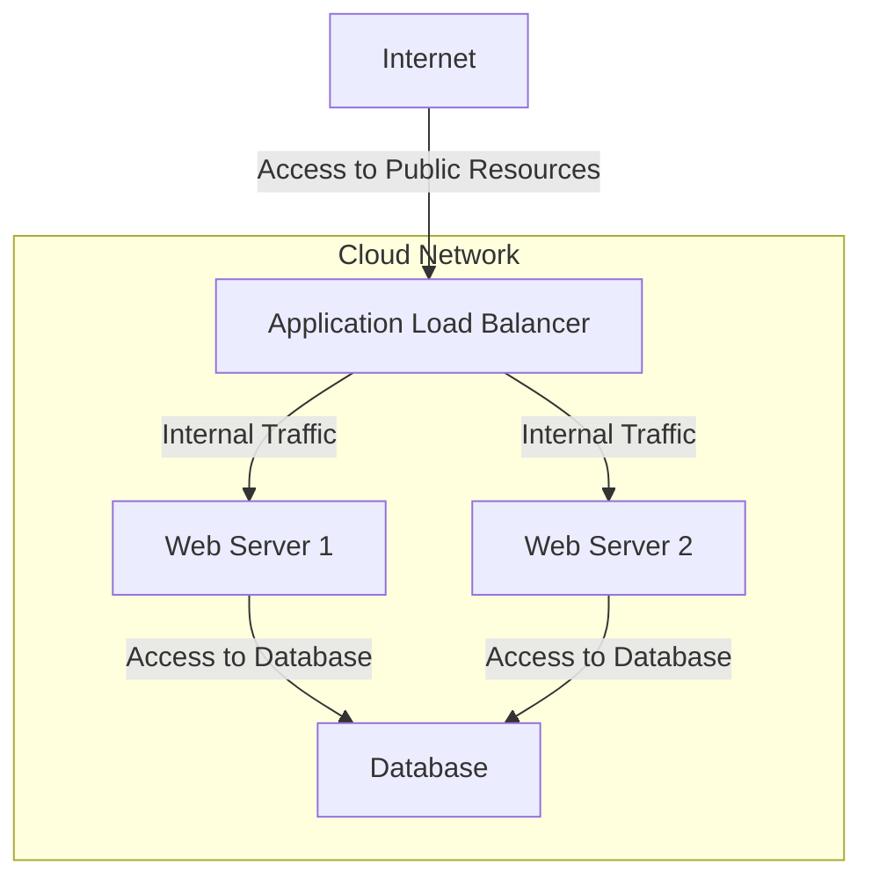

## Introduction

Security Hardening of Resources in cloud environments involves configuring systems in a manner that minimizes vulnerabilities and potential exposure. This pattern is quintessential for maintaining robust security and ensuring that cloud-based resources are resistant against threats and unauthorized access.

## Detailed Explanation

### Architectural Approaches

1. **Least Privilege Principle**: Assign the minimum level of access or permissions necessary for users and services to perform their functions. Implement fine-grained access control policies using Identity and Access Management (IAM) services.

2. **Network Segmentation**: Divide the network into distinct zones to limit the reach of potential attackers. This involves creating Virtual Private Clouds (VPCs), using subnets, and setting up firewall rules and security groups to control inbound and outbound traffic.

3. **Encryption**: Employ encryption both in transit and at rest for sensitive data. Use industry-standard protocols and services such as AWS KMS, Azure Key Vault, or GCP Cloud KMS for managing encryption keys securely.

4. **Regular Patching and Updates**: Ensure that systems and applications are regularly updated with the latest security patches. Implement automated patch management solutions to reduce manual intervention and minimize the window of vulnerability.

5. **Configuration Management**: Adopt Infrastructure as Code (IaC) practices for consistent and repeatable configuration management. Employ tools like Terraform, CloudFormation, or Ansible to automate configuration tasks and reduce human error.

### Best Practices

- **Multi-Factor Authentication (MFA)**: Enforce MFA to add an additional layer of security on user accounts and critical services.
- **Continuous Monitoring**: Implement logging and monitoring solutions such as AWS CloudTrail, Azure Monitor, or GCP Stackdriver to continuously monitor access, performance, and anomaly detection.
- **Incident Response Plan**: Develop and regularly test an incident response plan to quickly identify and mitigate security breaches.

## Example Code

### Infrastructure as Code Example Using Terraform

```hcl
provider "aws" {
  region = "us-west-2"
}

resource "aws_security_group" "web" {
  name = "web-sg"

  ingress {
    from_port   = 80
    to_port     = 80
    protocol    = "tcp"
    cidr_blocks = ["0.0.0.0/0"]
  }

  egress {
    from_port   = 0
    to_port     = 0
    protocol    = "-1"
    cidr_blocks = ["0.0.0.0/0"]
  }
}

resource "aws_instance" "web" {
  ami           = "ami-0c55b159cbfafe1f0"
  instance_type = "t2.micro"

  vpc_security_group_ids = [aws_security_group.web.id]
}
```

## Diagrams

### Network Segmentation Diagram



## Related Patterns

- **Defense in Depth**: Implements multiple layers of defense to protect information systems.
- **Identity-based Access Control**: Ensures that access to resources is governed by identities acting on behalf of users.
- **Automated Security Testing**: Integrates security testing into the CI/CD pipeline for early detection of vulnerabilities.

## Additional Resources

- [AWS Well-Architected Framework: Security Pillar](https://aws.amazon.com/architecture/well-architected/)
- [Azure Security Documentation](https://docs.microsoft.com/en-us/azure/security/)
- [Google Cloud Security](https://cloud.google.com/security)

## Summary

Security Hardening of Resources is an essential pattern to safeguard cloud environments by systematically configuring resources to reduce vulnerabilities and exposure. Applying best practices such as least privilege, network segmentation, encryption, regular patching, and continuous monitoring are critical to maintaining a secure cloud infrastructure. Employ tools and frameworks to automate these processes, ensuring consistency and minimizing human errors.
