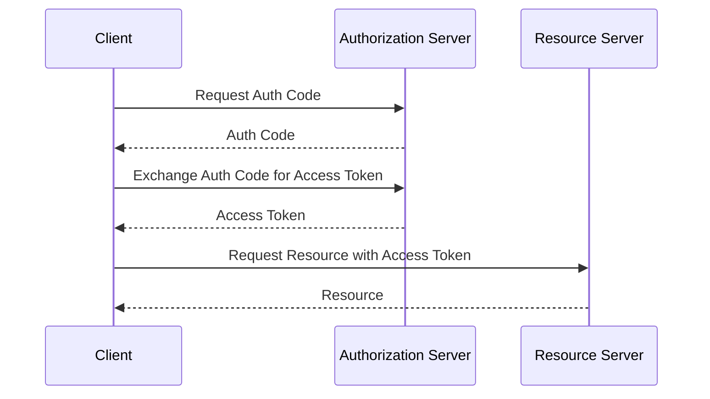

## Introduction

As organizations increasingly rely on APIs for critical business functions, ensuring the security of these interfaces becomes paramount. APIs are exposed to various security threats, such as unauthorized access, data breaches, and malicious inputs, which can compromise the entire application. This pattern focuses on implementing **API Security** through effective authentication, authorization, and input validation.

## Architectural Approaches

1. **Authentication**:
    - Implement authentication to ensure that only legitimate users can access the API.
    - Common methods include API keys, OAuth 2.0, JWT tokens, and mutual TLS.
    - Use tools like AWS IAM, Azure Active Directory, or Google Cloud Identity to manage credentials securely.

2. **Authorization**:
    - Determine what authenticated users are allowed to do.
    - Implement role-based access control (RBAC) or attribute-based access control (ABAC).
    - Utilize policies to delineate user permissions, restricting actions based on necessity.

3. **Input Validation**:
    - Protect against SQL injection, cross-site scripting, and other malicious inputs.
    - Validate and sanitize all inputs strictly following best practices.
    - Use libraries and frameworks that automatically handle input validation for common attack vectors.

## Best Practices

- **Principle of Least Privilege**: Grant only the necessary permissions required for a job or function, minimizing attack surfaces.
- **Use of Strong Encryption**: Encrypt data in transit and at rest. Use protocols like HTTPS/TLS for securing network communication.
- **Regular Security Audits and Penetration Testing**: Continuously assess the security posture using vulnerability scans and penetration tests.
- **Rate Limiting and Quotas**: Prevent abuse and denial-of-service attacks by implementing rate limits and usage quotas on API endpoints.

## Example Code: Setting Up OAuth 2.0 Authentication

Below is a basic example of integrating OAuth 2.0 in a Java Spring Boot application.

```java
@Configuration
@EnableWebSecurity
public class SecurityConfig extends WebSecurityConfigurerAdapter {

    @Override
    protected void configure(HttpSecurity http) throws Exception {
        http
            .oauth2Login()
            .and()
            .authorizeRequests()
            .antMatchers("/api/public").permitAll()
            .anyRequest().authenticated();
    }
}
```

## Diagrams

### Sequence Diagram: OAuth 2.0 Authentication Flow



## Related Patterns

- **Identity and Access Management**: Control of user identities and access permissions across cloud resources.
- **Security Monitoring and Logging**: Continuous monitoring of security events and prompt logging for threat detection.

## Additional Resources

- [OWASP API Security Project](https://owasp.org/www-project-api-security/)
- [Auth0: API Security Best Practices](https://auth0.com/blog/understanding-api-security/)
- [Google Cloud API Gateway Security](https://cloud.google.com/api-gateway/docs/security-overview)

## Summary

API Security is crucial in the modern cloud computing landscape where APIs serve as the backbone of communication between distributed services. Implementing strong authentication, authorization, and input validation ensures that APIs remain secure against emerging threats. By adhering to best practices and leveraging adequate tools, you can protect your APIs, preserve sensitive data, and maintain compliance with security regulations.
