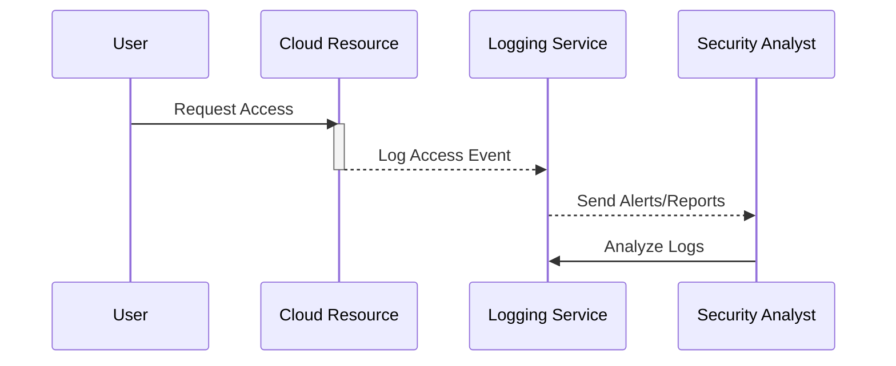

In today's cloud-centric environments, security is paramount. The **Logging and Monitoring Access** design pattern is crucial for securing cloud resources by keeping detailed logs of all access events. This pattern enhances visibility, helps in compliance with regulatory standards, and aids in proactive threat detection and response.

## Detailed Explanation

### Design Pattern Objectives

1. **Visibility**: To provide a clear view of who accessed what resources and when.
2. **Compliance**: To meet legal and regulatory requirements such as GDPR, HIPAA, and SOC 2.
3. **Incident Response**: To enable quick identification and remediation of suspicious activities.
4. **Audit Trail**: To maintain an immutable record of access for forensic investigations.

### Architectural Approaches

- **Centralized Logging**: Implement a centralized logging solution that aggregates logs from various cloud services and resources. Tools like AWS CloudTrail, Azure Monitor, or Google Cloud's Operations Suite can be customized for this purpose.
  
- **Real-time Monitoring**: Deploy real-time monitoring systems to alert security teams of any anomalies. These systems can use machine learning to adaptively detect unusual patterns that deviate from normal behavior.
  
- **Immutable Log Storage**: Use blockchain or immutable storage solutions to ensure the integrity and non-repudiation of logs.

### Paradigms and Best Practices

- **Least Privilege Principle**: Only log access events that are necessary and limit data capture to minimize potential data breaches.
  
- **Data Obfuscation**: Ensure sensitive information within logs is obfuscated or anonymized.
  
- **Retention Policy**: Define clear policies for the retention and deletion of logs to balance between operational needs and storage costs.

### Example Code

Below is a simple example in Python using AWS Boto3 to enable CloudTrail logging for all management events in all regions.

```python
import boto3

client = boto3.client('cloudtrail')

response = client.create_trail(
    Name='my-trail',
    S3BucketName='my-trail-bucket',
    IncludeGlobalServiceEvents=True,
    IsMultiRegionTrail=True,
    EnableLogFileValidation=True
)
response = client.start_logging(
    Name='my-trail'
)

print("CloudTrail Logging Enabled: ", response)
```

### Diagrams

#### Access Logging Sequence



### Related Patterns

- **Access Control Lists (ACLs)**: Used to define detailed permissions and access rules for different users and resources.
- **Identity and Access Management (IAM)**: Provides a framework for managing user identities and their access rights.
  
### Additional Resources

- **AWS CloudTrail Documentation**: [AWS CloudTrail](https://docs.aws.amazon.com/awscloudtrail/latest/userguide/cloudtrail-user-guide.html)
- **Azure Monitor Documentation**: [Azure Monitor](https://docs.microsoft.com/en-us/azure/azure-monitor/overview)
- **Google Cloud Operations Suite**: [Google Cloud Logging](https://cloud.google.com/logging/docs)

## Summary

The **Logging and Monitoring Access** pattern is an essential part of cloud security and identity management. It not only enhances visibility into access events but also ensures compliance with various security regulations. By implementing robust logging and monitoring solutions, organizations can significantly improve their security posture and effectively respond to any incidents.

This pattern, when combined with other security measures like IAM and ACLs, creates a strong defensive layer to protect critical cloud resources from unauthorized access and potential breaches.
